-   [Collections](#collections)
-   [iterator](#iterator)
-   [stream](#stream)
-   [Queue](#queue)
    -   [1、简介](#简介)
    -   [2、队列](#队列)
        -   [2.1、Queue](#queue-1)
        -   [2.2、Deque](#deque)
    -   [ArrayDeque](#arraydeque)
        -   [实现接口](#实现接口)
        -   [字段属性](#字段属性)
        -   [初始化](#初始化)
        -   [添加元素](#添加元素)
        -   [扩容](#扩容)
        -   [删除元素](#删除元素)
        -   [查找元素](#查找元素)
-   [Stack](#stack)
-   [Set](#set)
-   [List](#list)
    -   [ArrayList](#arraylist)
        -   [实现接口](#实现接口-1)
        -   [字段属性](#字段属性-1)
        -   [构造函数](#构造函数)
        -   [添加元素](#添加元素-1)
        -   [删除元素](#删除元素-1)
        -   [修改元素](#修改元素)
        -   [查找元素](#查找元素-1)
        -   [遍历集合](#遍历集合)
        -   [SubList](#sublist)
        -   [trimToSize](#trimtosize)
    -   [LinkedList](#linkedlist)
        -   [接口实现](#接口实现)
        -   [字段属性](#字段属性-2)
        -   [构造函数](#构造函数-1)
        -   [添加元素](#添加元素-2)
        -   [删除元素](#删除元素-2)
        -   [修改元素](#修改元素-1)
        -   [查找元素](#查找元素-2)
        -   [遍历集合](#遍历集合-1)
        -   [迭代器和for循环效率差异](#迭代器和for循环效率差异)
    -   [Vector](#vector)
    -   [Arrays工具类](#arrays工具类)
    -   [List总结](#list总结)
-   [Map](#map)
    -   [HashMap(重点)](#hashmap重点)
        -   [1、哈希表](#哈希表)
        -   [2、什么是 HashMap？](#什么是-hashmap)
        -   [3、HashMap定义](#hashmap定义)
        -   [4、字段属性](#字段属性-3)
        -   [5、构造函数](#构造函数-2)
        -   [6、确定哈希桶数组索引位置](#确定哈希桶数组索引位置)
        -   [7、添加元素](#添加元素-3)
        -   [8、扩容机制](#扩容机制)
        -   [9、删除元素](#删除元素-3)
        -   [10、查找元素](#查找元素-3)
        -   [11、遍历元素](#遍历元素)
        -   [12、总结](#总结)
    -   [LinkedHashMap](#linkedhashmap)
        -   [1、LinkedHashMap 定义](#linkedhashmap-定义)
        -   [2、字段属性](#字段属性-4)
        -   [3、构造函数](#构造函数-3)
        -   [4、添加元素](#添加元素-4)
        -   [5、删除元素](#删除元素-4)
        -   [6、查找元素](#查找元素-4)
        -   [7、遍历元素](#遍历元素-1)
        -   [8、迭代器](#迭代器)
        -   [9、总结](#总结-1)
    -   [TreeMap](#treemap)
        -   [TreeMap 简介](#treemap-简介)
        -   [构造函数](#构造函数-4)
        -   [基本属性](#基本属性)
        -   [添加数据](#添加数据)
        -   [查找元素](#查找元素-5)
        -   [3.总结](#总结-2)
    -   [HashTable](#hashtable)
        -   [HashMap和Hashtable的区别](#hashmap和hashtable的区别)
        -   [要注意的一些重要术语：](#要注意的一些重要术语)
        -   [我们能否让HashMap同步？](#我们能否让hashmap同步)
        -   [结论](#结论)
    -   [NavigableMap](#navigablemap)
    -   [SortedMap](#sortedmap)
    -   [哈希表](#哈希表-1)
        -   [哈希函数的引入](#哈希函数的引入)
        -   [冲突](#冲突)
        -   [开放地址法](#开放地址法)
        -   [链地址法](#链地址法)
        -   [桶](#桶)
        -   [总结](#总结-3)

数据结构资料:

[介绍java常见的数据结构](https://www.cnblogs.com/ysocean/tag/Java%E6%95%B0%E6%8D%AE%E7%BB%93%E6%9E%84%E5%92%8C%E7%AE%97%E6%B3%95/)

[java集合详解](https://www.cnblogs.com/ysocean/p/6555373.html)

[\[Java Collections Framework\] 浅析java 集合框架(三) :
ArrayList,LinkedList,ArrayDeque源码解析](https://blog.csdn.net/dylan_frank/article/details/81227743)


Collections
===========

集合工具类 提供集合操作的一些工具

void **reverse**(List list)：反转

void **shuffle**(List list),随机排序

void **sort**(List list),按自然排序的升序排序

void **sort**(List list, Comparator
c);定制排序，由Comparator控制排序逻辑

void **swap**(List list, int i , int j),交换两个索引位置的元素

void **rotate**(List list, int
distance),旋转。当distance为正数时，将list后distance个元素整体移到前面。当distance为负数时，将
list的前distance个元素整体移到后面。

int **binarySearch**(List list, Object key),
对List进行二分查找，返回索引，注意List必须是有序的

int **max**(Collection coll),根据元素的自然顺序，返回最大的元素。
类比int min(Collection coll)

int **max**(Collection coll, Comparator
c)，根据定制排序，返回最大元素，排序规则由Comparatator类控制。类比int
**min**(Collection coll, Comparator c)

void **fill**(List list, Object obj),用元素obj填充list中所有元素

int **frequency**(Collection c, Object o)，统计元素出现次数

int **indexOfSubList**(List list, List target),
统计targe在list中第一次出现的索引，找不到则返回-1，类比int
**lastIndexOfSubList**(List source, list target).

boolean **replaceAll**(List list, Object oldVal, Object newVal),
用新元素替换旧元素。

Collections中几乎对每个集合都定义了同步控制方法，例如
SynchronizedList(),
SynchronizedSet()等方法，来将集合包装成线程安全的集合。下面是Collections将**普通集合包装成线程安全集合**的用法

``` {.java}
     Collections.synchronizedList(new ArrayList<>());
     Collections.synchronizedMap(new HashMap<>());
     Collections.synchronizedSet(new HashSet<>());
```

设置不可变（只读）集合

Collections提供了三类方法返回一个不可变集合，

emptyXXX(),返回一个空的只读集合（这不知用意何在？）

singleXXX()，返回一个只包含指定对象，只有一个元素，只读的集合。

unmodifiablleXXX()，返回指定集合对象的只读视图。

iterator
========

https://www.cnblogs.com/softidea/p/5167676.html

stream
======

列表的stream 操作 详见1.8新特性

Queue
=====

[解读 Java 并发队列 BlockingQueue](http://www.importnew.com/28053.html)
[queue详细分析](https://www.cnblogs.com/lemon-flm/p/7877898.html)

**Queue： 基本上，一个队列就是一个先入先出（FIFO）的数据结构
有别于栈,是后入先出**

**Queue接口与List、Set同一级别，都是继承了Collection接口。LinkedList实现了Deque接
口。deque继承queue接口
,deque是双端队列可以实现FIFO形式也可以支持LIFO形式**

1、简介
-------

Queue（队列）：一种特殊的线性表，它只允许在表的前端（front）进行删除操作，只允许在表的后端（rear）进行插入操作。进行插入操作的端称为队尾，进行删除操作的端称为队头。

每个元素总是从队列的rear端进入队列，然后等待该元素之前的所有元素出队之后，当前元素才能出对，遵循先进先出（FIFO）原则。

下面是Queue类的继承关系图：

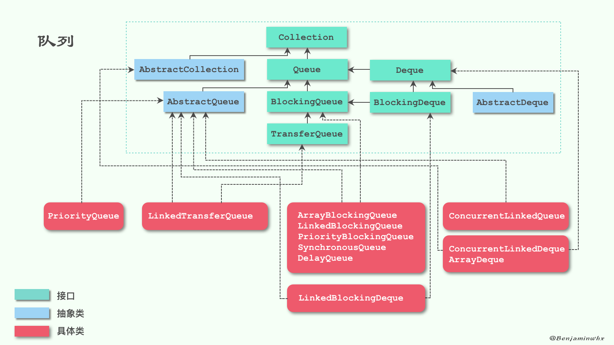

2、队列
-------

### 2.1、Queue

Queue：队列的上层接口，提供了插入、删除、获取元素这3种类型的方法，而且对每一种类型都提供了两种方式，先来看看插入方法：

-   add(E e)：插入元素到队尾，插入成功返回true，没有可用空间抛出异常
    IllegalStateException。
-   offer(E e)： 插入元素到队尾，插入成功返回true，否则返回false。

add和offer作为插入方法的唯一不同就在于队列满了之后的处理方式。add抛出异常，而offer返回false。

再来看看删除和获取元素方法（和插入方法类似）：

-   remove()：获取并移除队首的元素，该方法和poll方法的不同之处在于，如果队列为空该方法会抛出异常，而poll不会。
-   poll()：获取并移除队首的元素，如果队列为空，返回null。
-   element()：获取队列首的元素，该方法和peek方法的不同之处在于，如果队列为空该方法会抛出异常，而peek不会。
-   peek()：获取队列首的元素，如果队列为空，返回null。

如果队列是空，remove和element方法会抛出异常，而poll和peek返回null。

当然，Queue只是单向队列，为了提供更强大的功能，JDK在1.6的时候新增了一个双向队列Deque，用来实现更灵活的队列操作。

### 2.2、Deque

Deque在Queue的基础上，增加了以下几个方法：

-   addFirst(E e)：在前端插入元素，异常处理和add一样；
-   addLast(E e)：在后端插入元素，和add一样的效果；
-   offerFirst(E e)：在前端插入元素，异常处理和offer一样；
-   offerLast(E e)：在后端插入元素，和offer一样的效果；
-   removeFirst()：移除前端的一个元素，异常处理和remove一样；
-   removeLast()：移除后端的一个元素，和remove一样的效果；
-   pollFirst()：移除前端的一个元素，和poll一样的效果；
-   pollLast()：移除后端的一个元素，异常处理和poll一样；
-   getFirst()：获取前端的一个元素，和element一样的效果；
-   getLast()：获取后端的一个元素，异常处理和element一样；
-   peekFirst()：获取前端的一个元素，和peek一样的效果；
-   peekLast()：获取后端的一个元素，异常处理和peek一样；
-   removeFirstOccurrence(Object o)：从前端开始移除第一个是o的元素；
-   removeLastOccurrence(Object o)：从后端开始移除第一个是o的元素；
-   push(E e)：和addFirst一样的效果；
-   pop()：和removeFirst一样的效果。

可以发现，其实很多方法的效果都是一样的，只不过名字不同。比如Deque为了实现Stack的语义，定义了push和pop两个方法。

ArrayDeque
----------

[Java 容器源码分析之 Deque 与
ArrayDeque](https://www.cnblogs.com/wxd0108/p/7366234.html)

[Java基础——Queue、Deque、ArrayDeque源码分析](https://blog.csdn.net/qq_30379689/article/details/80558771)

[Java集合源码分析之Queue（三）：ArrayDeque](https://www.jianshu.com/p/1c1c3f24762e)

Queue 也是 Java 集合框架中定义的一种接口，直接继承自 Collection
接口。除了基本的 Collection 接口规定测操作外，Queue
接口还定义一组针对队列的特殊操作。通常来说，Queue
是按照先进先出(FIFO)的方式来管理其中的元素的，但是优先队列是一个例外。

Deque 接口继承自 Queue接口，但 Deque
支持同时从两端添加或移除元素，因此又被成为双端队列。鉴于此，**Deque
接口的实现可以被当作
FIFO队列使用，也可以当作LIFO队列（栈）来使用**。官方也是推荐使用 Deque
的实现来替代 Stack。

ArrayDeque 是 Deque
接口的一种具体实现，是依赖于可变数组来实现的。ArrayDeque
没有容量限制，可根据需求自动进行扩容。ArrayDeque不支持值为 null 的元素。

#### 实现接口

``` {.java}
public class ArrayDeque<E> extends AbstractCollection<E>
                       implements Deque<E>, Cloneable, Serializable{}
```

-   实现于Deque，拥有队列或者栈特性的接口
-   实现于Cloneable，拥有克隆对象的特性
-   实现于Serializable，拥有序列化的能力

#### 字段属性

``` {.java}
//数组存储元素
transient Object[] elements;
//头部元素索引
transient int head;
//尾部元素索引
transient int tail;
//最小容量
private static final int MIN_INITIAL_CAPACITY = 8;
```

ArrayDeque底层使用数组存储元素，同时还使用head和tail来表示索引，但注意tail不是尾部元素的索引，而是尾部元素的下一位，即下一个将要被加入的元素的索引

#### 初始化

``` {.java}
public ArrayDeque() {
    elements = new Object[16];
}

public ArrayDeque(int numElements) {
    allocateElements(numElements);
}

public ArrayDeque(Collection<? extends E> c) {
    allocateElements(c.size());
    addAll(c);
}

private void allocateElements(int numElements) {
    int initialCapacity = MIN_INITIAL_CAPACITY;
    // Find the best power of two to hold elements.
    // Tests "<=" because arrays aren't kept full.
    if (numElements >= initialCapacity) {
        initialCapacity = numElements;
        initialCapacity |= (initialCapacity >>>  1);
        initialCapacity |= (initialCapacity >>>  2);
        initialCapacity |= (initialCapacity >>>  4);
        initialCapacity |= (initialCapacity >>>  8);
        initialCapacity |= (initialCapacity >>> 16);
        initialCapacity++;

        if (initialCapacity < 0)   // Too many elements, must back off
            initialCapacity >>>= 1;// Good luck allocating 2 ^ 30 elements
    }
    elements = new Object[initialCapacity];
}
```

在初始化中，数组要求的大小必须为2\^n，所以有这么一个算法，如果当前的大小大于默认规定的大小时，就会去计算出新的大小，那么这个计算过程是怎么样的呢？我们举一个例子进行分析

如果initialCapacity为10的时候，那么二进制为 1010 经过initialCapacity |=
(initialCapacity &gt;&gt;&gt; 1)时，那么二进制为 1010 | 0101 = 1111
经过initialCapacity |= (initialCapacity &gt;&gt;&gt; 2)时，那么二进制为
1111 | 0011 = 1111
后面计算的结果都是1111，可以理解为将二进制的低位数都补上1，这样出来的结果都是2^n-1\ 最后initialCapacity++，2^n-1+1出来的结果就是2\^n

这里又有人会有疑问了，为什么initialCapacity&gt;&gt;&gt;16，右移到5位就可以结束呢？那是因为用的是|=符号，从右移1位到5位累加，其实就是整体右移了15位，刚好int值是16位的数，这就刚好满足16位二进制的低位都被补上了1

#### 添加元素

``` {.java}
public void addFirst(E e) {
    if (e == null)
        throw new NullPointerException();
    elements[head = (head - 1) & (elements.length - 1)] = e;
    if (head == tail)
        doubleCapacity();
}

public void addLast(E e) {
    if (e == null)
        throw new NullPointerException();
    //tail中保存的是即将加入末尾的元素的索引
    elements[tail] = e;
    //tail向后移动一位
    if ( (tail = (tail + 1) & (elements.length - 1)) == head)
        //tail和head相遇，空间用尽，需要扩容
        doubleCapacity();
}
```

在存储的过程中，这里有个有趣的算法，就是tail的计算公式`(tail = (tail + 1) & (elements.length - 1))`，注意这里的存储采用的是环形队列的形式，也就是当tail到达容量最后一个的时候，tail就为等于0，否则tail的值tail+1

(tail = (tail + 1) & (elements.length - 1))

证明：(elements.length - 1) = 2\^n-1 即二进制的所有低位都为1，假设为
11111111 假设：tail为最后一个元素，则(tail + 1)为 (11111111 + 1) =
100000000 结果：(tail + 1) & (elements.length - 1) =
000000000，tail下一个要添加的索引为0

其插入过程中，如果刚好是最后一个元素时，示例如下图
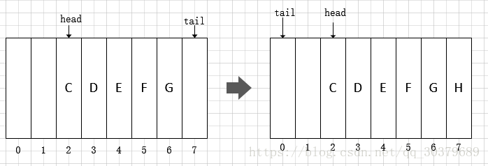

#### 扩容

``` {.java}
private void doubleCapacity() {
    assert head == tail; //扩容时头部索引和尾部索引肯定相等
    int p = head;
    int n = elements.length;
    //头部索引到数组末端(length-1处)共有多少元素
    int r = n - p; // number of elements to the right of p
    //容量翻倍
    int newCapacity = n << 1;
    //容量过大，溢出了
    if (newCapacity < 0)
        throw new IllegalStateException("Sorry, deque too big");
    //分配新空间
    Object[] a = new Object[newCapacity];
    //复制头部索引到数组末端的元素到新数组的头部
    System.arraycopy(elements, p, a, 0, r);
    //复制其余元素
    System.arraycopy(elements, 0, a, r, p);
    elements = a;
    //重置头尾索引
    head = 0;
    tail = n;
}
```

其扩容的过程如下图

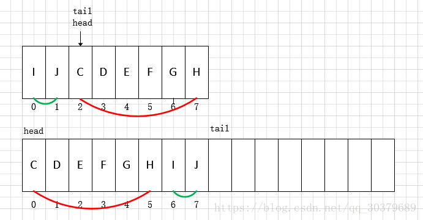

#### 删除元素

ArrayDeque支持从头尾两端移除元素，remove方法是通过poll来实现的。因为是基于数组的，在了解了环的原理后这段代码就比较容易理解了

``` {.java}
public E pollFirst() {
    int h = head;
    @SuppressWarnings("unchecked")
    E result = (E) elements[h];
    // Element is null if deque empty
    if (result == null)
        return null;
    elements[h] = null;     // Must null out slot
    head = (h + 1) & (elements.length - 1);
    return result;
}

public E pollLast() {
    int t = (tail - 1) & (elements.length - 1);
    @SuppressWarnings("unchecked")
    E result = (E) elements[t];
    if (result == null)
        return null;
    elements[t] = null;
    tail = t;
    return result;
}
```

#### 查找元素

``` {.java}
@SuppressWarnings("unchecked")
public E peekFirst() {
    // elements[head] is null if deque empty
    return (E) elements[head];
}

@SuppressWarnings("unchecked")
public E peekLast() {
    return (E) elements[(tail - 1) & (elements.length - 1)];
}
```

总结 ArrayDeque是Deque
接口的一种具体实现，是依赖于可变数组来实现的。ArrayDeque
没有容量限制，可根据需求自动进行扩容。ArrayDeque
可以作为栈来使用，效率要高于Stack；ArrayDeque
也可以作为队列来使用，效率相较于基于双向链表的LinkedList也要更好一些

Stack
=====

[Deque](https://www.cnblogs.com/mfrank/p/9600137.html)

栈是允许在同一端进行插入和删除操作的特殊线性表。允许进行插入和删除操作的一端称为栈顶(top)，另一端为栈底(bottom)；栈底固定，而栈顶浮动；栈中元素个数为零时称为空栈。插入一般称为进栈（PUSH），删除则称为退栈（POP）。

　　由于堆叠数据结构只允许在一端进行操作，因而按照后进先出（LIFO, Last
In First Out）的原理运作。栈也称为后进先出表。

　　官方建议使用 Deque(双端队列来替代Stack)

Deque 接口继承自 Queue接口，但 Deque
支持同时从两端添加或移除元素，因此又被成为双端队列。鉴于此，Deque
接口的实现可以被当作
FIFO队列使用，也可以当作LIFO队列（栈）来使用。官方也是推荐使用 Deque
的实现来替代 Stack。

ArrayDeque 是 Deque
接口的一种具体实现，是依赖于可变数组来实现的。ArrayDeque
没有容量限制，可根据需求自动进行扩容。ArrayDeque不支持值为 null 的元素.

``` {.java}
        Deque<Integer> stack = new ArrayDeque<Integer>();
        stack.addFirst(1);
        stack.addFirst(2);
        stack.addFirst(3);
        stack.addFirst(4);
        System.out.println(stack);
        stack.pollFirst();
        System.out.println(stack);
```

输出结果为:

\[4, 3, 2, 1\]\[3, 2, 1\]

1、ArrayDeque是什么？ArrayDeque是一个用循环数组实现的双端队列。
2、ArrayDeque如何使用？通过add，offer，poll等方法进行操作。
3、ArrayDeque的内部结构是怎样的？内部结构是一个循环数组。
4、ArrayDeque的各个方法是如何实现的？嗯，见上文。
5、ArrayDeque是如何扩容的？扩容成原来的两倍，然后将原来的内容复制到新数组中。
6、ArrayDeque的容量有什么限制？容量必须为2的幂次方，最小为8，默认为16.
7、ArrayDeque和LinkedList相比有什么优势？ArrayDeque通常来说比LinkedList更高效，因为可以在常量时间通过序号对元素进行定位，并且省去了对元素进行包装的空间和时间成本。
8、ArrayDeque的应用场景是什么？在很多场景下可以用来代替LinkedList，可以用做队列或者栈。

Set
===

[Java
Set集合的详解](https://blog.csdn.net/qq_33642117/article/details/52040345)

[Java集合之NavigableMap与NavigableSet接口](https://blog.csdn.net/u010126792/article/details/62236367)

Set的实现类主要有 HashSet 和 TreeSet ,LinkedHashSet 除了 hashSet
另外两个都是有序的

HashSet 底层使用 HashMap实现 如果实例的hashcode 相同 会调用 equals
当equals 都相同时 才认为是 同一个实例

TreeSet 底层使用 TreeMap实现

既然TreeSet可以自然排序,那么TreeSet必定是有排序规则的。

1:让存入的元素自定义比较规则。

2:给TreeSet指定排序规则。

方式一：元素自身具备比较性

元素自身具备比较性，需要元素实现Comparable接口，重写compareTo方法，也就是让元素自身具备比较性，这种方式叫做元素的自然排序也叫做默认排序。

方式二：容器具备比较性

当元素自身不具备比较性，或者自身具备的比较性不是所需要的。那么此时可以让容器自身具备。需要定义一个类实现接口Comparator，重写compare方法，并将该接口的子类实例对象作为参数传递给TreeMap集合的构造方法。

注意：当Comparable比较方式和Comparator比较方式同时存在时，以Comparator的比较方式为主；

注意：在重写compareTo或者compare方法时，必须要明确比较的主要条件相等时要比较次要条件。（假设姓名和年龄一直的人为相同的人，如果想要对人按照年龄的大小来排序，如果年龄相同的人，需要如何处理？不能直接return
0，因为可能姓名不同（年龄相同姓名不同的人是不同的人）。此时就需要进行次要条件判断（需要判断姓名），只有姓名和年龄同时相等的才可以返回0.）
通过return 0来判断唯一性。

LinkedHashSet 底层使用 LinkedHashMap实现 会保存 插入时的顺序;

NavigableSet接口 扩展了
SortedSet，具有了为给定搜索目标报告最接近匹配项的导航方法。方法
lower、floor、ceiling 和 higher
分别返回小于、小于等于、大于等于、大于给定元素的元素，如果不存在这样的元素，则返回
null。

``` {.java}
        //利用实现了NavigableSet的TreeSet做实验
            NavigableSet<String> sortedTreeSet = new TreeSet<String>(); // SortedSet接收TreeSet的实例 
            // 增加元素
            sortedTreeSet.add("aa");
            sortedTreeSet.add("bb");
            sortedTreeSet.add("cc");
            sortedTreeSet.add("dd");
            sortedTreeSet.add("ee");
            
            System.out.println(sortedTreeSet.size());//5个元素：5
            System.out.println( sortedTreeSet.ceiling("cc"));//大于等于cc的最小值，不存在返回null：cc
            System.out.println(sortedTreeSet.descendingSet());//返回Set的逆序视图：[ee, dd, cc, bb, aa]
            System.out.println(sortedTreeSet.floor("cc"));//返回小于等于cc的元素的最大值，不存在返回null：cc
            System.out.println( sortedTreeSet.headSet("cc"));//返回元素小于cc的元素：[aa,bb]
            System.out.println( sortedTreeSet.headSet("cc", true));//返回元素小于等于cc的元素视图:[aa,bb,cc]
            
            System.out.println(sortedTreeSet.higher("cc"));//返回大于给定元素的最小元素:dd
            System.out.println( sortedTreeSet.lower("cc"));//返回小于cc的最大元素:bb
            System.out.println(sortedTreeSet.pollFirst());//移除第一个元素:aa
            System.out.println(sortedTreeSet.pollLast());//移除最后一个元素:ee
            System.out.println( sortedTreeSet.subSet("aa",true,"dd",true));//返回部分视图，true表示包括当前元素:[bb,cc,dd]
            System.out.println( sortedTreeSet.subSet("bb","dd"));//返回部分视图包括前面的，不包括后面的:[bb,cc]
            System.out.println( sortedTreeSet.tailSet("cc"));//返回元素大于cc的元素视图,包括cc:[cc,dd]
            System.out.println( sortedTreeSet.tailSet("cc", false));//返回元素大于等于cc的元素视图:[dd]
            System.out.println( sortedTreeSet.iterator());//返回set上的升序排序的迭代器
            System.out.println( sortedTreeSet.descendingIterator());//返回set上的降序排序的迭代器
```

List
====

ArrayList
---------

[JDK1.8源码(五)——java.util.ArrayList
类](https://www.cnblogs.com/ysocean/p/8622264.html)

**ArrayList
是一个用数组实现的集合，支持随机访问，元素有序且可以重复。线程不安全**

#### 实现接口

``` {.java}
public class ArrayList<E> extends AbstractList<E> implements List<E>, RandomAccess, Cloneable, java.io.Serializable
```

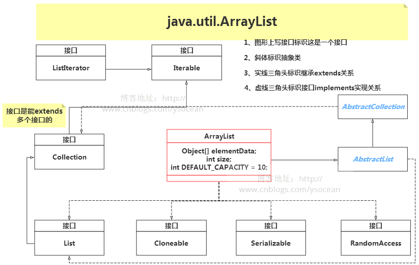

**①、实现 RandomAccess 接口**

　　这是一个标记接口，一般此标记接口用于
`List`实现，以表明它们支持快速（通常是恒定时间）的随机访问。该接口的主要目的是允许通用算法改变其行为，以便在应用于随机或顺序访问列表时提供良好的性能。

　　比如在工具类
Collections(这个工具类后面会详细讲解)中，应用二分查找方法时判断是否实现了
RandomAccess 接口：

``` {.java}
1     int binarySearch(List<? extends Comparable<? super T>> list, T key) {
2         if (list instanceof RandomAccess || list.size()<BINARYSEARCH_THRESHOLD)
3             return Collections.indexedBinarySearch(list, key);
4         else
5             return Collections.iteratorBinarySearch(list, key);
6     }
```

　　**②、实现 Cloneable 接口**

　　这个类是
java.lang.Cloneable，前面我们讲解[深拷贝和浅拷贝](http://www.cnblogs.com/ysocean/p/8482979.html)的原理时，我们介绍了浅拷贝可以通过调用
Object.clone() 方法来实现，但是调用该方法的对象必须要实现 Cloneable
接口，否则会抛出 CloneNoSupportException`异常。`

　　Cloneable 和 RandomAccess
接口一样也是一个标记接口，接口内无任何方法体和常量的声明，也就是说如果想克隆对象，必须要实现
Cloneable 接口，表明该类是可以被克隆的。

　　**③、实现 Serializable 接口**

　　这个没什么好说的，也是标记接口，表示能被序列化。

　　**④、实现 List 接口**

　　这个接口是 List
类集合的上层接口，定义了实现该接口的类都必须要实现的一组方法，如下所示，下面我们会对这一系列方法的实现做详细介绍。

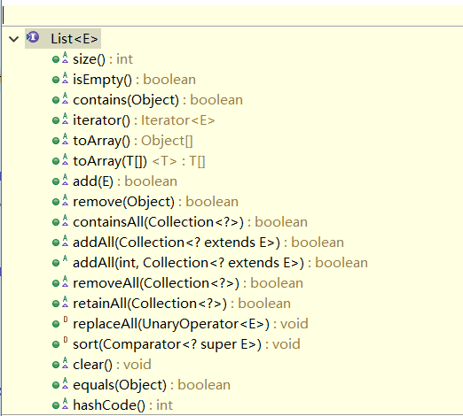

#### 字段属性

``` {.java}
        //集合的默认大小
        private static final int DEFAULT_CAPACITY = 10;
        //空的数组实例
        private static final Object[] EMPTY_ELEMENTDATA = {};
        //这也是一个空的数组实例，和EMPTY_ELEMENTDATA空数组相比是用于了解添加元素时数组膨胀多少
        private static final Object[] DEFAULTCAPACITY_EMPTY_ELEMENTDATA = {};
        //存储 ArrayList集合的元素，集合的长度即这个数组的长度
        //1、当 elementData == DEFAULTCAPACITY_EMPTY_ELEMENTDATA 时将会清空 ArrayList
        //2、当添加第一个元素时，elementData 长度会扩展为 DEFAULT_CAPACITY=10
        transient Object[] elementData;
        //表示集合的长度
        private int size;
```

#### 构造函数

``` {.java}
 public ArrayList() {
        this.elementData = DEFAULTCAPACITY_EMPTY_ELEMENTDATA;
     }
```

　　此无参构造函数将创建一个 DEFAULTCAPACITY\_EMPTY\_ELEMENTDATA
声明的数组，注意此时初始容量是0，而不是大家以为的 10。

　　**注意：根据默认构造函数创建的集合，ArrayList list = new
ArrayList();此时集合长度是0.**

``` {.java}
    public ArrayList(int initialCapacity) {
        if (initialCapacity > 0) {
            this.elementData = new Object[initialCapacity];
        } else if (initialCapacity == 0) {
            this.elementData = EMPTY_ELEMENTDATA;
        } else {
            throw new IllegalArgumentException("Illegal Capacity: "+
                                               initialCapacity);
        }
    }
```

初始化集合大小创建 ArrayList
集合。当大于0时，给定多少那就创建多大的数组；当等于0时，创建一个空数组；当小于0时，抛出异常。

``` {.java}
public ArrayList(Collection<? extends E> c) {
        elementData = c.toArray();
        if ((size = elementData.length) != 0) {
            // c.toArray might (incorrectly) not return Object[] (see 6260652)
            if (elementData.getClass() != Object[].class)
                elementData = Arrays.copyOf(elementData, size, Object[].class);
        } else {
            // replace with empty array.
            this.elementData = EMPTY_ELEMENTDATA;
        }
    }
```

　　这是将已有的集合复制到 ArrayList 集合中去。

#### 添加元素

通过前面的字段属性和构造函数，我们知道 ArrayList
集合是由数组构成的，那么向 ArrayList
中添加元素，也就是向数组赋值。我们知道一个数组的声明是能确定大小的，而使用
ArrayList 时，好像是能添加任意多个元素，这就涉及到数组的扩容。

　　扩容的核心方法就是调用前面我们讲过的**Arrays.copyOf**
方法，创建一个更大的数组，然后将原数组元素拷贝过去即可。下面我们看看具体实现：

``` {.java}
    public boolean add(E e) {
        ensureCapacityInternal(size + 1);  //添加元素之前，首先要确定集合的大小
        elementData[size++] = e;
        return true;
    }
```

　　如上所示，在通过调用 add 方法添加元素之前，我们要首先调用
ensureCapacityInternal
方法来确定集合的大小，如果集合满了，则要进行扩容操作。

``` {.java}
 1     private void ensureCapacityInternal(int minCapacity) {//这里的minCapacity 是集合当前大小+1
 2         //elementData 是实际用来存储元素的数组，注意数组的大小和集合的大小不是相等的，前面的size是指集合大小
 3         ensureExplicitCapacity(calculateCapacity(elementData, minCapacity));
 4     }
 5     private static int calculateCapacity(Object[] elementData, int minCapacity) {
 6         if (elementData == DEFAULTCAPACITY_EMPTY_ELEMENTDATA) {//如果数组为空，则从size+1的值和默认值10中取最大的
 7             return Math.max(DEFAULT_CAPACITY, minCapacity);
 8         }
 9         return minCapacity;//不为空，则返回size+1
10     }
11     private void ensureExplicitCapacity(int minCapacity) {
12         modCount++;
13 
14         // overflow-conscious code
15         if (minCapacity - elementData.length > 0)
16             grow(minCapacity);
17     }
```

　　在 ensureExplicitCapacity
方法中，首先对修改次数modCount加一，这里的modCount给ArrayList的迭代器使用的，在并发操作被修改时，提供快速失败行为（保证modCount在迭代期间不变，否则抛出ConcurrentModificationException异常，可以查看源码865行），接着判断minCapacity是否大于当前ArrayList内部数组长度，大于的话调用grow方法对内部数组elementData扩容，grow方法代码如下：

``` {.java}
 1     private void grow(int minCapacity) {
 2         int oldCapacity = elementData.length;//得到原始数组的长度
 3         int newCapacity = oldCapacity + (oldCapacity >> 1);//新数组的长度等于原数组长度的1.5倍
 4         if (newCapacity - minCapacity < 0)//当新数组长度仍然比minCapacity小，则为保证最小长度，新数组等于minCapacity
 5             newCapacity = minCapacity;
 6         //MAX_ARRAY_SIZE = Integer.MAX_VALUE - 8 = 2147483639
 7         if (newCapacity - MAX_ARRAY_SIZE > 0)//当得到的新数组长度比 MAX_ARRAY_SIZE 大时，调用 hugeCapacity 处理大数组
 8             newCapacity = hugeCapacity(minCapacity);
 9         //调用 Arrays.copyOf 将原数组拷贝到一个大小为newCapacity的新数组（注意是拷贝引用）
10         elementData = Arrays.copyOf(elementData, newCapacity);
11     }
12     
13     private static int hugeCapacity(int minCapacity) {
14         if (minCapacity < 0) // 
15             throw new OutOfMemoryError();
16         return (minCapacity > MAX_ARRAY_SIZE) ? //minCapacity > MAX_ARRAY_SIZE,则新数组大小为Integer.MAX_VALUE
17             Integer.MAX_VALUE :
18             MAX_ARRAY_SIZE;
19     }
```

　　对于 ArrayList 集合添加元素，我们总结一下：

　　**①、当通过 ArrayList() 构造一个空集合，初始长度是为0的，第 1
次添加元素，会创建一个长度为10的数组，并将该元素赋值到数组的第一个位置。**

　　**②、第 2
次添加元素，集合不为空，而且由于集合的长度size+1是小于数组的长度10，所以直接添加元素到数组的第二个位置，不用扩容。**

　　**③、第 11 次添加元素，此时 size+1 =
11，而数组长度是10，这时候创建一个长度为10+10\*0.5 = 15
的数组（扩容1.5倍），然后将原数组元素引用拷贝到新数组。并将第 11
次添加的元素赋值到新数组下标为10的位置。**

　　**④、第 Integer.MAX\_VALUE - 8 = 2147483639，然后
2147483639%1.5=1431655759（这个数是要进行扩容）
次添加元素，为了防止溢出，此时会直接创建一个 1431655759+1
大小的数组，这样一直，每次添加一个元素，都只扩大一个范围。**

　　**⑤、第 Integer.MAX\_VALUE - 7 次添加元素时，创建一个大小为
Integer.MAX\_VALUE 的数组，在进行元素添加。**

　　**⑥、第 Integer.MAX\_VALUE + 1 次添加元素时，抛出 OutOfMemoryError
异常。**

　　**注意：能向集合中添加 null 的，因为数组可以有 null 值存在。**

``` {.java}
1 Object[] obj = {null,1};
2 
3 ArrayList list = new ArrayList();
4 list.add(null);
5 list.add(1);
6 System.out.println(list.size());//2
```

#### 删除元素

①、根据索引删除元素

``` {.java}
 1     public E remove(int index) {
 2         rangeCheck(index);//判断给定索引的范围，超过集合大小则抛出异常
 3 
 4         modCount++;
 5         E oldValue = elementData(index);//得到索引处的删除元素
 6 
 7         int numMoved = size - index - 1;
 8         if (numMoved > 0)//size-index-1 > 0 表示 0<= index < (size-1),即索引不是最后一个元素
 9             //通过 System.arraycopy()将数组elementData 的下标index+1之后长度为 numMoved的元素拷贝到从index开始的位置
10             System.arraycopy(elementData, index+1, elementData, index,
11                              numMoved);
12         elementData[--size] = null; //将数组最后一个元素置为 null，便于垃圾回收
13 
14         return oldValue;
15     }
```

remove(int index) 方法表示删除索引index处的元素，首先通过
rangeCheck(index)
方法判断给定索引的范围，超过集合大小则抛出异常；接着通过
System.arraycopy
方法对数组进行自身拷贝。关于这个方法的用法可以参考[这篇博客](http://www.cnblogs.com/ysocean/p/8616122.html#_label3)。

②、直接删除指定元素

``` {.java}
 1     public boolean remove(Object o) {
 2         if (o == null) {//如果删除的元素为null
 3             for (int index = 0; index < size; index++)
 4                 if (elementData[index] == null) {
 5                     fastRemove(index);
 6                     return true;
 7                 }
 8         } else {//不为null，通过equals方法判断对象是否相等
 9             for (int index = 0; index < size; index++)
10                 if (o.equals(elementData[index])) {
11                     fastRemove(index);
12                     return true;
13                 }
14         }
15         return false;
16     }
17 
18 
19     private void fastRemove(int index) {
20         modCount++;
21         int numMoved = size - index - 1;
22         if (numMoved > 0)
23             System.arraycopy(elementData, index+1, elementData, index,
24                              numMoved);
25         elementData[--size] = null; // 
26     }
```

　　remove(Object
o)方法是删除第一次出现的该元素。然后通过System.arraycopy进行数组自身拷贝。

#### 修改元素

通过调用 set(int index, E element) 方法在指定索引 index 处的元素替换为
element。并返回原数组的元素。

``` {.java}
1     public E set(int index, E element) {
2         rangeCheck(index);//判断索引合法性
3 
4         E oldValue = elementData(index);//获得原数组指定索引的元素
5         elementData[index] = element;//将指定所引处的元素替换为 element
6         return oldValue;//返回原数组索引元素
7     }
```

　　通过调用 rangeCheck(index) 来检查索引合法性。

``` {.java}
    private void rangeCheck(int index) {
        if (index >= size)
            throw new IndexOutOfBoundsException(outOfBoundsMsg(index));
    }
```

　　当索引为负数时，会抛出 java.lang.ArrayIndexOutOfBoundsException
异常。当索引大于集合长度时，会抛出 IndexOutOfBoundsException 异常。

#### 查找元素

①、根据索引查找元素

``` {.java}
1     public E get(int index) {
2         rangeCheck(index);
3 
4         return elementData(index);
5     }
```

　　同理，首先还是判断给定索引的合理性，然后直接返回处于该下标位置的数组元素。

　　②、根据元素查找索引

``` {.java}
 1     public int indexOf(Object o) {
 2         if (o == null) {
 3             for (int i = 0; i < size; i++)
 4                 if (elementData[i]==null)
 5                     return i;
 6         } else {
 7             for (int i = 0; i < size; i++)
 8                 if (o.equals(elementData[i]))
 9                     return i;
10         }
11         return -1;
12     }
```

　　注意：indexOf(Object o)
方法是返回第一次出现该元素的下标，如果没有则返回 -1。

　　还有 lastIndexOf(Object o) 方法是返回最后一次出现该元素的下标。

#### 遍历集合

①、普通 for 循环遍历

　　前面我们介绍查找元素时，知道可以通过get(int
index)方法，根据索引查找元素，那么遍历同理：

``` {.java}
1 ArrayList list = new ArrayList();
2 list.add("a");
3 list.add("b");
4 list.add("c");
5 for(int i = 0 ; i < list.size() ; i++){
6     System.out.print(list.get(i)+" ");
7 }
```

　　②、迭代器 iterator

　　先看看具体用法：

``` {.java}
1 ArrayList<String> list = new ArrayList<>();
2 list.add("a");
3 list.add("b");
4 list.add("c");
5 Iterator<String> it = list.iterator();
6 while(it.hasNext()){
7     String str = it.next();
8     System.out.print(str+" ");
9 }
```

　　在介绍 ArrayList 时，我们知道该类实现了 List 接口，而 List
接口又继承了 Collection 接口，Collection 接口又继承了 Iterable
接口，该接口有个 Iterator<T> iterator() 方法，能获取 Iterator
对象，能用该对象进行集合遍历，为什么能用该对象进行集合遍历？我们再看看
ArrayList 类中的该方法实现：

    1     public Iterator<E> iterator() {
    2         return new Itr();
    3     }

　　该方法是返回一个 Itr 对象，这个类是 ArrayList 的内部类。

``` {.java}
private class Itr implements Iterator<E> {
        int cursor; // 游标， 下一个要返回的元素的索引
        int lastRet = -1; // 返回最后一个元素的索引; 如果没有这样的话返回-1.
        int expectedModCount = modCount;

        // 通过 cursor ！= size 判断是否还有下一个元素
        public boolean hasNext() {
            return cursor != size;
        }

        @SuppressWarnings("unchecked")
        public E next() {
            checkForComodification();// 迭代器进行元素迭代时同时进行增加和删除操作，会抛出异常
            int i = cursor;
            if (i >= size)
                throw new NoSuchElementException();
            Object[] elementData = ArrayList.this.elementData;
            if (i >= elementData.length)
                throw new ConcurrentModificationException();
            cursor = i + 1;// 游标向后移动一位
            return (E) elementData[lastRet = i];// 返回索引为i处的元素，并将 lastRet赋值为i
        }

        public void remove() {
            if (lastRet < 0)
                throw new IllegalStateException();
            checkForComodification();

            try {
                ArrayList.this.remove(lastRet);// 调用ArrayList的remove方法删除元素
                cursor = lastRet;// 游标指向删除元素的位置，本来是lastRet+1的，这里删除一个元素，然后游标就不变了
                lastRet = -1;// lastRet恢复默认值-1
                expectedModCount = modCount;// expectedModCount值和modCount同步，因为进行add和remove操作，modCount会加1
            } catch (IndexOutOfBoundsException ex) {
                throw new ConcurrentModificationException();
            }
        }

        @Override
        @SuppressWarnings("unchecked")
        public void forEachRemaining(Consumer<? super E> consumer) {// 便于进行forEach循环
            Objects.requireNonNull(consumer);
            final int size = ArrayList.this.size;
            int i = cursor;
            if (i >= size) {
                return;
            }
            final Object[] elementData = ArrayList.this.elementData;
            if (i >= elementData.length) {
                throw new ConcurrentModificationException();
            }
            while (i != size && modCount == expectedModCount) {
                consumer.accept((E) elementData[i++]);
            }
            // update once at end of iteration to reduce heap write traffic
            cursor = i;
            lastRet = i - 1;
            checkForComodification();
        }

        // 前面在新增元素add() 和 删除元素 remove() 时，我们可以看到 modCount++。修改set() 是没有的
        // 也就是说不能在迭代器进行元素迭代时进行增加和删除操作，否则抛出异常
        final void checkForComodification() {
            if (modCount != expectedModCount)
                throw new ConcurrentModificationException();
        }
    }
```

　　注意在进行 next() 方法调用的时候，会进行 checkForComodification()
调用，该方法表示迭代器进行元素迭代时，如果同时进行增加和删除操作，会抛出
ConcurrentModificationException 异常。比如：

``` {.java}
ArrayList<String> list = new ArrayList<>();
list.add("a");
list.add("b");
list.add("c");
Iterator<String> it = list.iterator();
while(it.hasNext()){
    String str = it.next();
    System.out.print(str+" ");
    list.remove(str);//集合遍历时进行删除或者新增操作，都会抛出 ConcurrentModificationException 异常
    //list.add(str);
    list.set(0, str);//修改操作不会造成异常
}
```

　　解决办法是不调用 ArrayList.remove() 方法，转而调用 迭代器的 remove()
方法：

``` {.java}
Iterator<String> it = list.iterator();
while(it.hasNext()){
    String str = it.next();
    System.out.print(str+" ");
    //list.remove(str);//集合遍历时进行删除或者新增操作，都会抛出 ConcurrentModificationException 异常
    it.remove();
}
```

　　**注意：迭代器只能向后遍历，不能向前遍历，能够删除元素，但是不能新增元素。**

　　③、迭代器的变种 forEach

``` {.java}
ArrayList<String> list = new ArrayList<>();
list.add("a");
list.add("b");
list.add("c");
for(String str : list){
    System.out.print(str + " ");
}
```

　　这种语法可以看成是 JDK 的一种语法糖，通过反编译 class
文件，我们可以看到生成的 java 文件，其具体实现还是通过调用 Iterator
迭代器进行遍历的。如下：

``` {.java}
ArrayList list = new ArrayList();
        list.add("a");
        list.add("b");
        list.add("c");
        String str;
        for (Iterator iterator1 = list.iterator(); iterator1.hasNext(); System.out.print((new StringBuilder(String.valueOf(str))).append(" ").toString()))
            str = (String)iterator1.next();
```

　　④、迭代器 ListIterator

　　还是先看看具体用法：

``` {.java}
ArrayList<String> list = new ArrayList<>();
list.add("a");
list.add("b");
list.add("c");
ListIterator<String> listIt = list.listIterator();

//向后遍历
while(listIt.hasNext()){
    System.out.print(listIt.next()+" ");//a b c
}

//向后前遍历,此时由于上面进行了向后遍历，游标已经指向了最后一个元素，所以此处向前遍历能有值
while(listIt.hasPrevious()){
    System.out.print(listIt.previous()+" ");//c b a
}
```

　　还能一边遍历，一边进行新增或者删除操作：

``` {.java}
ArrayList<String> list = new ArrayList<>();
list.add("a");
list.add("b");
list.add("c");
ListIterator<String> listIt = list.listIterator();

//向后遍历
while(listIt.hasNext()){
    System.out.print(listIt.next()+" ");//a b c
    listIt.add("1");//在每一个元素后面增加一个元素 "1"
}

//向后前遍历,此时由于上面进行了向后遍历，游标已经指向了最后一个元素，所以此处向前遍历能有值
while(listIt.hasPrevious()){
    System.out.print(listIt.previous()+" ");//1 c 1 b 1 a 
}
```

　　**也就是说相比于 Iterator 迭代器，这里的 ListIterator
多出了能向前迭代，以及能够新增元素**。

#### SubList

在 ArrayList 中有这样一个方法：

``` {.java}
public List<E> subList(int fromIndex, int toIndex) {
         subListRangeCheck(fromIndex, toIndex, size);
         return new SubList(this, 0, fromIndex, toIndex);
     }
```

作用是返回从 fromIndex(包括) 开始的下标，到 toIndex(不包括)
结束的下标之间的元素**视图**。如下：

``` {.java}
ArrayList<String> list = new ArrayList<>();
list.add("a");
list.add("b");
list.add("c");

List<String> subList = list.subList(0, 1);
for(String str : subList){
    System.out.print(str + " ");//a
}
```

这里出现了 SubList 类，这也是 ArrayList 中的一个内部类。

　　**注意：返回的是原集合的视图，也就是说，如果对 subList
出来的集合进行修改或新增操作，那么原始集合也会发生同样的操作。**

``` {.java}
ArrayList<String> list = new ArrayList<>();
list.add("a");
list.add("b");
list.add("c");

List<String> subList = list.subList(0, 1);
for(String str : subList){
    System.out.print(str + " ");//a
}
subList.add("d");
System.out.println(subList.size());//2
System.out.println(list.size());//4,原始集合长度也增加了
```

想要独立出来一个集合，解决办法如下：

``` {.java}
List<String> subList = new ArrayList<>(list.subList(0, 1));
```

#### trimToSize

``` {.java}
public void trimToSize() {
        modCount++;
        if (size < elementData.length) {
            elementData = Arrays.copyOf(elementData, size);
        }
    }
```

该方法用于回收多余的内存。也就是说一旦我们确定集合不在添加多余的元素之后，调用
trimToSize() 方法会将实现集合的数组大小刚好调整为集合元素的大小。

　　注意：该方法会花时间来复制数组元素，所以应该在确定不会添加元素之后在调用。

LinkedList
----------

[JDK1.8源码(六)——java.util.LinkedList
类](https://www.cnblogs.com/ysocean/p/8657850.html)

**LinkedList 是一个用链表实现的集合，元素有序且可以重复。线程不安全**

#### 接口实现

``` {.java}
 public class LinkedList<E>
     extends AbstractSequentialList<E>
     implements List<E>, Deque<E>, Cloneable, java.io.Serializable
```


和 ArrayList 集合一样，LinkedList
集合也实现了Cloneable接口和Serializable接口，分别用来支持克隆以及支持序列化。List
接口也不用多说，定义了一套 List 集合类型的方法规范。

　　注意，相对于 ArrayList 集合，LinkedList 集合多实现了一个 **Deque**
接口，这是一个双向队列接口，双向队列就是两端都可以进行增加和删除操作。

#### 字段属性

``` {.java}
//链表元素（节点）的个数
    transient int size = 0;

    /**
     *指向第一个节点的指针
     */
    transient Node<E> first;

    /**
     *指向最后一个节点的指针
     */
    transient Node<E> last;
```

注意这里出现了一个 Node 类，这是 LinkedList
类中的一个内部类，其中每一个元素就代表一个 Node 类对象，LinkedList
集合就是由许多个 Node 对象类似于手拉着手构成。

``` {.java}
private static class Node<E> {
        E item;//实际存储的元素
        Node<E> next;//指向上一个节点的引用
        Node<E> prev;//指向下一个节点的引用

        //构造函数
        Node(Node<E> prev, E element, Node<E> next) {
            this.item = element;
            this.next = next;
            this.prev = prev;
        }
    }
```

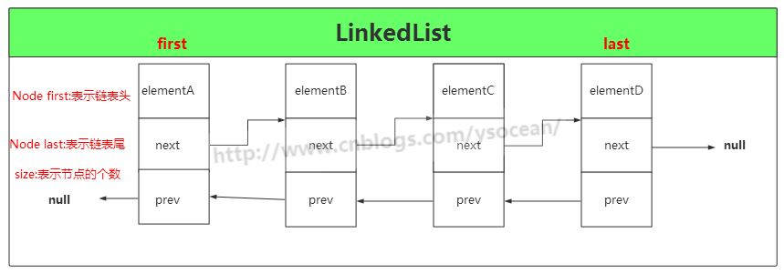

#### 构造函数

``` {.java}
public LinkedList() {
    }
public LinkedList(Collection<? extends E> c) {
        this();
        addAll(c);
    }
```

LinkedList
有两个构造函数，第一个是默认的空的构造函数，第二个是将已有元素的集合Collection
的实例添加到 LinkedList 中，调用的是 addAll()
方法，这个方法下面我们会介绍。

　　注意：LinkedList
是没有初始化链表大小的构造函数，因为链表不像数组，一个定义好的数组是必须要有确定的大小，然后去分配内存空间，而链表不一样，它没有确定的大小，通过指针的移动来指向下一个内存地址的分配。

#### 添加元素

①、addFirst(E e)

　　将指定元素添加到链表头

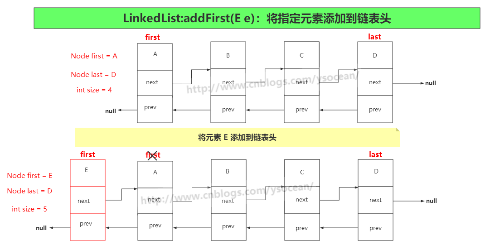

``` {.java}
//将指定的元素附加到链表头节点
    public void addFirst(E e) {
        linkFirst(e);
    }
    private void linkFirst(E e) {
        final Node<E> f = first;//将头节点赋值给 f
        final Node<E> newNode = new Node<>(null, e, f);//将指定元素构造成一个新节点，此节点的指向下一个节点的引用为头节点
        first = newNode;//将新节点设为头节点，那么原先的头节点 f 变为第二个节点
        if (f == null)//如果第二个节点为空，也就是原先链表是空
            last = newNode;//将这个新节点也设为尾节点（前面已经设为头节点了）
        else
            f.prev = newNode;//将原先的头节点的上一个节点指向新节点
        size++;//节点数加1
        modCount++;//和ArrayList中一样，iterator和listIterator方法返回的迭代器和列表迭代器实现使用。
    }
```

②、addLast(E e)和add(E e)

　　将指定元素添加到链表尾

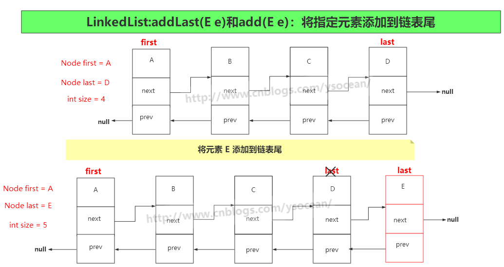

``` {.java}
//将元素添加到链表末尾
    public void addLast(E e) {
        linkLast(e);
    }
    //将元素添加到链表末尾
    public boolean add(E e) {
        linkLast(e);
        return true;
    }
    void linkLast(E e) {
        final Node<E> l = last;//将l设为尾节点
        final Node<E> newNode = new Node<>(l, e, null);//构造一个新节点，节点上一个节点引用指向尾节点l
        last = newNode;//将尾节点设为创建的新节点
        if (l == null)//如果尾节点为空，表示原先链表为空
            first = newNode;//将头节点设为新创建的节点（尾节点也是新创建的节点）
        else
            l.next = newNode;//将原来尾节点下一个节点的引用指向新节点
        size++;//节点数加1
        modCount++;//和ArrayList中一样，iterator和listIterator方法返回的迭代器和列表迭代器实现使用。
    }
```

③、add(int index, E element)

　　将指定的元素插入此列表中的指定位置

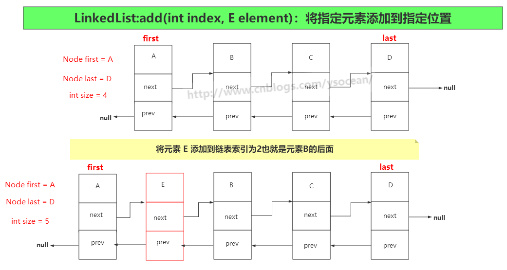

``` {.java}
//将指定的元素插入此列表中的指定位置
    public void add(int index, E element) {
        //判断索引 index >= 0 && index <= size中时抛出IndexOutOfBoundsException异常
        checkPositionIndex(index);

        if (index == size)//如果索引值等于链表大小
            linkLast(element);//将节点插入到尾节点
        else
            linkBefore(element, node(index));
    }
    void linkLast(E e) {
        final Node<E> l = last;//将l设为尾节点
        final Node<E> newNode = new Node<>(l, e, null);//构造一个新节点，节点上一个节点引用指向尾节点l
        last = newNode;//将尾节点设为创建的新节点
        if (l == null)//如果尾节点为空，表示原先链表为空
            first = newNode;//将头节点设为新创建的节点（尾节点也是新创建的节点）
        else
            l.next = newNode;//将原来尾节点下一个节点的引用指向新节点
        size++;//节点数加1
        modCount++;//和ArrayList中一样，iterator和listIterator方法返回的迭代器和列表迭代器实现使用。
    }
    Node<E> node(int index) {
        if (index < (size >> 1)) {//如果插入的索引在前半部分
            Node<E> x = first;//设x为头节点
            for (int i = 0; i < index; i++)//从开始节点到插入节点索引之间的所有节点向后移动一位
                x = x.next;
            return x;
        } else {//如果插入节点位置在后半部分
            Node<E> x = last;//将x设为最后一个节点
            for (int i = size - 1; i > index; i--)//从最后节点到插入节点的索引位置之间的所有节点向前移动一位
                x = x.prev;
            return x;
        }
    }
    void linkBefore(E e, Node<E> succ) {
        final Node<E> pred = succ.prev;//将pred设为插入节点的上一个节点
        final Node<E> newNode = new Node<>(pred, e, succ);//将新节点的上引用设为pred,下引用设为succ
        succ.prev = newNode;//succ的上一个节点的引用设为新节点
        if (pred == null)//如果插入节点的上一个节点引用为空
            first = newNode;//新节点就是头节点
        else
            pred.next = newNode;//插入节点的下一个节点引用设为新节点
        size++;
        modCount++;
    }
```

④、addAll(Collection&lt;? extends E&gt; c)

　　按照指定集合的迭代器返回的顺序，将指定集合中的所有元素追加到此列表的末尾

　　此方法还有一个 addAll(int index, Collection&lt;? extends E&gt;
c)，将集合 c 中所有元素插入到指定索引的位置。其实

　　　　**addAll(Collection&lt;? extends E&gt; c) == addAll(size,
Collection&lt;? extends E&gt; c)**

　　源码如下：

``` {.java}
//按照指定集合的​​迭代器返回的顺序，将指定集合中的所有元素追加到此列表的末尾。
    public boolean addAll(Collection<? extends E> c) {
        return addAll(size, c);
    }
    //将集合 c 中所有元素插入到指定索引的位置。
    public boolean addAll(int index, Collection<? extends E> c) {
        //判断索引 index >= 0 && index <= size中时抛出IndexOutOfBoundsException异常
        checkPositionIndex(index);

        Object[] a = c.toArray();//将集合转换成一个 Object 类型的数组
        int numNew = a.length;
        if (numNew == 0)//如果添加的集合为空，直接返回false
            return false;

        Node<E> pred, succ;
        if (index == size) {//如果插入的位置等于链表的长度，就是将原集合元素附加到链表的末尾
            succ = null;
            pred = last;
        } else {
            succ = node(index);
            pred = succ.prev;
        }

        for (Object o : a) {//遍历要插入的元素
            @SuppressWarnings("unchecked") E e = (E) o;
            Node<E> newNode = new Node<>(pred, e, null);
            if (pred == null)
                first = newNode;
            else
                pred.next = newNode;
            pred = newNode;
        }

        if (succ == null) {
            last = pred;
        } else {
            pred.next = succ;
            succ.prev = pred;
        }

        size += numNew;
        modCount++;
        return true;
    }
```

看到上面向 LinkedList 集合中添加元素的各种方式，我们发现LinkedList
每次添加元素只是改变元素的上一个指针引用和下一个指针引用，而且没有扩容。，对比于
ArrayList
，需要扩容，而且在中间插入元素时，后面的所有元素都要移动一位，两者插入元素时的效率差异很大，下一篇博客会对这两者的效率，以及何种情况选择何种集合进行分析。

　　还有，每次进行添加操作，都有modCount++ 的操作，

#### 删除元素

删除元素和添加元素一样，也是通过更改指向上一个节点和指向下一个节点的引用即可，这里就不作图形展示了。

　　①、remove()和removeFirst()

　　从此列表中移除并返回第一个元素

``` {.java}
//从此列表中移除并返回第一个元素
    public E remove() {
        return removeFirst();
    }
    //从此列表中移除并返回第一个元素
    public E removeFirst() {
        final Node<E> f = first;//f设为头结点
        if (f == null)
            throw new NoSuchElementException();//如果头结点为空，则抛出异常
        return unlinkFirst(f);
    }
    private E unlinkFirst(Node<E> f) {
        // assert f == first && f != null;
        final E element = f.item;
        final Node<E> next = f.next;//next 为头结点的下一个节点
        f.item = null;
        f.next = null; // 将节点的元素以及引用都设为 null，便于垃圾回收
        first = next; //修改头结点为第二个节点
        if (next == null)//如果第二个节点为空（当前链表只存在第一个元素）
            last = null;//那么尾节点也置为 null
        else
            next.prev = null;//如果第二个节点不为空，那么将第二个节点的上一个引用置为 null
        size--;
        modCount++;
        return element;
    }
```

　　②、removeLast()

　　从该列表中删除并返回最后一个元素

``` {.java}
//从该列表中删除并返回最后一个元素
    public E removeLast() {
        final Node<E> l = last;
        if (l == null)//如果尾节点为空，表示当前集合为空，抛出异常
            throw new NoSuchElementException();
        return unlinkLast(l);
    }
    
    private E unlinkLast(Node<E> l) {
        // assert l == last && l != null;
        final E element = l.item;
        final Node<E> prev = l.prev;
        l.item = null;
        l.prev = null; //将节点的元素以及引用都设为 null，便于垃圾回收
        last = prev;//尾节点为倒数第二个节点
        if (prev == null)//如果倒数第二个节点为null
            first = null;//那么将节点也置为 null
        else
            prev.next = null;//如果倒数第二个节点不为空，那么将倒数第二个节点的下一个引用置为 null
        size--;
        modCount++;
        return element;
    }
```

　　③、remove(int index)

　　删除此列表中指定位置的元素

``` {.java}
//删除此列表中指定位置的元素
    public E remove(int index) {
        //判断索引 index >= 0 && index <= size中时抛出IndexOutOfBoundsException异常
        checkElementIndex(index);
        return unlink(node(index));
    }
    E unlink(Node<E> x) {
        // assert x != null;
        final E element = x.item;
        final Node<E> next = x.next;
        final Node<E> prev = x.prev;

        if (prev == null) {//如果删除节点位置的上一个节点引用为null（表示删除第一个元素）
            first = next;//将头结点置为第一个元素的下一个节点
        } else {//如果删除节点位置的上一个节点引用不为null
            prev.next = next;//将删除节点的上一个节点的下一个节点引用指向删除节点的下一个节点（去掉删除节点）
            x.prev = null;//删除节点的上一个节点引用置为null
        }

        if (next == null) {//如果删除节点的下一个节点引用为null（表示删除最后一个节点）
            last = prev;//将尾节点置为删除节点的上一个节点
        } else {//不是删除尾节点
            next.prev = prev;//将删除节点的下一个节点的上一个节点的引用指向删除节点的上一个节点
            x.next = null;//将删除节点的下一个节点引用置为null
        }

        x.item = null;//删除节点内容置为null，便于垃圾回收
        size--;
        modCount++;
        return element;
    }
```

　　④、remove(Object o)

　　如果存在，则从该列表中删除指定元素的第一次出现

　　此方法本质上和 remove(int index)
没多大区别，通过循环判断元素进行删除，需要注意的是，是删除第一次出现的元素，不是所有的。

``` {.java}
public boolean remove(Object o) {
        if (o == null) {
            for (Node<E> x = first; x != null; x = x.next) {
                if (x.item == null) {
                    unlink(x);
                    return true;
                }
            }
        } else {
            for (Node<E> x = first; x != null; x = x.next) {
                if (o.equals(x.item)) {
                    unlink(x);
                    return true;
                }
            }
        }
        return false;
    }
```

#### 修改元素

``` {.java}
public E set(int index, E element) {
        //判断索引 index >= 0 && index <= size中时抛出IndexOutOfBoundsException异常
        checkElementIndex(index);
        Node<E> x = node(index);//获取指定索引处的元素
        E oldVal = x.item;
        x.item = element;//将指定位置的元素替换成要修改的元素
        return oldVal;//返回指定索引位置原来的元素
    }
```

　　这里主要是通过 node(index)
方法获取指定索引位置的节点，然后修改此节点位置的元素即可。

#### 查找元素

①、getFirst()

　　返回此列表中的第一个元素

``` {.java}
public E getFirst() {
        final Node<E> f = first;
        if (f == null)
            throw new NoSuchElementException();
        return f.item;
    }
```

②、getLast()

　　返回此列表中的最后一个元素

``` {.java}
public E getLast() {
        final Node<E> l = last;
        if (l == null)
            throw new NoSuchElementException();
        return l.item;
    }
```

③、get(int index)

　　返回指定索引处的元素

``` {.java}
 public E get(int index) {
         checkElementIndex(index);
         return node(index).item;
     }
```

④、indexOf(Object o)

　　返回此列表中指定元素第一次出现的索引，如果此列表不包含元素，则返回-1。

``` {.java}
//返回此列表中指定元素第一次出现的索引，如果此列表不包含元素，则返回-1。
    public int indexOf(Object o) {
        int index = 0;
        if (o == null) {//如果查找的元素为null(LinkedList可以允许null值)
            for (Node<E> x = first; x != null; x = x.next) {//从头结点开始不断向下一个节点进行遍历
                if (x.item == null)
                    return index;
                index++;
            }
        } else {//如果查找的元素不为null
            for (Node<E> x = first; x != null; x = x.next) {
                if (o.equals(x.item))
                    return index;
                index++;
            }
        }
        return -1;//找不到返回-1
    }
```

#### 遍历集合

①、普通 for 循环

``` {.java}
LinkedList<String> linkedList = new LinkedList<>();
linkedList.add("A");
linkedList.add("B");
linkedList.add("C");
linkedList.add("D");
for(int i = 0 ; i < linkedList.size() ; i++){
    System.out.print(linkedList.get(i)+" ");//A B C D
}
```

​ 代码很简单，我们就利用 LinkedList 的 get(int index)
方法，遍历出所有的元素。

　　但是需要注意的是， get(int index)
方法每次都要遍历该索引之前的所有元素，这句话这么理解：

　　比如上面的一个 LinkedList 集合，我放入了
A,B,C,D是个元素。总共需要四次遍历：

　　第一次遍历打印 A：只需遍历一次。

　　第二次遍历打印 B：需要先找到 A，然后再找到 B 打印。

　　第三次遍历打印 C：需要先找到 A，然后找到 B，最后找到 C 打印。

　　第四次遍历打印 D：需要先找到 A，然后找到 B，然后找到 C，最后找到 D。

　　这样如果集合元素很多，越查找到后面（当然此处的get方法进行了优化，查找前半部分从前面开始遍历，查找后半部分从后面开始遍历，但是需要的时间还是很多）花费的时间越多。那么如何改进呢？

②、迭代器

``` {.java}
LinkedList<String> linkedList = new LinkedList<>();
linkedList.add("A");
linkedList.add("B");
linkedList.add("C");
linkedList.add("D");
Iterator<String> listIt = linkedList.listIterator();
while(listIt.hasNext()){
    System.out.print(listIt.next()+" ");//A B C D
}
//通过适配器模式实现的接口，作用是倒叙打印链表
Iterator<String> it = linkedList.descendingIterator();
while(it.hasNext()){
    System.out.print(it.next()+" ");//D C B A
}
```

在 LinkedList 集合中也有一个内部类
ListItr，方法实现大体上也差不多，通过移动游标指向每一次要遍历的元素，不用在遍历某个元素之前都要从头开始。其方法实现也比较简单：

``` {.java}
public ListIterator<E> listIterator(int index) {
        checkPositionIndex(index);
        return new ListItr(index);
    }

    private class ListItr implements ListIterator<E> {
        private Node<E> lastReturned;
        private Node<E> next;
        private int nextIndex;
        private int expectedModCount = modCount;

        ListItr(int index) {
            // assert isPositionIndex(index);
            next = (index == size) ? null : node(index);
            nextIndex = index;
        }

        public boolean hasNext() {
            return nextIndex < size;
        }

        public E next() {
            checkForComodification();
            if (!hasNext())
                throw new NoSuchElementException();

            lastReturned = next;
            next = next.next;
            nextIndex++;
            return lastReturned.item;
        }

        public boolean hasPrevious() {
            return nextIndex > 0;
        }

        public E previous() {
            checkForComodification();
            if (!hasPrevious())
                throw new NoSuchElementException();

            lastReturned = next = (next == null) ? last : next.prev;
            nextIndex--;
            return lastReturned.item;
        }

        public int nextIndex() {
            return nextIndex;
        }

        public int previousIndex() {
            return nextIndex - 1;
        }

        public void remove() {
            checkForComodification();
            if (lastReturned == null)
                throw new IllegalStateException();

            Node<E> lastNext = lastReturned.next;
            unlink(lastReturned);
            if (next == lastReturned)
                next = lastNext;
            else
                nextIndex--;
            lastReturned = null;
            expectedModCount++;
        }

        public void set(E e) {
            if (lastReturned == null)
                throw new IllegalStateException();
            checkForComodification();
            lastReturned.item = e;
        }

        public void add(E e) {
            checkForComodification();
            lastReturned = null;
            if (next == null)
                linkLast(e);
            else
                linkBefore(e, next);
            nextIndex++;
            expectedModCount++;
        }

        public void forEachRemaining(Consumer<? super E> action) {
            Objects.requireNonNull(action);
            while (modCount == expectedModCount && nextIndex < size) {
                action.accept(next.item);
                lastReturned = next;
                next = next.next;
                nextIndex++;
            }
            checkForComodification();
        }

        final void checkForComodification() {
            if (modCount != expectedModCount)
                throw new ConcurrentModificationException();
        }
    }
```

这里需要重点注意的是 modCount
字段，前面我们在增加和删除元素的时候，都会进行自增操作
modCount，这是因为如果想一边迭代，一边用集合自带的方法进行删除或者新增操作，都会抛出异常。（使用迭代器的增删方法不会抛异常）

**迭代器的另一种形式就是使用 foreach
循环，底层实现也是使用的迭代器，这里我们就不做介绍了。**

#### 迭代器和for循环效率差异

``` {.java}
LinkedList<Integer> linkedList = new LinkedList<>();
for(int i = 0 ; i < 10000 ; i++){//向链表中添加一万个元素
    linkedList.add(i);
}
long beginTimeFor = System.currentTimeMillis();
for(int i = 0 ; i < 10000 ; i++){
    System.out.print(linkedList.get(i));
}
long endTimeFor = System.currentTimeMillis();
System.out.println("使用普通for循环遍历10000个元素需要的时间："+ (endTimeFor - beginTimeFor));


long beginTimeIte = System.currentTimeMillis();
Iterator<Integer> it = linkedList.listIterator();
while(it.hasNext()){
    System.out.print(it.next()+" ");
}
long endTimeIte = System.currentTimeMillis();
System.out.println("使用迭代器遍历10000个元素需要的时间："+ (endTimeIte - beginTimeIte));
```

使用普通for循环遍历10000个元素需要的时间：94

使用迭代器遍历10000个元素需要的时间：39

一万个元素两者之间都相差一倍多的时间，如果是十万，百万个元素，那么两者之间相差的速度会越来越大。下面通过图形来解释：

　　**普通for循环：每次遍历一个索引的元素之前，都要访问之间所有的索引。**

**迭代器：每次访问一个元素后，都会用游标记录当前访问元素的位置，遍历一个元素，记录一个位置。**

Vector
------

vector 是使用数组实现的列表,并且线程安全,但是由于效率低,不建议使用

如果要线程安全的列表 可以用Collections 同步方法
把ArrayList包装为线程安全的列表

Arrays工具类
------------

[Arrays](https://www.cnblogs.com/ysocean/p/8616122.html)

-   [1、asList](https://www.cnblogs.com/ysocean/p/8616122.html#_label0)
-   [2、sort](https://www.cnblogs.com/ysocean/p/8616122.html#_label1)
-   [3、binarySearch](https://www.cnblogs.com/ysocean/p/8616122.html#_label2)
-   [4、copyOf](https://www.cnblogs.com/ysocean/p/8616122.html#_label3)
-   [5、equals 和
    deepEquals](https://www.cnblogs.com/ysocean/p/8616122.html#_label4)
-   [6、fill](https://www.cnblogs.com/ysocean/p/8616122.html#_label5)
-   [7、toString 和
    deepToString](https://www.cnblogs.com/ysocean/p/8616122.html#_label6)

List总结
--------

1.ArrayList是实现了基于动态数组的数据结构，LinkedList基于链表的数据结构。
（LinkedList是双向链表，有next也有previous）

2.对于随机访问get和set，ArrayList觉得优于LinkedList，因为LinkedList要移动指针。

3.对于新增和删除操作add和remove，LinkedList比较占优势，因为ArrayList要移动数据。

ArrayList和LinkedList在性能上各有优缺点，都有各自所适用的地方，总的说来可以描述如下：
1．对ArrayList和LinkedList而言，在列表末尾增加一个元素所花的开销都是固定的。对ArrayList而言，主要是在内部数组中增加一项，指向所添加的元素，偶尔可能会导致对数组重新进行分配；而对LinkedList而言，这个开销是统一的，分配一个内部Entry对象。

2．在ArrayList的中间插入或删除一个元素意味着这个列表中剩余的元素都会被移动；而在LinkedList的中间插入或删除一个元素的开销是固定的。
3．LinkedList不支持高效的随机元素访问。
4．ArrayList的空间浪费主要体现在在list列表的结尾预留一定的容量空间，而LinkedList的空间花费则体现在它的每一个元素都需要消耗相当的空间
可以这样说：当操作是在一列数据的后面添加数据而不是在前面或中间,并且需要随机地访问其中的元素时,使用ArrayList会提供比较好的性能；当你的操作是在一列数据的前面或中间添加或删除数据,并且按照顺序访问其中的元素时,就应该使用LinkedList了。

Map
===

HashMap(重点)
-------------

[JDK1.8源码(七)——java.util.HashMap
类](https://www.cnblogs.com/ysocean/p/8711071.html)

[由HashMap哈希算法引出的求余%和与运算&转换问题](https://www.cnblogs.com/ysocean/p/9054804.html)

#### 1、哈希表

哈希表具体看下面的结束

#### 2、什么是 HashMap？

听名字就知道，HashMap
是一个利用哈希表原理来存储元素的集合。遇到冲突时，HashMap
是采用的链地址法来解决，在 JDK1.7 中，HashMap 是由
数组+链表构成的。但是在 JDK1.8 中，HashMap 是由
数组+链表+红黑树构成，新增了红黑树作为底层数据结构，结构变得复杂了，但是效率也变的更高效。下面我们来具体介绍在
JDK1.8 中 HashMap 是如何实现的。

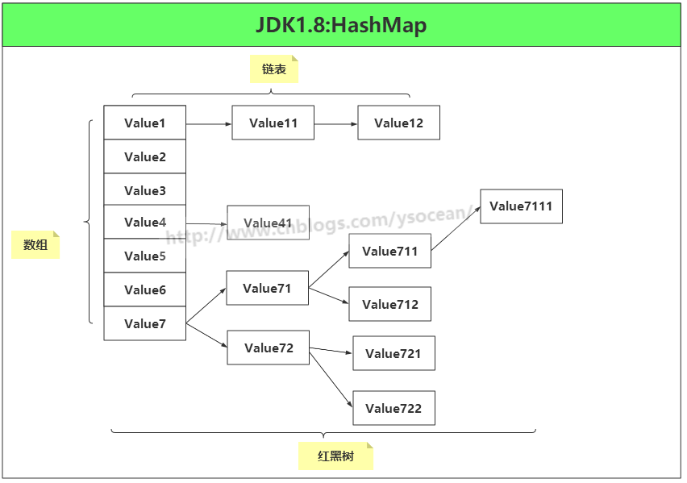

#### 3、HashMap定义

HashMap 是一个散列表，它存储的内容是键值对(key-value)映射，而且 key 和
value 都可以为 null。

``` {.java}
 public class HashMap<K,V> extends AbstractMap<K,V>
     implements Map<K,V>, Cloneable, Serializable {
```

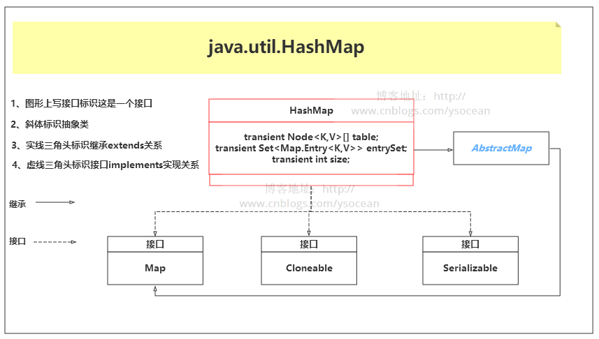

首先该类实现了一个 Map
接口，该接口定义了一组键值对映射通用的操作。储存一组成对的键-值对象，提供key（键）到value（值）的映射，Map中的key不要求有序，不允许重复。value同样不要求有序，但可以重复。但是我们发现该接口方法有很多，我们设计某个键值对的集合有时候并不像实现那么多方法，那该怎么办？

　　JDK 还为我们提供了一个抽象类 AbstractMap ，该抽象类继承 Map
接口，所以如果我们不想实现所有的 Map 接口方法，就可以选择继承抽象类
AbstractMap 。

　　**但是我们发现 HashMap 类即继承了 AbstractMap 接口，也实现了 Map
接口，这样做难道不是多此一举？后面我们会讲的 LinkedHashSet
集合也有这样的写法。**

　　毕竟 JDK
经过这么多年的发展维护，博主起初也是认为这样是有具体的作用的，后来找了很多资料，发现这其实完全没有任何作用，[具体出处](https://stackoverflow.com/questions/2165204/why-does-linkedhashsete-extend-hashsete-and-implement-sete)。

    据 java 集合框架的创始人Josh Bloch描述，这样的写法是一个失误。在java集合框架中，类似这样的写法很多，最开始写java集合框架的时候，他认为这样写，在某些地方可能是有价值的，直到他意识到错了。显然的，JDK的维护者，后来不认为这个小小的失误值得去修改，所以就这样存在下来了。

　　HashMap 集合还实现了 Cloneable 接口以及 Serializable
接口，分别用来进行对象克隆以及将对象进行序列化。

#### 4、字段属性

``` {.java}
//序列化和反序列化时，通过该字段进行版本一致性验证
    private static final long serialVersionUID = 362498820763181265L;
    //默认 HashMap 集合初始容量为16（必须是 2 的倍数）
    static final int DEFAULT_INITIAL_CAPACITY = 1 << 4; // aka 16
    //集合的最大容量，如果通过带参构造指定的最大容量超过此数，默认还是使用此数
    static final int MAXIMUM_CAPACITY = 1 << 30;
    //默认的填充因子
    static final float DEFAULT_LOAD_FACTOR = 0.75f;
    //当桶(bucket)上的结点数大于这个值时会转成红黑树(JDK1.8新增)
    static final int TREEIFY_THRESHOLD = 8;
    //当桶(bucket)上的节点数小于这个值时会转成链表(JDK1.8新增)
    static final int UNTREEIFY_THRESHOLD = 6;
    /**(JDK1.8新增)
     * 当集合中的容量大于这个值时，表中的桶才能进行树形化 ，否则桶内元素太多时会扩容，
     * 而不是树形化 为了避免进行扩容、树形化选择的冲突，这个值不能小于 4 * TREEIFY_THRESHOLD
     */
    static final int MIN_TREEIFY_CAPACITY = 64;
```

　**注意：后面三个字段是 JDK1.8
新增的，主要是用来进行红黑树和链表的互相转换。**

``` {.java}
/**
* 初始化使用，长度总是 2的幂
          */
        transient Node<K,V>[] table;
/**
 * 保存缓存的entrySet（）
 */
transient Set<Map.Entry<K,V>> entrySet;

/**
 * 此映射中包含的键值映射的数量。（集合存储键值对的数量）
 */
transient int size;

/**
 * 跟前面ArrayList和LinkedList集合中的字段modCount一样，记录集合被修改的次数
 * 主要用于迭代器中的快速失败
 */
transient int modCount;

/**
 * 调整大小的下一个大小值（容量*加载因子）。capacity * load factor
 */
int threshold;

/**
 * 散列表的加载因子。
 */
final float loadFactor;
```

下面我们重点介绍上面几个字段：

　　**①、Node<K,V>\[\] table**

　　我们说 HashMap 是由数组+链表+红黑树组成，这里的数组就是 table
字段。后面对其进行初始化长度默认是 DEFAULT\_INITIAL\_CAPACITY= 16。而且
JDK 声明数组的长度总是
2的n次方(一定是合数)，为什么这里要求是合数，一般我们知道哈希算法为了避免冲突都要求长度是质数，这里要求是合数，下面在介绍
HashMap 的hashCode() 方法(散列函数)，我们再进行讲解。

　　②**、size**

　　集合中存放key-value 的实时对数。

　　**③、loadFactor**

　　装载因子，是用来衡量 HashMap
满的程度，计算HashMap的实时装载因子的方法为：size/capacity，而不是占用桶的数量去除以capacity。capacity
是桶的数量，也就是 table 的长度length。

　　默认的负载因子0.75
是对空间和时间效率的一个平衡选择，建议大家不要修改，除非在时间和空间比较特殊的情况下，如果内存空间很多而又对时间效率要求很高，可以降低负载因子loadFactor
的值；相反，如果内存空间紧张而对时间效率要求不高，可以增加负载因子
loadFactor 的值，这个值可以大于1。

　　**④、threshold**

　　计算公式：capacity \*
loadFactor。这个值是当前已占用数组长度的最大值。过这个数目就重新resize(扩容)，扩容后的
HashMap 容量是之前容量的两倍

#### 5、构造函数

**①、默认无参构造函数**

``` {.java}
/**
     * 默认构造函数，初始化加载因子loadFactor = 0.75
     */
    public HashMap() {
        this.loadFactor = DEFAULT_LOAD_FACTOR; 
    }
```

无参构造器，初始化散列表的加载因子为0.75

　　**②、指定初始容量的构造函数**

``` {.java}
/**
     * 
     * @param initialCapacity 指定初始化容量
     * @param loadFactor 加载因子 0.75
     */
    public HashMap(int initialCapacity, float loadFactor) {
        //初始化容量不能小于 0 ，否则抛出异常
        if (initialCapacity < 0)
            throw new IllegalArgumentException("Illegal initial capacity: " +
                                               initialCapacity);
        //如果初始化容量大于2的30次方，则初始化容量都为2的30次方
        if (initialCapacity > MAXIMUM_CAPACITY)
            initialCapacity = MAXIMUM_CAPACITY;
        //如果加载因子小于0，或者加载因子是一个非数值，抛出异常
        if (loadFactor <= 0 || Float.isNaN(loadFactor))
            throw new IllegalArgumentException("Illegal load factor: " +
                                               loadFactor);
        this.loadFactor = loadFactor;
        this.threshold = tableSizeFor(initialCapacity);
    }
    // 返回大于等于initialCapacity的最小的二次幂数值。
    // >>> 操作符表示无符号右移，高位取0。
    // | 按位或运算
    static final int tableSizeFor(int cap) {
        int n = cap - 1;
        n |= n >>> 1;
        n |= n >>> 2;
        n |= n >>> 4;
        n |= n >>> 8;
        n |= n >>> 16;
        return (n < 0) ? 1 : (n >= MAXIMUM_CAPACITY) ? MAXIMUM_CAPACITY : n + 1;
    }
```

#### 6、确定哈希桶数组索引位置

前面我们讲解哈希表的时候，我们知道是用散列函数来确定索引的位置。散列函数设计的越好，使得元素分布的越均匀。HashMap
是数组+链表+红黑树的组合，我们希望在有限个数组位置时，尽量每个位置的元素只有一个，那么当我们用散列函数求得索引位置的时候，我们能马上知道对应位置的元素是不是我们想要的，而不是要进行链表的遍历或者红黑树的遍历，这会大大优化我们的查询效率。我们看
HashMap 中的哈希算法：

``` {.java}
static final int hash(Object key) {
        int h;
        return (key == null) ? 0 : (h = key.hashCode()) ^ (h >>> 16);
    }
    
    i = (table.length - 1) & hash;//这一步是在后面添加元素putVal()方法中进行位置的确定
```

主要分为三步：

　　①、取 hashCode 值： key.hashCode()

　　②、高位参与运算：h&gt;&gt;&gt;16

　　③、取模运算：(n-1) & hash

　　这里获取 hashCode()
方法的值是变量，但是我们知道，对于任意给定的对象，只要它的 hashCode()
返回值相同，那么程序调用 hash(Object key) 所计算得到的 hash码
值总是相同的。

　　为了让数组元素分布均匀，我们首先想到的是把获得的
hash码对数组长度取模运算(
hash%length)，但是计算机都是二进制进行操作，取模运算相对开销还是很大的，那该如何优化呢？

　　HashMap 使用的方法很巧妙，它通过 hash & (table.length
-1)来得到该对象的保存位，前面说过 HashMap
底层数组的长度总是2的n次方，这是HashMap在速度上的优化。当 length
总是2的n次方时，hash & (length-1)运算等价于对 length 取模，也就是
hash%length，但是&比%具有更高的效率。比如 n % 32 = n & (32 -1)

　　**这也解释了为什么要保证数组的长度总是2的n次方。**

　　再就是在 JDK1.8 中还有个高位参与运算，hashCode() 得到的是一个32位
int 类型的值，通过hashCode()的高16位 **异或** 低16位实现的：(h =
k.hashCode()) \^ (h &gt;&gt;&gt;
16)，主要是从速度、功效、质量来考虑的，这么做可以在数组table的length比较小的时候，也能保证考虑到高低Bit都参与到Hash的计算中，同时不会有太大的开销。

　　下面举例说明下，n为table的长度：

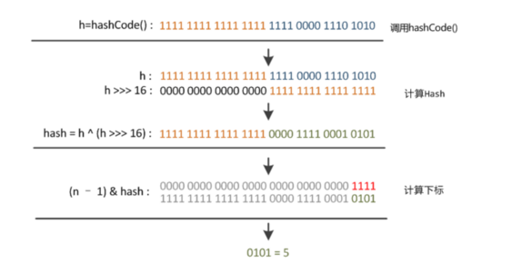

#### 7、添加元素

``` {.java}
//hash(key)就是上面讲的hash方法，对其进行了第一步和第二步处理
    public V put(K key, V value) {
        return putVal(hash(key), key, value, false, true);
    }
    /**
     * 
     * @param hash 索引的位置
     * @param key  键
     * @param value  值
     * @param onlyIfAbsent true 表示不要更改现有值
     * @param evict false表示table处于创建模式
     * @return
     */
    final V putVal(int hash, K key, V value, boolean onlyIfAbsent,
            boolean evict) {
         Node<K,V>[] tab; Node<K,V> p; int n, i;
         //如果table为null或者长度为0，则进行初始化
         //resize()方法本来是用于扩容，由于初始化没有实际分配空间，这里用该方法进行空间分配，后面会详细讲解该方法
         if ((tab = table) == null || (n = tab.length) == 0)
             n = (tab = resize()).length;
         //注意：这里用到了前面讲解获得key的hash码的第三步，取模运算，下面的if-else分别是 tab[i] 为null和不为null
         if ((p = tab[i = (n - 1) & hash]) == null)
             tab[i] = newNode(hash, key, value, null);//tab[i] 为null，直接将新的key-value插入到计算的索引i位置
         else {//tab[i] 不为null，表示该位置已经有值了
             Node<K,V> e; K k;
             if (p.hash == hash &&
                 ((k = p.key) == key || (key != null && key.equals(k))))
                 e = p;//节点key已经有值了，直接用新值覆盖
             //该链是红黑树
             else if (p instanceof TreeNode)
                 e = ((TreeNode<K,V>)p).putTreeVal(this, tab, hash, key, value);
             //该链是链表
             else {
                 for (int binCount = 0; ; ++binCount) {
                     if ((e = p.next) == null) {
                         p.next = newNode(hash, key, value, null);
                         //链表长度大于8，转换成红黑树
                         if (binCount >= TREEIFY_THRESHOLD - 1) // -1 for 1st
                             treeifyBin(tab, hash);
                         break;
                     }
                     //key已经存在直接覆盖value
                     if (e.hash == hash &&
                         ((k = e.key) == key || (key != null && key.equals(k))))
                         break;
                     p = e;
                 }
             }
             if (e != null) { // existing mapping for key
                 V oldValue = e.value;
                 if (!onlyIfAbsent || oldValue == null)
                     e.value = value;
                 afterNodeAccess(e);
                 return oldValue;
             }
         }
         ++modCount;//用作修改和新增快速失败
         if (++size > threshold)//超过最大容量，进行扩容
             resize();
         afterNodeInsertion(evict);
         return null;
    }
```

①、判断键值对数组 table 是否为空或为null，否则执行resize()进行扩容；

　　②、根据键值key计算hash值得到插入的数组索引i，如果table\[i\]==null，直接新建节点添加，转向⑥，如果table\[i\]不为空，转向③；

　　③、判断table\[i\]的首个元素是否和key一样，如果相同直接覆盖value，否则转向④，这里的相同指的是hashCode以及equals；

　　④、判断table\[i\] 是否为treeNode，即table\[i\]
是否是红黑树，如果是红黑树，则直接在树中插入键值对，否则转向⑤；

　　⑤、遍历table\[i\]，判断链表长度是否大于8，大于8的话把链表转换为红黑树，在红黑树中执行插入操作，否则进行链表的插入操作；遍历过程中若发现key已经存在直接覆盖value即可；

　　⑥、插入成功后，判断实际存在的键值对数量size是否超过了最大容量threshold，如果超过，进行扩容。

　　⑦、如果新插入的key不存在，则返回null，如果新插入的key存在，则返回原key对应的value值（注意新插入的value会覆盖原value值）

　　**注意1：看第 58,59 行代码：**

``` {.java}
if (++size > threshold)//超过最大容量，进行扩容
    resize();
```

　　这里有个考点，我们知道 HashMap
是由数组+链表+红黑树（JDK1.8）组成，如果在添加元素时，发生冲突，会将冲突的数放在链表上，当链表长度超过8时，会自动转换成红黑树。

　　那么有如下问题：**数组上有5个元素，而某个链表上有3个元素，问此HashMap的
size 是多大？**

　　我们分析第58,59 行代码，很容易知道，**只要是调用put()
方法添加元素，那么就会调用
++size(这里有个例外是插入重复key的键值对，不会调用，但是重复key元素不会影响size),所以，上面的答案是
7。**

　　**注意2：看第 53 、 60 行代码：**

``` {.java}
 afterNodeAccess(e);
 afterNodeInsertion(evict);
```

　　这里调用的该方法，其实是调用了如下实现方法：

``` {.java}
void afterNodeAccess(Node<K,V> p) { }
void afterNodeInsertion(boolean evict) { }
```

　　这都是一个空的方法实现，我们在这里可以不用管，但是在后面介绍
LinkedHashMap 会用到，LinkedHashMap 是继承的
HashMap，并且重写了该方法，后面我们会详细介绍。

#### 8、扩容机制

扩容（resize），我们知道集合是由数组+链表+红黑树构成，向 HashMap
中插入元素时，如果HashMap
集合的元素已经大于了最大承载容量threshold（capacity \*
loadFactor），这里的threshold不是数组的最大长度。那么必须扩大数组的长度，Java中数组是无法自动扩容的，我们采用的方法是用一个更大的数组代替这个小的数组，就好比以前是用小桶装水，现在小桶装不下了，我们使用一个更大的桶。

　　JDK1.8融入了红黑树的机制，比较复杂，这里我们先介绍
JDK1.7的扩容源码，便于理解，然后在介绍JDK1.8的源码。

JDK1.7 源码

``` {.java}
//参数 newCapacity 为新数组的大小
    void resize(int newCapacity) {
        Entry[] oldTable = table;//引用扩容前的 Entry 数组
        int oldCapacity = oldTable.length;
        if (oldCapacity == MAXIMUM_CAPACITY) {//扩容前的数组大小如果已经达到最大(2^30)了
            threshold = Integer.MAX_VALUE;///修改阈值为int的最大值(2^31-1)，这样以后就不会扩容了
            return;
        }

        Entry[] newTable = new Entry[newCapacity];//初始化一个新的Entry数组
        transfer(newTable, initHashSeedAsNeeded(newCapacity));//将数组元素转移到新数组里面
        table = newTable;
        threshold = (int)Math.min(newCapacity * loadFactor, MAXIMUM_CAPACITY + 1);//修改阈值
    }
    void transfer(Entry[] newTable, boolean rehash) {
        int newCapacity = newTable.length;
        for (Entry<K,V> e : table) {//遍历数组
            while(null != e) {
                Entry<K,V> next = e.next;
                if (rehash) {
                    e.hash = null == e.key ? 0 : hash(e.key);
                }
                int i = indexFor(e.hash, newCapacity);//重新计算每个元素在数组中的索引位置
                e.next = newTable[i];//标记下一个元素，添加是链表头添加
                newTable[i] = e;//将元素放在链上
                e = next;//访问下一个 Entry 链上的元素
            }
        }
    }
```

通过方法我们可以看到，JDK1.7中首先是创建一个新的大容量数组，然后依次重新计算原集合所有元素的索引，然后重新赋值。如果数组某个位置发生了hash冲突，使用的是单链表的头插入方法，同一位置的新元素总是放在链表的头部，这样与原集合链表对比，扩容之后的可能就是倒序的链表了。

　　下面我们在看看JDK1.8的。

``` {.java}
final Node<K,V>[] resize() {
        Node<K,V>[] oldTab = table;
        int oldCap = (oldTab == null) ? 0 : oldTab.length;//原数组如果为null，则长度赋值0
        int oldThr = threshold;
        int newCap, newThr = 0;
        if (oldCap > 0) {//如果原数组长度大于0
            if (oldCap >= MAXIMUM_CAPACITY) {//数组大小如果已经大于等于最大值(2^30)
                threshold = Integer.MAX_VALUE;//修改阈值为int的最大值(2^31-1)，这样以后就不会扩容了
                return oldTab;
            }
            //原数组长度大于等于初始化长度16，并且原数组长度扩大1倍也小于2^30次方
            else if ((newCap = oldCap << 1) < MAXIMUM_CAPACITY &&
                     oldCap >= DEFAULT_INITIAL_CAPACITY)
                newThr = oldThr << 1; // 阀值扩大1倍
        }
        else if (oldThr > 0) //旧阀值大于0，则将新容量直接等于就阀值 
            newCap = oldThr;
        else {//阀值等于0，oldCap也等于0（集合未进行初始化）
            newCap = DEFAULT_INITIAL_CAPACITY;//数组长度初始化为16
            newThr = (int)(DEFAULT_LOAD_FACTOR * DEFAULT_INITIAL_CAPACITY);//阀值等于16*0.75=12
        }
        //计算新的阀值上限
        if (newThr == 0) {
            float ft = (float)newCap * loadFactor;
            newThr = (newCap < MAXIMUM_CAPACITY && ft < (float)MAXIMUM_CAPACITY ?
                      (int)ft : Integer.MAX_VALUE);
        }
        threshold = newThr;
        @SuppressWarnings({"rawtypes","unchecked"})
            Node<K,V>[] newTab = (Node<K,V>[])new Node[newCap];
        table = newTab;
        if (oldTab != null) {
            //把每个bucket都移动到新的buckets中
            for (int j = 0; j < oldCap; ++j) {
                Node<K,V> e;
                if ((e = oldTab[j]) != null) {
                    oldTab[j] = null;//元数据j位置置为null，便于垃圾回收
                    if (e.next == null)//数组没有下一个引用（不是链表）
                        newTab[e.hash & (newCap - 1)] = e;
                    else if (e instanceof TreeNode)//红黑树
                        ((TreeNode<K,V>)e).split(this, newTab, j, oldCap);
                    else { // preserve order
                        Node<K,V> loHead = null, loTail = null;
                        Node<K,V> hiHead = null, hiTail = null;
                        Node<K,V> next;
                        do {
                            next = e.next;
                            //原索引
                            if ((e.hash & oldCap) == 0) {
                                if (loTail == null)
                                    loHead = e;
                                else
                                    loTail.next = e;
                                loTail = e;
                            }
                            //原索引+oldCap
                            else {
                                if (hiTail == null)
                                    hiHead = e;
                                else
                                    hiTail.next = e;
                                hiTail = e;
                            }
                        } while ((e = next) != null);
                        //原索引放到bucket里
                        if (loTail != null) {
                            loTail.next = null;
                            newTab[j] = loHead;
                        }
                        //原索引+oldCap放到bucket里
                        if (hiTail != null) {
                            hiTail.next = null;
                            newTab[j + oldCap] = hiHead;
                        }
                    }
                }
            }
        }
        return newTab;
    }
```

该方法分为两部分，首先是计算新桶数组的容量 newCap 和新阀值
newThr，然后将原集合的元素重新映射到新集合中。


相比于JDK1.7，1.8使用的是2次幂的扩展(指长度扩为原来2倍)，所以，元素的位置要么是在原位置，要么是在原位置再移动2次幂的位置。我们在扩充HashMap的时候，**不需要像JDK1.7的实现那样重新计算hash，只需要看看原来的hash值新增的那个bit是1还是0就好了，是0的话索引没变，是1的话索引变成“原索引+oldCap”**。

#### 9、删除元素

HashMap 删除元素首先是要找到
桶的位置，然后如果是链表，则进行链表遍历，找到需要删除的元素后，进行删除；如果是红黑树，也是进行树的遍历，找到元素删除后，进行平衡调节，注意，当红黑树的节点数小于
6 时，会转化成链表。

``` {.java}
public V remove(Object key) {
        Node<K,V> e;
        return (e = removeNode(hash(key), key, null, false, true)) == null ?
            null : e.value;
    }
    
    final Node<K,V> removeNode(int hash, Object key, Object value,
            boolean matchValue, boolean movable) {
        Node<K,V>[] tab; Node<K,V> p; int n, index;
        //(n - 1) & hash找到桶的位置
        if ((tab = table) != null && (n = tab.length) > 0 &&
        (p = tab[index = (n - 1) & hash]) != null) {
        Node<K,V> node = null, e; K k; V v;
        //如果键的值与链表第一个节点相等，则将 node 指向该节点
        if (p.hash == hash &&
        ((k = p.key) == key || (key != null && key.equals(k))))
        node = p;
        //如果桶节点存在下一个节点
        else if ((e = p.next) != null) {
            //节点为红黑树
        if (p instanceof TreeNode)
         node = ((TreeNode<K,V>)p).getTreeNode(hash, key);//找到需要删除的红黑树节点
        else {
         do {//遍历链表，找到待删除的节点
             if (e.hash == hash &&
                 ((k = e.key) == key ||
                  (key != null && key.equals(k)))) {
                 node = e;
                 break;
             }
             p = e;
         } while ((e = e.next) != null);
        }
        }
        //删除节点，并进行调节红黑树平衡
        if (node != null && (!matchValue || (v = node.value) == value ||
                      (value != null && value.equals(v)))) {
        if (node instanceof TreeNode)
         ((TreeNode<K,V>)node).removeTreeNode(this, tab, movable);
        else if (node == p)
         tab[index] = node.next;
        else
         p.next = node.next;
        ++modCount;
        --size;
        afterNodeRemoval(node);
        return node;
        }
        }
        return null;
    }
```

注意第 46 行代码

``` {.java}
afterNodeRemoval(node);
```

这也是为实现 LinkedHashMap
做准备的，在这里和上面一样，是一个空方法实现，可以不用管。而在
LinkedHashMap 中进行了重写，用来维护删除节点后，链表的前后关系。

#### 10、查找元素

①、通过 key 查找 value

　　首先通过 key
找到计算索引，找到桶位置，先检查第一个节点，如果是则返回，如果不是，则遍历其后面的链表或者红黑树。其余情况全部返回
null。

``` {.java}
public V get(Object key) {
        Node<K,V> e;
        return (e = getNode(hash(key), key)) == null ? null : e.value;
    }
    
    final Node<K,V> getNode(int hash, Object key) {
        Node<K,V>[] tab; Node<K,V> first, e; int n; K k;
        if ((tab = table) != null && (n = tab.length) > 0 &&
            (first = tab[(n - 1) & hash]) != null) {
            //根据key计算的索引检查第一个索引
            if (first.hash == hash && // always check first node
                ((k = first.key) == key || (key != null && key.equals(k))))
                return first;
            //不是第一个节点
            if ((e = first.next) != null) {
                if (first instanceof TreeNode)//遍历树查找元素
                    return ((TreeNode<K,V>)first).getTreeNode(hash, key);
                do {
                    //遍历链表查找元素
                    if (e.hash == hash &&
                        ((k = e.key) == key || (key != null && key.equals(k))))
                        return e;
                } while ((e = e.next) != null);
            }
        }
        return null;
    }
```

②、判断是否存在给定的 key 或者 value

``` {.java}
public boolean containsKey(Object key) {
        return getNode(hash(key), key) != null;
    }
    public boolean containsValue(Object value) {
        Node<K,V>[] tab; V v;
        if ((tab = table) != null && size > 0) {
            //遍历桶
            for (int i = 0; i < tab.length; ++i) {
                //遍历桶中的每个节点元素
                for (Node<K,V> e = tab[i]; e != null; e = e.next) {
                    if ((v = e.value) == value ||
                        (value != null && value.equals(v)))
                        return true;
                }
            }
        }
        return false;
    }
```

#### 11、遍历元素

首先构造一个 HashMap 集合：

``` {.java}
HashMap<String,Object> map = new HashMap<>();
map.put("A","1");
map.put("B","2");
map.put("C","3");
```

①、分别获取 key 集合和 value 集合。

``` {.java}
//1、分别获取key和value的集合
for(String key : map.keySet()){
    System.out.println(key);
}
for(Object value : map.values()){
    System.out.println(value);
}
```

②、获取 key 集合，然后遍历key集合，根据key分别得到相应value

``` {.java}
1 //2、获取key集合，然后遍历key，根据key得到 value
2 Set<String> keySet = map.keySet();
3 for(String str : keySet){
4     System.out.println(str+"-"+map.get(str));
5 }
```

③、得到 Entry 集合，然后遍历 Entry

``` {.java}
1 //3、得到 Entry 集合，然后遍历 Entry
2 Set<Map.Entry<String,Object>> entrySet = map.entrySet();
3 for(Map.Entry<String,Object> entry : entrySet){
4     System.out.println(entry.getKey()+"-"+entry.getValue());
5 }
```

④、迭代

``` {.java}
//4、迭代
Iterator<Map.Entry<String,Object>> iterator = map.entrySet().iterator();
while(iterator.hasNext()){
    Map.Entry<String,Object> mapEntry = iterator.next();
    System.out.println(mapEntry.getKey()+"-"+mapEntry.getValue());
}
```

​ 基本上使用第三种方法是性能最好的，

　　第一种遍历方法在我们只需要 key 集合或者只需要 value 集合时使用；

　　第二种方法效率很低，不推荐使用；

　　第四种方法效率也挺好，关键是在遍历的过程中我们可以对集合中的元素进行删除。

#### 12、总结

　①、基于JDK1.8的HashMap是由数组+链表+红黑树组成，当链表长度超过 8
时会自动转换成红黑树，当红黑树节点个数小于 6
时，又会转化成链表。相对于早期版本的 JDK HashMap
实现，新增了红黑树作为底层数据结构，在数据量较大且哈希碰撞较多时，能够极大的增加检索的效率。

　　②、允许 key 和 value 都为 null。key 重复会被覆盖，value 允许重复。

　　③、非线程安全

　　④、无序（遍历HashMap得到元素的顺序不是按照插入的顺序）

参考文档：https://docs.oracle.com/javase/8/docs/api/java/util/HashMap.html\#

　　　　　http://www.importnew.com/20386.html

　　　　　https://www.cnblogs.com/nullllun/p/8327664.html

LinkedHashMap
-------------

[JDK1.8源码(九)——java.util.LinkedHashMap
类](https://www.cnblogs.com/ysocean/p/9839173.html)

LinkedHashMap，其实也是继承 HashMap 集合来实现的，而且我们在介绍 HashMap
集合的 put 方法时，也指出了 put 方法中调用的部分方法在 HashMap
都是空实现，而在 LinkedHashMap 中进行了重写。所以想要彻底了解
LinkedHashMap 的实现原理，HashMap 的实现原理一定不能不懂。

#### 1、LinkedHashMap 定义

LinkedHashMap 是基于 HashMap 实现的一种集合，具有 HashMap
集合上面所说的所有特点，除了 HashMap 无序的特点，LinkedHashMap
是有序的，因为 LinkedHashMap 在 HashMap
的基础上单独维护了一个具有所有数据的双向链表，该链表保证了元素迭代的顺序。

　　所以我们可以直接这样说：LinkedHashMap = HashMap +
LinkedList。LinkedHashMap 就是在 HashMap
的基础上多维护了一个双向链表，用来保证元素迭代顺序。

　　更形象化的图形展示可以直接移到文章末尾。

``` {.java}
public class LinkedHashMap<K,V>
    extends HashMap<K,V>
    implements Map<K,V>
```

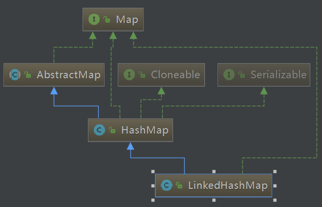

#### 2、字段属性

①、Entry<K,V>

``` {.java}
static class Entry<K,V> extends HashMap.Node<K,V> {
        Entry<K,V> before, after;
        Entry(int hash, K key, V value, Node<K,V> next) {
            super(hash, key, value, next);
        }
    }
```

LinkedHashMap 的每个元素都是一个 Entry，我们看到对于 Entry 继承自
HashMap 的 Node 结构，相对于 Node 结构，LinkedHashMap 多了 before 和
after 结构。

　　下面是Map类集合基本元素的实现演变。

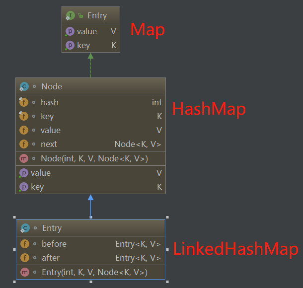

LinkedHashMap 中 Entry 相对于 HashMap 多出的 before 和 after
便是用来维护 LinkedHashMap 插入 Entry 的先后顺序的。

　　②、其它属性

``` {.java}
//用来指向双向链表的头节点
transient LinkedHashMap.Entry<K,V> head;
//用来指向双向链表的尾节点
transient LinkedHashMap.Entry<K,V> tail;
//用来指定LinkedHashMap的迭代顺序
//true 表示按照访问顺序，会把访问过的元素放在链表后面，放置顺序是访问的顺序
//false 表示按照插入顺序遍历
final boolean accessOrder;
```

注意：这里有五个属性别搞混淆的，对于 Node next
属性，是用来维护整个集合中 Entry 的顺序。对于 Entry before，Entry after
，以及 Entry head，Entry
tail，这四个属性都是用来维护保证集合顺序的链表，其中前两个before和after表示某个节点的上一个节点和下一个节点，这是一个双向链表。后两个属性
head 和 tail 分别表示这个链表的头节点和尾节点。

　　PS：关于双向链表的介绍，可以看[这篇博客](https://www.cnblogs.com/ysocean/p/7928988.html)。

#### 3、构造函数

①、无参构造

``` {.java}
1     public LinkedHashMap() {
2         super();
3         accessOrder = false;
4     }
```

　　调用无参的 HashMap
构造函数，具有默认初始容量（16）和加载因子（0.75）。并且设定了
accessOrder = false，表示默认按照插入顺序进行遍历。

　　②、指定初始容量

``` {.java}
1     public LinkedHashMap(int initialCapacity) {
2         super(initialCapacity);
3         accessOrder = false;
4     }
```

　　③、指定初始容量和加载因子

``` {.java}
1     public LinkedHashMap(int initialCapacity, float loadFactor) {
2         super(initialCapacity, loadFactor);
3         accessOrder = false;
4     }
```

　　④、指定初始容量和加载因子，以及迭代规则

``` {.java}
1     public LinkedHashMap(int initialCapacity,
2                          float loadFactor,
3                          boolean accessOrder) {
4         super(initialCapacity, loadFactor);
5         this.accessOrder = accessOrder;
6     }
```

　　⑤、构造包含指定集合中的元素

``` {.java}
1     public LinkedHashMap(Map<? extends K, ? extends V> m) {
2         super();
3         accessOrder = false;
4         putMapEntries(m, false);
5     }
```

　　上面所有的构造函数默认 accessOrder =
false，除了第四个构造函数能够指定 accessOrder 的值。

#### 4、添加元素

LinkedHashMap 中是没有 put 方法的，直接调用父类 HashMap 的 put
方法。关于 HashMap 的put 方法，可以参看我对于[HashMap
的介绍](https://www.cnblogs.com/ysocean/p/8711071.html#_label6)。

　　我将方法介绍复制到下面：

``` {.java}
//hash(key)就是上面讲的hash方法，对其进行了第一步和第二步处理
    public V put(K key, V value) {
        return putVal(hash(key), key, value, false, true);
    }
    /**
     * 
     * @param hash 索引的位置
     * @param key  键
     * @param value  值
     * @param onlyIfAbsent true 表示不要更改现有值
     * @param evict false表示table处于创建模式
     * @return
     */
    final V putVal(int hash, K key, V value, boolean onlyIfAbsent,
            boolean evict) {
         Node<K,V>[] tab; Node<K,V> p; int n, i;
         //如果table为null或者长度为0，则进行初始化
         //resize()方法本来是用于扩容，由于初始化没有实际分配空间，这里用该方法进行空间分配，后面会详细讲解该方法
         if ((tab = table) == null || (n = tab.length) == 0)
             n = (tab = resize()).length;
         //注意：这里用到了前面讲解获得key的hash码的第三步，取模运算，下面的if-else分别是 tab[i] 为null和不为null
         if ((p = tab[i = (n - 1) & hash]) == null)
             tab[i] = newNode(hash, key, value, null);//tab[i] 为null，直接将新的key-value插入到计算的索引i位置
         else {//tab[i] 不为null，表示该位置已经有值了
             Node<K,V> e; K k;
             if (p.hash == hash &&
                 ((k = p.key) == key || (key != null && key.equals(k))))
                 e = p;//节点key已经有值了，直接用新值覆盖
             //该链是红黑树
             else if (p instanceof TreeNode)
                 e = ((TreeNode<K,V>)p).putTreeVal(this, tab, hash, key, value);
             //该链是链表
             else {
                 for (int binCount = 0; ; ++binCount) {
                     if ((e = p.next) == null) {
                         p.next = newNode(hash, key, value, null);
                         //链表长度大于8，转换成红黑树
                         if (binCount >= TREEIFY_THRESHOLD - 1) // -1 for 1st
                             treeifyBin(tab, hash);
                         break;
                     }
                     //key已经存在直接覆盖value
                     if (e.hash == hash &&
                         ((k = e.key) == key || (key != null && key.equals(k))))
                         break;
                     p = e;
                 }
             }
             if (e != null) { // existing mapping for key
                 V oldValue = e.value;
                 if (!onlyIfAbsent || oldValue == null)
                     e.value = value;
                 afterNodeAccess(e);
                 return oldValue;
             }
         }
         ++modCount;//用作修改和新增快速失败
         if (++size > threshold)//超过最大容量，进行扩容
             resize();
         afterNodeInsertion(evict);
         return null;
    }
```

这里主要介绍上面方法中，为了保证 LinkedHashMap
的迭代顺序，在添加元素时重写了的4个方法，分别是第23行、31行以及53、60行代码：

``` {.java}
1 newNode(hash, key, value, null);
2 putTreeVal(this, tab, hash, key, value)//newTreeNode(h, k, v, xpn)
3 afterNodeAccess(e);
4 afterNodeInsertion(evict);
```

　①、对于 newNode(hash,key,value,null) 方法

``` {.java}
HashMap.Node<K,V> newNode(int hash, K key, V value, HashMap.Node<K,V> e) {
        LinkedHashMap.Entry<K,V> p =
                new LinkedHashMap.Entry<K,V>(hash, key, value, e);
        linkNodeLast(p);
        return p;
    }

    private void linkNodeLast(LinkedHashMap.Entry<K,V> p) {
        //用临时变量last记录尾节点tail
        LinkedHashMap.Entry<K,V> last = tail;
        //将尾节点设为当前插入的节点p
        tail = p;
        //如果原先尾节点为null，表示当前链表为空
        if (last == null)
            //头结点也为当前插入节点
            head = p;
        else {
            //原始链表不为空，那么将当前节点的上节点指向原始尾节点
            p.before = last;
            //原始尾节点的下一个节点指向当前插入节点
            last.after = p;
        }
    }
```

　也就是说将当前添加的元素设为原始链表的尾节点。

　　②、对于 putTreeVal 方法

　　是在添加红黑树节点时的操作，LinkedHashMap 也重写了该方法的
newTreeNode 方法：

``` {.java}
1     TreeNode<K,V> newTreeNode(int hash, K key, V value, Node<K,V> next) {
2         TreeNode<K,V> p = new TreeNode<K,V>(hash, key, value, next);
3         linkNodeLast(p);
4         return p;
5     }
```

也就是说上面两个方法都是在将新添加的元素放置到链表的尾端，并维护链表节点之间的关系。　

　　③、对于 afterNodeAccess(e) 方法，在 putVal
方法中，是当添加数据键值对的 key 存在时，会对 value 进行替换。然后调用
afterNodeAccess(e) 方法：

``` {.java}
//把当前节点放到双向链表的尾部
    void afterNodeAccess(HashMap.Node<K,V> e) { // move node to last
        LinkedHashMap.Entry<K,V> last;
        //当 accessOrder = true 并且当前节点不等于尾节点tail。这里将last节点赋值为tail节点
        if (accessOrder && (last = tail) != e) {
            //记录当前节点的上一个节点b和下一个节点a
            LinkedHashMap.Entry<K,V> p =
                    (LinkedHashMap.Entry<K,V>)e, b = p.before, a = p.after;
            //释放当前节点和后一个节点的关系
            p.after = null;
            //如果当前节点的前一个节点为null
            if (b == null)
                //头节点=当前节点的下一个节点
                head = a;
            else
                //否则b的后节点指向a
                b.after = a;
            //如果a != null
            if (a != null)
                //a的前一个节点指向b
                a.before = b;
            else
                //b设为尾节点
                last = b;
            //如果尾节点为null
            if (last == null)
                //头节点设为p
                head = p;
            else {
                //否则将p放到双向链表的最后
                p.before = last;
                last.after = p;
            }
            //将尾节点设为p
            tail = p;
            //LinkedHashMap对象操作次数+1，用于快速失败校验
            ++modCount;
        }
    }
```

该方法是在 accessOrder = true 并且
插入的当前节点不等于尾节点时，该方法才会生效。并且该方法的作用是将插入的节点变为尾节点，后面在get方法中也会调用。代码实现可能有点绕，可以借助下图来理解：

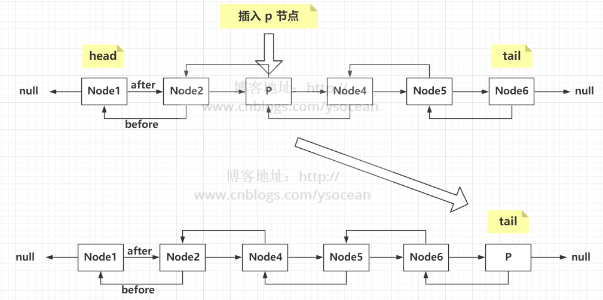

④、在看 afterNodeInsertion(evict) 方法

``` {.java}
void afterNodeInsertion(boolean evict) { // possibly remove eldest
        LinkedHashMap.Entry<K,V> first;
        if (evict && (first = head) != null && removeEldestEntry(first)) {
            K key = first.key;
            removeNode(hash(key), key, null, false, true);
        }
    }
```

该方法用来移除最老的首节点，首先方法要能执行到if语句里面，必须 evict =
true，并且 头节点不为null，并且 removeEldestEntry(first)
返回true，这三个条件必须同时满足，前面两个好理解，我们看最后这个方法条件：

``` {.java}
1     protected boolean removeEldestEntry(Map.Entry<K,V> eldest) {
2         return false;
3     }
```

这就奇怪了，该方法直接返回的是 false，也就是说怎么都不会进入到 if
方法体内了，那这是这么回事呢？

　　这其实是用来实现 LRU（Least Recently Used，最近最少使用）Cache
时，重写的一个方法。比如在 mybatis-connector 包中，有这样一个类：

``` {.java}
package com.mysql.jdbc.util;

import java.util.LinkedHashMap;
import java.util.Map.Entry;

public class LRUCache<K, V> extends LinkedHashMap<K, V> {
    private static final long serialVersionUID = 1L;
    protected int maxElements;

    public LRUCache(int maxSize) {
        super(maxSize, 0.75F, true);
        this.maxElements = maxSize;
    }

    protected boolean removeEldestEntry(Entry<K, V> eldest) {
        return this.size() > this.maxElements;
    }
}
```

可以看到，它重写了 removeEldestEntry(Entry<K,V> eldest)
方法，当元素的个数大于设定的最大个数，便移除首元素。

#### 5、删除元素

``` {.java}
public V remove(Object key) {
        Node<K,V> e;
        return (e = removeNode(hash(key), key, null, false, true)) == null ?
            null : e.value;
    }
    
    final Node<K,V> removeNode(int hash, Object key, Object value,
            boolean matchValue, boolean movable) {
        Node<K,V>[] tab; Node<K,V> p; int n, index;
        //(n - 1) & hash找到桶的位置
        if ((tab = table) != null && (n = tab.length) > 0 &&
        (p = tab[index = (n - 1) & hash]) != null) {
        Node<K,V> node = null, e; K k; V v;
        //如果键的值与链表第一个节点相等，则将 node 指向该节点
        if (p.hash == hash &&
        ((k = p.key) == key || (key != null && key.equals(k))))
        node = p;
        //如果桶节点存在下一个节点
        else if ((e = p.next) != null) {
            //节点为红黑树
        if (p instanceof TreeNode)
         node = ((TreeNode<K,V>)p).getTreeNode(hash, key);//找到需要删除的红黑树节点
        else {
         do {//遍历链表，找到待删除的节点
             if (e.hash == hash &&
                 ((k = e.key) == key ||
                  (key != null && key.equals(k)))) {
                 node = e;
                 break;
             }
             p = e;
         } while ((e = e.next) != null);
        }
        }
        //删除节点，并进行调节红黑树平衡
        if (node != null && (!matchValue || (v = node.value) == value ||
                      (value != null && value.equals(v)))) {
        if (node instanceof TreeNode)
         ((TreeNode<K,V>)node).removeTreeNode(this, tab, movable);
        else if (node == p)
         tab[index] = node.next;
        else
         p.next = node.next;
        ++modCount;
        --size;
        afterNodeRemoval(node);
        return node;
        }
        }
        return null;
    }
```

我们看第 46 行代码实现：

``` {.java}
void afterNodeRemoval(HashMap.Node<K,V> e) { // unlink
        LinkedHashMap.Entry<K,V> p =
                (LinkedHashMap.Entry<K,V>)e, b = p.before, a = p.after;
        p.before = p.after = null;
        if (b == null)
            head = a;
        else
            b.after = a;
        if (a == null)
            tail = b;
        else
            a.before = b;
    }
```

该方法其实很好理解，就是当我们删除某个节点时，为了保证链表还是有序的，那么必须维护其前后节点。而该方法的作用就是维护删除节点的前后节点关系。

#### 6、查找元素

``` {.java}
public V get(Object key) {
        Node<K,V> e;
        if ((e = getNode(hash(key), key)) == null)
            return null;
        if (accessOrder)
            afterNodeAccess(e);
        return e.value;
    }
```

相比于 HashMap 的 get 方法，这里多出了第 5,6行代码，当 accessOrder =
true 时，即表示按照最近访问的迭代顺序，会将访问过的元素放在链表后面。

　　对于 afterNodeAccess(e) 方法，在前面第 4 小节
添加元素已经介绍过了，这就不在介绍。

当accessorder被设置为true get和新插入都会被调整到
链表的前面,越是在后面的 就表明最新没有访问的. 重写
removeEldestEntry方法可以将 其删除

#### 7、遍历元素

在介绍 HashMap 时，我们介绍了 4 中遍历方式，同理，对于 LinkedHashMap
也有 4 种，这里我们介绍效率较高的两种遍历方式：

　　①、得到 Entry 集合，然后遍历 Entry

``` {.java}
LinkedHashMap<String,String> map = new LinkedHashMap<>();
        map.put("A","1");
        map.put("B","2");
        map.put("C","3");
        map.get("B");
        Set<Map.Entry<String,String>> entrySet = map.entrySet();
        for(Map.Entry<String,String> entry : entrySet ){
            System.out.println(entry.getKey()+"---"+entry.getValue());
        }
```

　②、迭代

``` {.java}
1         Iterator<Map.Entry<String,String>> iterator = map.entrySet().iterator();
2         while(iterator.hasNext()){
3             Map.Entry<String,String> entry = iterator.next();
4             System.out.println(entry.getKey()+"----"+entry.getValue());
5         }
```

这两种效率都还不错，通过迭代的方式可以对一边遍历一边删除元素，而第一种删除元素会报错。

#### 8、迭代器

结果跟预期一致。那么在遍历的过程中，LinkedHashMap 是如何进行的呢？

　　我们追溯源码：首先进入到 map.entrySet() 方法里面：

发现 entrySet = new LinkedEntrySet() ，接下来我们查看 LinkedEntrySet
类。

这是一个内部类，我们查看其 iterator() 方法，发现又new 了一个新对象
LinkedEntryIterator，接着看这个类：

　这个类继承 LinkedHashIterator。

``` {.java}
abstract class LinkedHashIterator {
        LinkedHashMap.Entry<K,V> next;
        LinkedHashMap.Entry<K,V> current;
        int expectedModCount;

        LinkedHashIterator() {
            next = head;
            expectedModCount = modCount;
            current = null;
        }

        public final boolean hasNext() {
            return next != null;
        }

        final LinkedHashMap.Entry<K,V> nextNode() {
            LinkedHashMap.Entry<K,V> e = next;
            if (modCount != expectedModCount)
                throw new ConcurrentModificationException();
            if (e == null)
                throw new NoSuchElementException();
            current = e;
            next = e.after;
            return e;
        }

        public final void remove() {
            HashMap.Node<K,V> p = current;
            if (p == null)
                throw new IllegalStateException();
            if (modCount != expectedModCount)
                throw new ConcurrentModificationException();
            current = null;
            K key = p.key;
            removeNode(hash(key), key, null, false, false);
            expectedModCount = modCount;
        }
    }
```

看到 nextNode() 方法，很显然是通过遍历链表的方式来遍历整个 LinkedHashMap
。

#### 9、总结

通过上面的介绍，关于 LinkedHashMap ，我想直接用下面一幅图来解释：

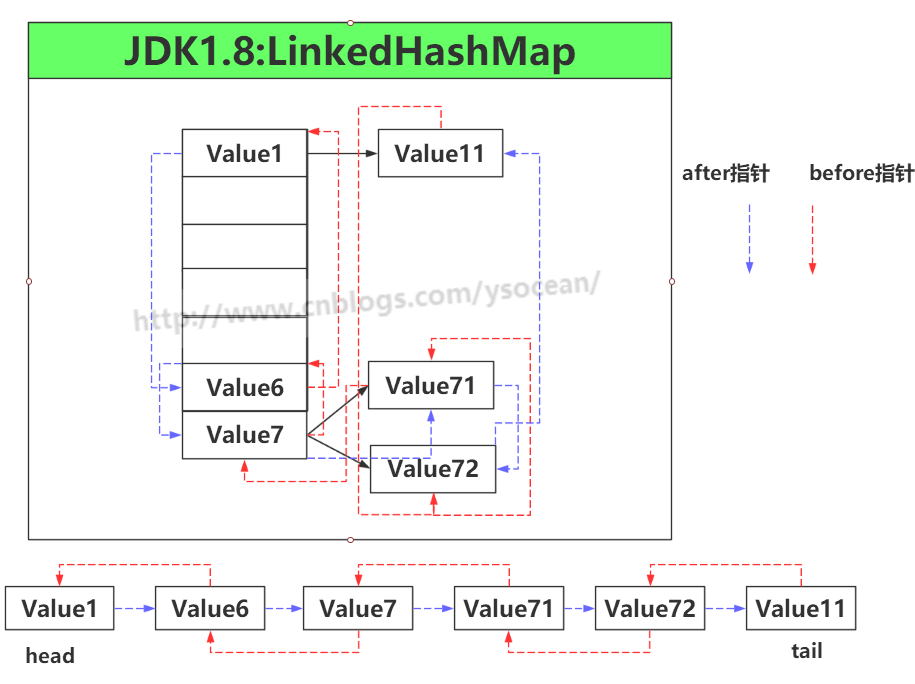

TreeMap
-------

[JAVA学习-TreeMap详解](https://www.jianshu.com/p/d9ad7f6d75a0)

#### TreeMap 简介

TreeMap
是一个**有序的key-value集合**，它是通过[红黑树](http://www.cnblogs.com/skywang12345/p/3245399.html)实现的。
TreeMap **继承于AbstractMap**，所以它是一个Map，即一个key-value集合。
TreeMap
实现了NavigableMap接口，意味着它**支持一系列的导航方法。**比如返回有序的key集合。
TreeMap 实现了Cloneable接口，意味着**它能被克隆**。 TreeMap
实现了java.io.Serializable接口，意味着**它支持序列化**。

TreeMap基于**红黑树（Red-Black
tree）实现**。该映射根据**其键的自然顺序进行排序**，或者根据**创建映射时提供的
Comparator 进行排序**，具体取决于使用的构造方法。 TreeMap的基本操作
containsKey、get、put 和 remove 的时间复杂度是 log(n) 。
另外，TreeMap是**非同步**的。 它的iterator
方法返回的**迭代器是fail-fastl**的。

``` {.java}
java.lang.Object
   ↳     java.util.AbstractMap<K, V>
         ↳     java.util.TreeMap<K, V>

public class TreeMap<K,V>
    extends AbstractMap<K,V>
    implements NavigableMap<K,V>, Cloneable, java.io.Serializable {}
```


从图中可以看出： (01)
TreeMap实现继承于AbstractMap，并且实现了NavigableMap接口。 (02)
TreeMap的本质是R-B Tree(红黑树)，它包含几个重要的成员变量： root, size,
comparator。 　　root
是红黑数的根节点。它是Entry类型，Entry是红黑数的节点，它包含了红黑数的6个基本组成成分：key(键)、value(值)、left(左孩子)、right(右孩子)、parent(父节点)、color(颜色)。Entry节点根据key进行排序，Entry节点包含的内容为value。
　　红黑数排序时，根据Entry中的key进行排序；Entry中的key比较大小是根据比较器comparator来进行判断的。
　　size是红黑数中节点的个数。

关于红黑数的具体算法，请参考"[红黑树(一)
原理和算法详细介绍](http://www.cnblogs.com/skywang12345/p/3245399.html)"。

#### 构造函数

``` {.java}
// 默认构造函数。使用该构造函数，TreeMap中的元素按照自然排序进行排列。
TreeMap()

// 创建的TreeMap包含Map
TreeMap(Map<? extends K, ? extends V> copyFrom)

// 指定Tree的比较器
TreeMap(Comparator<? super K> comparator)

// 创建的TreeSet包含copyFrom
TreeMap(SortedMap<K, ? extends V> copyFrom)
```

#### 基本属性

``` {.java}
//比较器
private final Comparator<? super K> comparator;
// Entry节点，这个表示红黑树的根节点
private transient Entry<K,V> root;
// TreeMap中元素的个数
private transient int size = 0;
// TreeMap修改次数
private transient int modCount = 0;

static final class Entry<K,V> implements Map.Entry<K,V> {
    K key;//对于key值
    V value;//对于value值
    Entry<K,V> left;//指向左子树的引用
    Entry<K,V> right;//指向右子树的引用
    Entry<K,V> parent;//指向父节点的引用
    boolean color = BLACK;//节点的颜色默认是黑色
    
    // 省略部分代码
}
```

如下图所示，是TreeMap(key:为\[4,2,5,6,8,7,9\])的一个内部结构示意图,其中每个节点都是Entry类型的

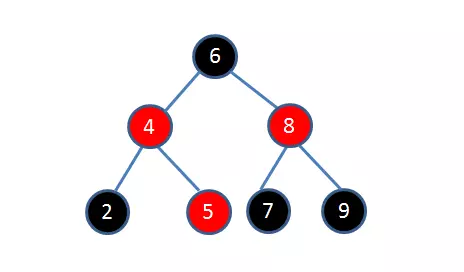

#### 添加数据

``` {.java}
public V put(K key, V value) {
        Entry<K,V> t = root;
        //根节点为空直接新增节点，否则继续下面的流程
        if (t == null) {
            compare(key, key); // type (and possibly null) check

            root = new Entry<>(key, value, null);
            size = 1;
            modCount++;
            return null;
        }
        int cmp;
        Entry<K,V> parent;
        // split comparator and comparable paths
        Comparator<? super K> cpr = comparator;
        //有特殊指定的比较器则使用比较器进行比较，否则使用key的比较器进行比较
        if (cpr != null) {
            do {
                parent = t;
                cmp = cpr.compare(key, t.key);
                if (cmp < 0)
                    t = t.left;
                else if (cmp > 0)
                    t = t.right;
                else
                    return t.setValue(value);
            } while (t != null);
        }
        else {
            if (key == null)
                throw new NullPointerException();
            @SuppressWarnings("unchecked")
                Comparable<? super K> k = (Comparable<? super K>) key;
            do {
                parent = t;
                cmp = k.compareTo(t.key);
                if (cmp < 0)
                    t = t.left;
                else if (cmp > 0)
                    t = t.right;
                else
                    return t.setValue(value);
            } while (t != null);
        }
        Entry<K,V> e = new Entry<>(key, value, parent);
        if (cmp < 0)
            parent.left = e;
        else
            parent.right = e;
        //修复红黑树的平衡
        fixAfterInsertion(e);
        size++;
        modCount++;
        return null;
    }
```

如上所示为put方法的源码，可能看起来相对来说比较长，但是我们来详细分析下如以下步骤

-   1.校验根节点：校验根节点是否为空，若为空则根据传入的key-value的值创建一个新的节点，若根节点不为空则继续第二步
-   2.寻找插入位置：其实这点很好理解，由于TreeMap内部是红黑树实现的则插入元素时，实际上是会去遍历左子树，或者右子树(具体遍历哪颗子树是根据当前插入key-value与根节点的比较判定的，这部在代码里面其实分为两步来体现是否指定比较器，若指定了则使用指定的比较器比较，否则使用默认key的比较器进行比较（这里有一点需要注意是TreeMap是不允许key-value为NULL）
-   3.新建并恢复：在第二步中实际上是需要确定当前插入节点的位置，而这一步是实际的插入操作，而插入之后为啥还需要调用fixAfterInsertion方法，这里是因为红黑树插入一个节点后可能会破坏红黑树的性质，则通过修改的代码使得红黑树从新达到平衡，具体可以参考[JAVA学习-红黑树详解](https://www.jianshu.com/p/4cd37000f4e3)

其实从上面的分析来讲TreeMap插入一个节点的流程不是太复杂，只要深刻的理解红黑树的原理，这个流程就相对简单很多，其实这里本人存在一点疑问(为什么要引入红黑树来做TreeMap的结构，需要看到本文的大神指导指导)，

#### 查找元素

如下所示是get方法的源码,其实际是调用了getEntry方法

``` {.java}
public V get(Object key) {
    //获取元素，若为空则返回null否则返回其值
    Entry<K,V> p = getEntry(key);
    return (p==null ? null : p.value);
}

final Entry<K,V> getEntry(Object key) {
        // Offload comparator-based version for sake of performance
    if (comparator != null)
    //构造器不为空则调用以下方法
        return getEntryUsingComparator(key);
    if (key == null)
        throw new NullPointerException();
    @SuppressWarnings("unchecked")
        Comparable<? super K> k = (Comparable<? super K>) key;
    Entry<K,V> p = root;
    while (p != null) {
        int cmp = k.compareTo(p.key);
        if (cmp < 0)
            p = p.left;
        else if (cmp > 0)
            p = p.right;
        else
            return p;
    }
    return null;
    }
```

getEntry方法主要流程如下：

-   1.构造器校验：判断是否指定构造器，若指定则调用getEntryUsingComparator，若没有则进行第二步
-   2.空值校验：key若为空直接抛出NullPointerException，从这点可以看出TreeMap是不允许Key-value为空的
-   3.遍历返回：遍历整个红黑树若找到对应的值则返回，否则返回null值
    以上就是getEntry方法的主要流程，在步骤一中提到了getEntryUsingComparator方法，其实该方法与步骤三中的操作并无太大差异，存在的区别就是使用了构造器进行比较。

#### 3.总结

本文主要介绍了TreeMap的实现及其特点，还有一些方法及代码没有详解介绍，若想深入了解可以查看源码做更深入的探究。若有问题,请指正。

-   1.TreeMap的内部实现是红黑树，关于红黑树的详解请查看[JAVA学习-红黑树详解](https://www.jianshu.com/p/4cd37000f4e3)
-   2.TreeMap特点有些是源于红黑树的一些特点，比如TreeMap是有序的,TreeMap不允许key-value为空等

作者：遇见技术

链接：https://www.jianshu.com/p/d9ad7f6d75a0

来源：简书

简书著作权归作者所有，任何形式的转载都请联系作者获得授权并注明出处。

HashTable
---------

https://blog.csdn.net/varyall/article/details/80992123

HashMap和Hashtable的比较是Java面试中的常见问题，用来考验程序员是否能够正确使用集合类以及是否可以随机应变使用多种思路解决问题。HashMap的工作原理、ArrayList与Vector的比较以及这个问题是有关Java
集合框架的最经典的问题。Hashtable是个过时的集合类，存在于Java
API中很久了。在Java
4中被重写了，实现了Map接口，所以自此以后也成了Java集合框架中的一部分。Hashtable和HashMap在Java面试中相当容易被问到，甚至成为了集合框架面试题中最常被考的问题，所以在参加任何Java面试之前，都不要忘了准备这一题。

这篇文章中，我们不仅将会看到HashMap和Hashtable的区别，还将看到它们之间的相似之处。

#### HashMap和Hashtable的区别

HashMap和Hashtable都实现了Map接口，但决定用哪一个之前先要弄清楚它们之间的分别。主要的区别有：线程安全性，同步(synchronization)，以及速度。

1.  HashMap几乎可以等价于Hashtable，除了HashMap是非synchronized的，并可以接受null(HashMap可以接受为null的键值(key)和值(value)，而Hashtable则不行)。
2.  HashMap是非synchronized，而Hashtable是synchronized，这意味着Hashtable是线程安全的，多个线程可以共享一个Hashtable；而如果没有正确的同步的话，多个线程是不能共享HashMap的。Java
    5提供了ConcurrentHashMap，它是HashTable的替代，比HashTable的扩展性更好。
3.  另一个区别是HashMap的迭代器(Iterator)是fail-fast迭代器，而Hashtable的enumerator迭代器不是fail-fast的。所以当有其它线程改变了HashMap的结构（增加或者移除元素），将会抛出ConcurrentModificationException，但迭代器本身的remove()方法移除元素则不会抛出ConcurrentModificationException异常。但这并不是一个一定发生的行为，要看JVM。这条同样也是Enumeration和Iterator的区别。
4.  由于Hashtable是线程安全的也是synchronized，所以在单线程环境下它比HashMap要慢。如果你不需要同步，只需要单一线程，那么使用HashMap性能要好过Hashtable。
5.  HashMap不能保证随着时间的推移Map中的元素次序是不变的。

#### 要注意的一些重要术语：

1)  sychronized意味着在一次仅有一个线程能够更改Hashtable。就是说任何线程要更新Hashtable时要首先获得同步锁，其它线程要等到同步锁被释放之后才能再次获得同步锁更新Hashtable。

2)  Fail-safe和iterator迭代器相关。如果某个集合对象创建了Iterator或者ListIterator，然后其它的线程试图“结构上”更改集合对象，将会抛出ConcurrentModificationException异常。但其它线程可以通过set()方法更改集合对象是允许的，因为这并没有从“结构上”更改集合。但是假如已经从结构上进行了更改，再调用set()方法，将会抛出IllegalArgumentException异常。

3)  结构上的更改指的是删除或者插入一个元素，这样会影响到map的结构。

#### 我们能否让HashMap同步？

HashMap可以通过下面的语句进行同步： Map m =
Collections.synchronizeMap(hashMap);

#### 结论

Hashtable和HashMap有几个主要的不同：线程安全以及速度。仅在你需要完全的线程安全的时候使用Hashtable，而如果你使用Java
5或以上的话，请使用ConcurrentHashMap吧。

Hashtable 是遗留类，很多映射的常用功能与 HashMap 类似，不同的是它承自
Dictionary 类， 并且是线程安全的，任一时间只有一个线程能写
Hashtable，并发性不如 ConcurrentHashMap， 因为 ConcurrentHashMap
引入了分段锁。Hashtable 不建议在新代码中使用，不需要线程安全
的场合可以用 HashMap 替换，需要线程安全的场合可以用 ConcurrentHashMap
替换。

NavigableMap
------------

https://blog.csdn.net/u010126792/article/details/62236367

``` {.java}
public interface NavigableMap<K,V> extends SortedMap<K,V> {

//返回原map中小于且最接近key的键值对（不包含等于）
    Map.Entry<K,V> lowerEntry(K key);

//返回小于且最接近key的键（不包含等于)
    K lowerKey(K key);

//返回小于且最接近key的键值对（包含等于）
    Map.Entry<K,V> floorEntry(K key);

//返回最接近的大于key的键（包含等于）
    K floorKey(K key);

//返回最接近的大于等于key的键值对
    Map.Entry<K,V> ceilingEntry(K key);

//返回最接近的大于等于key的键
    K ceilingKey(K key);

//返回最接近的大于key的键值对
    Map.Entry<K,V> higherEntry(K key);

//返回最接近的大于key的键
    K higherKey(K key);

//返回最小的Entry
    Map.Entry<K,V> firstEntry();

//返回最大的Entry
    Map.Entry<K,V> lastEntry();

//删除并返回最小的Entry
    Map.Entry<K,V> pollFirstEntry();

//删除并返回最大的Entry
    Map.Entry<K,V> pollLastEntry();

//返回一个与原map反向顺序的视图，仍然是同一个map，操作会互相影响
    NavigableMap<K,V> descendingMap();

//返回一个所有key键的视图
    NavigableSet<K> navigableKeySet();

//返回一个所有key键的视图，顺序是逆序
    NavigableSet<K> descendingKeySet();

//返回fromKey到toKey的map视图，通过fromInclusive与toInclusive控制是否包含
    NavigableMap<K,V> subMap(K fromKey, boolean fromInclusive,
                             K toKey,   boolean toInclusive);

//返回小于toKey的键值对的视图（inclusive为true代表包含等于）
    NavigableMap<K,V> headMap(K toKey, boolean inclusive);

//返回大于fromKey的键值对视图（inclusive为true代表包含等于）
    NavigableMap<K,V> tailMap(K fromKey, boolean inclusive);

//范围 [fromKey, toKey) 的视图
    SortedMap<K,V> subMap(K fromKey, K toKey);

//小于toKey的map视图
    SortedMap<K,V> headMap(K toKey);

//大于等于fromKey的map视图
    SortedMap<K,V> tailMap(K fromKey);
}
```

SortedMap
---------

``` {.java}
public interface SortedMap<K,V> extends Map<K,V> {

    Comparator<? super K> comparator();

//返回 [fromeKey， toKey)，左闭右开，区间内的原map的一个视图
    SortedMap<K,V> subMap(K fromKey, K toKey);


//返回小于toKey的原map的一个视图
    SortedMap<K,V> headMap(K toKey);


//返回一个大于等于fromKey的视图，并不是将原map中大于等于formeKey的节点
//复制重新组成一个新的map，对该map的操作等同于对原map相应位置的节点的操作，
//就是提供一个大于等于fromeKey的视图
    SortedMap<K,V> tailMap(K fromKey);

//返回第一个（最小）的key
    K firstKey();

//返回最后（最大）的key
    K lastKey();

    Set<K> keySet();

    Collection<V> values();

    Set<Map.Entry<K, V>> entrySet();
}
```

哈希表
------

[Java数据结构和算法（十三）——哈希表](http://www.cnblogs.com/ysocean/p/8032656.html)

Hash表也称散列表，也有直接译作哈希表，Hash表是一种根据关键字值（key -
value）而直接进行访问的数据结构。它基于数组，通过把关键字映射到数组的某个下标来加快查找速度，但是又和数组、链表、树等数据结构不同，在这些数据结构中查找某个关键字，通常要遍历整个数据结构，也就是O(N)的时间级，但是对于哈希表来说，只是O(1)的时间级。

　　注意，这里有个重要的问题就是如何把关键字转换为数组的下标，这个转换的函数称为哈希函数（也称散列函数），转换的过程称为哈希化。

#### 哈希函数的引入

大家都用过字典，字典的优点是我们可以通过前面的目录快速定位到所要查找的单词。如果我们想把一本英文字典的每个单词，从
a 到
zyzzyva(这是牛津字典的最后一个单词)，都写入计算机内存，以便快速读写，那么哈希表是个不错的选择。

　　这里我们将范围缩小点，比如想在内存中存储5000个英文单词。我们可能想到每个单词会占用一个数组单元，那么数组的大小是5000，同时可以用数组下标存取单词，这样设想很完美，但是数组下标和单词怎么建立联系呢？

　　首先我们要建立单词和数字（数组下标）的关系：

　　我们知道 ASCII 是一种编码，其中 a
表示97，b表示98，以此类推，一直到122表示z，而每个单词都是由这26个字母组成，我们可以不用
ASCII 编码那么大的数字，自己设计一套类似
ASCII的编码，比如a表示1，b表示2，依次类推，z表示26，那么表示方法我们就知道了。

　　接下来如何把单个字母的数字组合成代表整个单词的数字呢？

　　**①、把数字相加**

　　首先第一种简单的方法就是把单词的每个字母表示的数字相加，得到的和便是数组的下标。

　　比如单词 cats 转换成数字：

　　cats = 3 + 1 + 20 + 19 = 43

　　那么单词 cats
存储在数组中的下标为43，所有的英文单词都可以用这个办法转换成数组下标。但是这个办法真的可行吗？

　　假设我们约定一个单词最多有 10 个字母，那么字典的最后一个单词为
zzzzzzzzzz ，其转换为数字：

　　zzzzzzzzzz = 26\*10 = 260

　　那么我们可以得到单词编码的范围是从1-260。很显然，这个范围是不够存储5000个单词的，那么肯定有一个位置存储了多个单词，每个数组的数据项平均要存储192个单词（5000除以260）。

　　对于上面的问题，我们如何解决呢？

　　**第一种方法：**考虑每个数组项包含一个子数组或者一个子链表，这个办法存数据项确实很快，但是如果我们想要从192个单词中查找到其中一个，那么还是很慢。

　　**第二种方法：**为啥要让那么多单词占据同一个数据项呢？也就是说我们没有把单词分的足够开，数组能表示的元素太少，我们需要扩展数组的下标，使其每个位置都只存放一个单词。

　　对于上面的第二种方法，问题产生了，我们如何扩展数组的下标呢？

　　**②、幂的连乘**

　　我们将单词表示的数拆成数列，用适当的 27
的幂乘以这些位数（因为有26个可能的字符，以及空格，一共27个），然后把乘积相加，这样就得出了每个单词独一无二的数字。

　　比如把单词cats 转换为数字：

　　cats = 3*273 + 1*272 + 20*271 + 19*270 = 59049 + 729 + 540 + 19 =
60337

　　这个过程会为每个单词创建一个独一无二的数，但是注意的是我们这里只是计算了
4 个字母组成的单词，如果单词很长，比如最长的10个字母的单词
zzzzzzzzzz，仅仅是279
结果就超出了7000000000000，这个结果是很巨大的，在实际内存中，根本不可能为一个数组分配这么大的空间。

　　所以这个方案的问题就是虽然为每个单词都分配了独一无二的下标，但是只有一小部分存放了单词，很大一部分都是空着的。那么现在就需要一种方法，把数位幂的连乘系统中得到的巨大的整数范围压缩到可接受的数组范围中。

　　对于英语字典，假设只有5000个单词，这里我们选定容量为10000
的数组空间来存放（后面会介绍为啥需要多出一倍的空间）。那么我们就需要将从
0 到超过 7000000000000 的范围，压缩到从0到10000的范围。

　　第一种方法：取余，得到一个数被另一个整数除后的余数。首先我们假设要把从0-199的数字（用largeNumber表示），压缩为从0-9的数字（用smallNumber表示），后者有10个数，所以变量smallRange
的值为10，这个转换的表达式为：

　　smallNumber = largeNumber % smallRange

　　当一个数被 10
整除时，余数一定在0-9之间，这样，我们就把从0-199的数压缩为从0-9的数，压缩率为
20 :1。

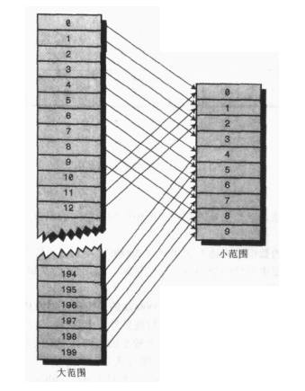

我们也可以用类似的方法把表示单词唯一的数压缩成数组的下标：

　　arrayIndex = largerNumber % smallRange

　　**这也就是哈希函数。它把一个大范围的数字哈希（转化）成一个小范围的数字，这个小范围的数对应着数组的下标。使用哈希函数向数组插入数据后，这个数组就是哈希表。**

#### 冲突

把巨大的数字范围压缩到较小的数字范围，那么肯定会有几个不同的单词哈希化到同一个数组下标，即产生了**冲突**。

　　冲突可能会导致哈希化方案无法实施，前面我们说指定的数组范围大小是实际存储数据的两倍，因此可能有一半的空间是空着的，所以，当冲突产生时，一个方法是通过系统的方法找到数组的一个空位，并把这个单词填入，而不再用哈希函数得到数组的下标，这种方法称为开放地址法。比如加入单词
cats
哈希化的结果为5421，但是它的位置已经被单词parsnip占用了，那么我们会考虑将单词
cats 存放在parsnip后面的一个位置 5422 上。

　　另一种方法，前面我们也提到过，就是数组的每个数据项都创建一个子链表或子数组，那么数组内不直接存放单词，当产生冲突时，新的数据项直接存放到这个数组下标表示的链表中，这种方法称为链地址法。

#### 开放地址法

开发地址法中，若数据项不能直接存放在由哈希函数所计算出来的数组下标时，就要寻找其他的位置。分别有三种方法：线性探测、二次探测以及再哈希法。

　　**①、线性探测**

　　在线性探测中，它会线性的查找空白单元。比如如果 5421
是要插入数据的位置，但是它已经被占用了，那么就使用5422，如果5422也被占用了，那么使用5423，以此类推，数组下标依次递增，直到找到空白的位置。这就叫做线性探测，因为它沿着数组下标一步一步顺序的查找空白单元。

　　完整代码：

``` {.java}
package com.ys.hash;
 
public class MyHashTable {
    private DataItem[] hashArray;   //DataItem类，表示每个数据项信息
    private int arraySize;//数组的初始大小
    private int itemNum;//数组实际存储了多少项数据
    private DataItem nonItem;//用于删除数据项
     
    public MyHashTable(int arraySize){
        this.arraySize = arraySize;
        hashArray = new DataItem[arraySize];
        nonItem = new DataItem(-1);//删除的数据项下标为-1
    }
    //判断数组是否存储满了
    public boolean isFull(){
        return (itemNum == arraySize);
    }
     
    //判断数组是否为空
    public boolean isEmpty(){
        return (itemNum == 0);
    }
     
    //打印数组内容
    public void display(){
        System.out.println("Table:");
        for(int j = 0 ; j < arraySize ; j++){
            if(hashArray[j] != null){
                System.out.print(hashArray[j].getKey() + " ");
            }else{
                System.out.print("** ");
            }
        }
    }
    //通过哈希函数转换得到数组下标
    public int hashFunction(int key){
        return key%arraySize;
    }
     
    //插入数据项
    public void insert(DataItem item){
        if(isFull()){
            //扩展哈希表
            System.out.println("哈希表已满，重新哈希化...");
            extendHashTable();
        }
        int key = item.getKey();
        int hashVal = hashFunction(key);
        while(hashArray[hashVal] != null && hashArray[hashVal].getKey() != -1){
            ++hashVal;
            hashVal %= arraySize;
        }
        hashArray[hashVal] = item;
        itemNum++;
    }
    /**
     * 数组有固定的大小，而且不能扩展，所以扩展哈希表只能另外创建一个更大的数组，然后把旧数组中的数据插到新的数组中。
     * 但是哈希表是根据数组大小计算给定数据的位置的，所以这些数据项不能再放在新数组中和老数组相同的位置上。
     * 因此不能直接拷贝，需要按顺序遍历老数组，并使用insert方法向新数组中插入每个数据项。
     * 这个过程叫做重新哈希化。这是一个耗时的过程，但如果数组要进行扩展，这个过程是必须的。
     */
    public void extendHashTable(){
        int num = arraySize;
        itemNum = 0;//重新计数，因为下面要把原来的数据转移到新的扩张的数组中
        arraySize *= 2;//数组大小翻倍
        DataItem[] oldHashArray = hashArray;
        hashArray = new DataItem[arraySize];
        for(int i = 0 ; i < num ; i++){
            insert(oldHashArray[i]);
        }
    }
     
    //删除数据项
    public DataItem delete(int key){
        if(isEmpty()){
            System.out.println("Hash Table is Empty!");
            return null;
        }
        int hashVal = hashFunction(key);
        while(hashArray[hashVal] != null){
            if(hashArray[hashVal].getKey() == key){
                DataItem temp = hashArray[hashVal];
                hashArray[hashVal] = nonItem;//nonItem表示空Item,其key为-1
                itemNum--;
                return temp;
            }
            ++hashVal;
            hashVal %= arraySize;
        }
        return null;
    }
     
    //查找数据项
    public DataItem find(int key){
        int hashVal = hashFunction(key);
        while(hashArray[hashVal] != null){
            if(hashArray[hashVal].getKey() == key){
                return hashArray[hashVal];
            }
            ++hashVal;
            hashVal %= arraySize;
        }
        return null;
    }
     
    public static class DataItem{
        private int iData;
        public DataItem(int iData){
            this.iData = iData;
        }
        public int getKey(){
            return iData;
        }
    }
 
}
```

需要注意的是，当哈希表变得太满时，我们需要扩展数组，但是需要注意的是，数据项不能放到新数组中和老数组相同的位置，而是要根据数组大小重新计算插入位置。这是一个比较耗时的过程，所以一般我们要确定数据的范围，给定好数组的大小，而不再扩容。

　　另外，当哈希表变得比较满时，我们每插入一个新的数据，都要频繁的探测插入位置，因为可能很多位置都被前面插入的数据所占用了，这称为聚集。数组填的越满，聚集越可能发生。

　　这就像人群，当某个人在商场晕倒时，人群就会慢慢聚集。最初的人群聚过来是因为看到了那个倒下的人，而后面聚过来的人是因为它们想知道这些人聚在一起看什么。人群聚集的越大，吸引的人就会越多。

　　**②、装填因子**

　　已填入哈希表的数据项和表长的比率叫做装填因子，比如有10000个单元的哈希表填入了6667
个数据后，其装填因子为
2/3。当装填因子不太大时，聚集分布的比较连贯，而装填因子比较大时，则聚集发生的很大了。

　　我们知道线性探测是一步一步的往后面探测，当装填因子比较大时，会频繁的产生聚集，那么如果我们探测比较大的单元，而不是一步一步的探测呢，这就是下面要讲的二次探测。

　　**③、二次探测**

　　二测探测是防止聚集产生的一种方式，思想是探测相距较远的单元，而不是和原始位置相邻的单元。

　　线性探测中，如果哈希函数计算的原始下标是x, 线性探测就是x+1, x+2,
x+3, 以此类推；而在二次探测中，探测的过程是x+1, x+4, x+9,
x+16，以此类推，到原始位置的距离是步数的平方。二次探测虽然消除了原始的聚集问题，但是产生了另一种更细的聚集问题，叫二次聚集：比如讲184，302，420和544依次插入表中，它们的映射都是7，那么302需要以1为步长探测，420需要以4为步长探测，
544需要以9为步长探测。只要有一项其关键字映射到7，就需要更长步长的探测，这个现象叫做二次聚集。二次聚集不是一个严重的问题，但是二次探测不会经常使用，因为还有好的解决方法，比如再哈希法。

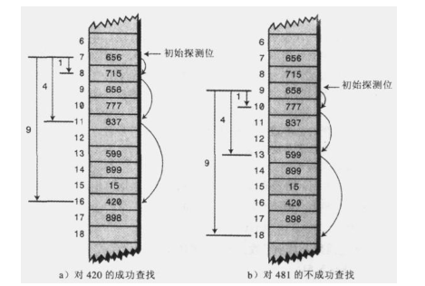

**④、再哈希法**

　　为了消除原始聚集和二次聚集，我们使用另外一种方法：再哈希法。

　　我们知道二次聚集的原因是，二测探测的算法产生的探测序列步长总是固定的：1,4，9,16以此类推。那么我们想到的是需要产生一种依赖关键字的探测序列，而不是每个关键字都一样，那么，不同的关键字即使映射到相同的数组下标，也可以使用不同的探测序列。

　　方法是把关键字用不同的哈希函数再做一遍哈希化，用这个结果作为步长。对于指定的关键字，步长在整个探测中是不变的，不过不同的关键字使用不同的步长。

　　第二个哈希函数必须具备如下特点：

　　一、和第一个哈希函数不同

　　二、不能输出0（否则，将没有步长，每次探测都是原地踏步，算法将陷入死循环）。

　　专家们已经发现下面形式的哈希函数工作的非常好：stepSize = constant -
key % constant; 其中constant是质数，且小于数组容量。
　　再哈希法要求表的容量是一个质数，假如表长度为15(0-14)，非质数，有一个特定关键字映射到0，步长为5，则探测序列是0,5,10,0,5,10,以此类推一直循环下去。算法只尝试这三个单元，所以不可能找到某些空白单元，最终算法导致崩溃。如果数组容量为13,
质数，探测序列最终会访问所有单元。即0,5,10,2,7,12,4,9,1,6,11,3,一直下去，只要表中有一个空位，就可以探测到它。

　　完整再哈希法代码：

``` {.java}
package com.ys.hash;
 
public class HashDouble {
    private DataItem[] hashArray;   //DataItem类，表示每个数据项信息
    private int arraySize;//数组的初始大小
    private int itemNum;//数组实际存储了多少项数据
    private DataItem nonItem;//用于删除数据项
     
    public HashDouble(){
        this.arraySize = 13;
        hashArray = new DataItem[arraySize];
        nonItem = new DataItem(-1);//删除的数据项下标为-1
    }
    //判断数组是否存储满了
    public boolean isFull(){
        return (itemNum == arraySize);
    }
     
    //判断数组是否为空
    public boolean isEmpty(){
        return (itemNum == 0);
    }
     
    //打印数组内容
    public void display(){
        System.out.println("Table:");
        for(int j = 0 ; j < arraySize ; j++){
            if(hashArray[j] != null){
                System.out.print(hashArray[j].getKey() + " ");
            }else{
                System.out.print("** ");
            }
        }
    }
    //通过哈希函数转换得到数组下标
    public int hashFunction1(int key){
        return key%arraySize;
    }
     
    public int hashFunction2(int key){
        return 5 - key%5;
    }
     
    //插入数据项
    public void insert(DataItem item){
        if(isFull()){
            //扩展哈希表
            System.out.println("哈希表已满，重新哈希化...");
            extendHashTable();
        }
        int key = item.getKey();
        int hashVal = hashFunction1(key);
        int stepSize = hashFunction2(key);//用第二个哈希函数计算探测步数
        while(hashArray[hashVal] != null && hashArray[hashVal].getKey() != -1){
            hashVal += stepSize;
            hashVal %= arraySize;//以指定的步数向后探测
        }
        hashArray[hashVal] = item;
        itemNum++;
    }
 
    /**
     * 数组有固定的大小，而且不能扩展，所以扩展哈希表只能另外创建一个更大的数组，然后把旧数组中的数据插到新的数组中。
     * 但是哈希表是根据数组大小计算给定数据的位置的，所以这些数据项不能再放在新数组中和老数组相同的位置上。
     * 因此不能直接拷贝，需要按顺序遍历老数组，并使用insert方法向新数组中插入每个数据项。
     * 这个过程叫做重新哈希化。这是一个耗时的过程，但如果数组要进行扩展，这个过程是必须的。
     */
    public void extendHashTable(){
        int num = arraySize;
        itemNum = 0;//重新计数，因为下面要把原来的数据转移到新的扩张的数组中
        arraySize *= 2;//数组大小翻倍
        DataItem[] oldHashArray = hashArray;
        hashArray = new DataItem[arraySize];
        for(int i = 0 ; i < num ; i++){
            insert(oldHashArray[i]);
        }
    }
     
    //删除数据项
    public DataItem delete(int key){
        if(isEmpty()){
            System.out.println("Hash Table is Empty!");
            return null;
        }
        int hashVal = hashFunction1(key);
        int stepSize = hashFunction2(key);
        while(hashArray[hashVal] != null){
            if(hashArray[hashVal].getKey() == key){
                DataItem temp = hashArray[hashVal];
                hashArray[hashVal] = nonItem;//nonItem表示空Item,其key为-1
                itemNum--;
                return temp;
            }
            hashVal += stepSize;
            hashVal %= arraySize;
        }
        return null;
    }
     
    //查找数据项
    public DataItem find(int key){
        int hashVal = hashFunction1(key);
        int stepSize = hashFunction2(key);
        while(hashArray[hashVal] != null){
            if(hashArray[hashVal].getKey() == key){
                return hashArray[hashVal];
            }
            hashVal += stepSize;
            hashVal %= arraySize;
        }
        return null;
    }
    public static class DataItem{
        private int iData;
        public DataItem(int iData){
            this.iData = iData;
        }
        public int getKey(){
            return iData;
        }
    }
}
```

#### 链地址法

在开放地址法中，通过再哈希法寻找一个空位解决冲突问题，另一个方法是在哈希表每个单元中设置链表（即链地址法），某个数据项的关键字值还是像通常一样映射到哈希表的单元，而数据项本身插入到这个单元的链表中。其他同样映射到这个位置的数据项只需要加到链表中，不需要在原始的数组中寻找空位。

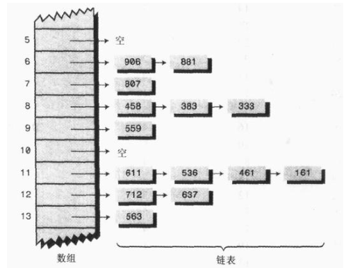

有序链表：

``` {.java}
package com.ys.hash;
 
public class SortLink {
    private LinkNode first;
    public SortLink(){
        first = null;
    }
    public boolean isEmpty(){
        return (first == null);
    }
    public void insert(LinkNode node){
        int key = node.getKey();
        LinkNode previous = null;
        LinkNode current = first;
        while(current != null && current.getKey() < key){
            previous = current;
            current = current.next;
        }
        if(previous == null){
            first = node;
        }else{
            previous.next = node;
        }
　　　　　　node.next = curent;
    }
    public void delete(int key){
        LinkNode previous = null;
        LinkNode current = first;
        if(isEmpty()){
            System.out.println("Linked is Empty!!!");
            return;
        }
        while(current != null && current.getKey() != key){
            previous = current;
            current = current.next;
        }
        if(previous == null){
            first = first.next;
        }else{
            previous.next = current.next;
        }
    }
     
    public LinkNode find(int key){
        LinkNode current = first;
        while(current != null && current.getKey() <= key){
            if(current.getKey() == key){
                return current;
            }
                        current = current.next;
        }
        return null;
    }
     
    public void displayLink(){
        System.out.println("Link(First->Last)");
        LinkNode current = first;
        while(current != null){
            current.displayLink();
            current = current.next;
        }
        System.out.println("");
    }
    class LinkNode{
        private int iData;
        public LinkNode next;
        public LinkNode(int iData){
            this.iData = iData;
        }
        public int getKey(){
            return iData;
        }
        public void displayLink(){
            System.out.println(iData + " ");
        }
    }
}
```

链地址法：

``` {.java}
package com.ys.hash;
 
import com.ys.hash.SortLink.LinkNode;
 
public class HashChain {
    private SortLink[] hashArray;//数组中存放链表
    private int arraySize;
    public HashChain(int size){
        arraySize = size;
        hashArray = new SortLink[arraySize];
        //new 出每个空链表初始化数组
        for(int i = 0 ; i < arraySize ; i++){
            hashArray[i] = new SortLink();
        }
    }
     
    public void displayTable(){
        for(int i = 0 ; i < arraySize ; i++){
            System.out.print(i + "：");
            hashArray[i].displayLink();
        }
    }
     
    public int hashFunction(int key){
        return key%arraySize;
    }
     
    public void insert(LinkNode node){
        int key = node.getKey();
        int hashVal = hashFunction(key);
        hashArray[hashVal].insert(node);//直接往链表中添加即可
    }
     
    public LinkNode delete(int key){
        int hashVal = hashFunction(key);
        LinkNode temp = find(key);
        hashArray[hashVal].delete(key);//从链表中找到要删除的数据项，直接删除
        return temp;
    }
     
    public LinkNode find(int key){
        int hashVal = hashFunction(key);
        LinkNode node = hashArray[hashVal].find(key);
        return node;
    }
 
}
```

链地址法中，装填因子（数据项数和哈希表容量的比值）与开放地址法不同，在链地址法中，需要有N个单元的数组中转入N个或更多的数据项，因此装填因子一般为1，或比1大（有可能某些位置包含的链表中包含两个或两个以上的数据项）。

　　找到初始单元需要O(1)的时间级别，而搜索链表的时间与M成正比，M为链表包含的平均项数，即O(M)的时间级别。

#### 桶

另外一种方法类似于链地址法，它是在每个数据项中使用子数组，而不是链表。这样的数组称为桶。

　　这个方法显然不如链表有效，因为桶的容量不好选择，如果容量太小，可能会溢出，如果太大，又造成性能浪费，而链表是动态分配的，不存在此问题。所以一般不使用桶。

#### 总结

　哈希表基于数组，类似于key-value的存储形式，关键字值通过哈希函数映射为数组的下标，如果一个关键字哈希化到已占用的数组单元，这种情况称为冲突。用来解决冲突的有两种方法：开放地址法和链地址法。在开发地址法中，把冲突的数据项放在数组的其它位置；在链地址法中，每个单元都包含一个链表，把所有映射到同一数组下标的数据项都插入到这个链表中。
