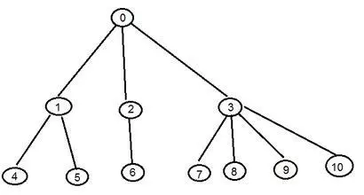
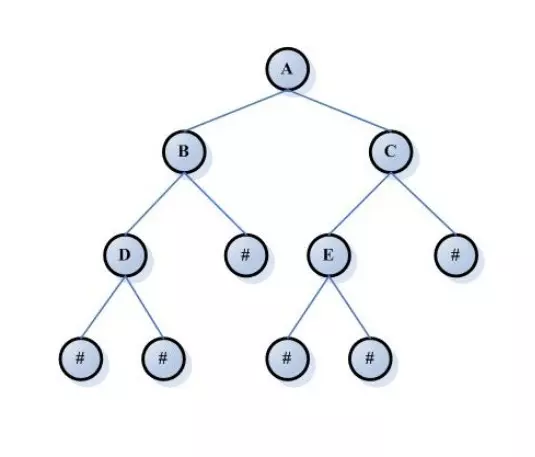
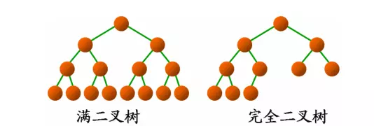
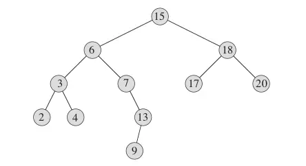
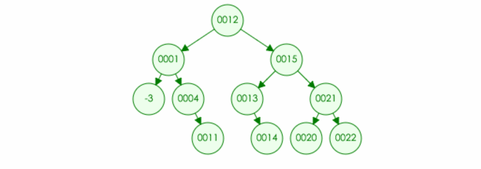

# Tree

[数据结构 - 树](https://www.jianshu.com/p/45661b029292)

[总结深度优先与广度优先的区别](https://blog.csdn.net/u010412301/article/details/79949730)

## 树基本概念

树是一种数据结构，它看上去像一棵 "圣诞树"，它的根在上，叶朝下。

**树有多个节点(node)，用以储存元素。某些节点之间存在一定的关系，用连线表示，连线称为边(edge)。边的上端节点称为父节点，下端称为子节点。树像是一个不断分叉的树根。**

例如：




树要吗为空树(empty tree)，要吗具有以下特性：

1. 每个节点可以有多个子节点(children)，而该节点是相应子节点的父节点(parent) - 比如说，1,2 是 0 的子节点，3 是 7,8 的父节点
2. 树有一个没有父节点的节点，称为根节点(root) - 比如图中的 0 节点
3. 没有子节点的节点称为叶节点(leaf) - 比如图中的 7，8，9，10 节点
4. 两个具有相同父节点的节点称为兄弟节点(sibling) - 比如图中 4，5 节点互为兄弟节点
5. 一个节点的子节点以及子节点的后代称为该节点的子树 (subtree) - 比如 1 和 1 的子节点构成了节点 0 的一棵子树

树的深度和高度的定义：(这里不太确定)

- 树的深度(depth)是从根节点开始（其深度为1）自顶向下逐层累加的
- 高度(height)也是从根节点开始（其高度为0）自顶向下逐层累加的

例如：该树深度为 3，高度为 2。

## 二叉树

**首先，二叉树(binary)是一种特殊的树，它是每个节点最多有两个子树的树结构，通常子树被称作是 "左子树" 和 "右子树"，二叉树常用于实现二叉搜索树和二叉堆。(这些在后面都会介绍)**

例如: 下面这个就是一棵二叉树



常见的二叉树有：完全二叉树，满二叉树，二叉搜索树，二叉堆，AVL 树，红黑树，哈夫曼树。这些都会在后面一一介绍。

## 满二叉树

很好理解，除最后一层无任何子节点外，每一层上的所有结点都有两个子结点的二叉树被称之为满二叉树。

**满二叉树一定是完全二叉树，完全二叉树不一定满二叉树。**

例如：



一个高度为 h 的满二叉树含有 `1 + 2 + 4 + ... + 2^h = 2^(h + 1) - 1个节点`，所以满二叉树的节点个数一定为奇数。

## 完全二叉树

若设二叉树的深度为 h，除第 h 层外，其它各层 (1～h-1) 的结点数都达到最大个数，第 h 层所有的结点都连续集中在最左边，这就是完全二叉树。

例如:


**即除了最后一层外，每一层上的节点数均达到最大值；在最后一层上只缺少右边的若干结点。**而像这样就不是完全二叉树.

用途：

完全二叉树是效率很高的数据结构，堆是一种完全二叉树或者近似完全二叉树，所以效率极高。后面介绍的二叉堆也是基于完全二叉树来实现的。


## 二叉查找树

**二叉搜索树是一种特殊的二叉树，也可以称为二叉排序树，二叉查找树。**除了具有二叉树的基本性质外，它还具备：

1. 树中每个节点最多有两个子树，通常称为左子树和右子树
2. 若它的左子树不空，则左子树上所有结点的值均小于它的根结点的值
3. 若它的右子树不空，则右子树上所有结点的值均大于它的根结点的值
4. 它的左右子树仍然是一棵二叉搜索树 (recursive)

例图：



**二叉查找树的时间复杂度：它和二分查找一样，插入和查找的时间复杂度均为O(logn)，但是在最坏的情况下仍然会有O(n)的时间复杂度。原因在于插入和删除元素的时候，树没有保持平衡（比如，我们查找上图中的“9”，我们需要进行n次查找操作）。我们追求的是在最坏的情况下仍然有较好的时间复杂度，这就是平衡查找树设计的初衷。**

　　**二叉查找树的高度决定了二叉查找树的查找效率。**


#### 基本类型:

```java
class TreeNode<E extends Comparable<E>> {
	private E data;
	private TreeNode<E> left;
	private TreeNode<E> right;
	TreeNode(E theData) {
		data = theData;
		left = null;
		right = null;
	}
	public E getData() {return data;}
	public void setData(E data) {this.data = data;}
	public TreeNode<E> getLeft() {return left;}
	public void setLeft(TreeNode<E> left) {this.left = left;}
	public TreeNode<E> getRight() {return right;}
	public void setRight(TreeNode<E> right) {this.right = right;}
}
public class BinarySearchTree<E extends Comparable<E>>{
    private TreeNode<E> root = null;
}
```

#### 树的遍历

树遍历有**深度优先**和**广度优先**两种方式:

1, **深度优先遍历(DFS)**：对每一个可能的分支路径深入到不能再深入为止，而且每个结点只能访问一次。要特别注意的是，二叉树的深度优先遍历比较特殊，可以细分为先序遍历、中序遍历、后序遍历。具体说明如下：

- 先序遍历：对任一子树，先访问根，然后遍历其左子树，最后遍历其右子树。
- 中序遍历：对任一子树，先遍历其左子树，然后访问根，最后遍历其右子树。
- 后序遍历：对任一子树，先遍历其左子树，然后遍历其右子树，最后访问根。

2,**广度优先遍历(BFS)**：又叫层次遍历，从上往下对每一层依次访问，在每一层中，从左往右（也可以从右往左）访问结点，访问完一层就进入下一层，直到没有结点可以访问为止。　　

3, 二叉树的深度优先遍历的非递归的通用做法是采用栈，广度优先遍历的非递归的通用做法是采用队列。

4,深度优先搜索算法：不全部保留结点，占用空间少；有回溯操作(即有入栈、出栈操作)，运行速度慢。

广度优先搜索算法：保留全部结点，占用空间大； 无回溯操作(即无入栈、出栈操作)，运行速度快。

​          通常 深度优先搜索法不全部保留结点，扩展完的结点从数据库中弹出删去，这样，一般在数据库中存储的结点数就是深度值，因此它占用空间较少。

所以，当搜索树的结点较多，用其它方法易产生内存溢出时，深度优先搜索不失为一种有效的求解方法。 　

​          广度优先搜索算法，一般需存储产生的所有结点，占用的存储空间要比深度优先搜索大得多，因此，程序设计中，必须考虑溢出和节省内存空间的问题。

但广度优先搜索法一般无回溯操作，即入栈和出栈的操作，所以运行速度比深度优先搜索要快些

##### 深度优先算法实现:

**1. 前序遍历：当到达某个节点时，先输出该节点，再访问左子节点，最后访问右子节点。**

代码实现：

```java
    /**
     * 前序遍历(递归)
     * @param cursor
     */
    public void preOrder(TreeNode<E> cursor){
        if(cursor == null) return;
        System.out.println(cursor.getData());
        preOrder(cursor.getLeft());
        preOrder(cursor.getRight());
    }
    /**
     * 前序遍历 非递归版
     * @param root
     */
    public void preOrderNoRec(TreeNode<E> root) {
    	LinkedList<TreeNode<E>> stack=new LinkedList<>();
    	stack.push(root);
    	TreeNode<E> currentNode=null;
    	while(!stack.isEmpty()) {
    		currentNode=stack.pop();
    		System.out.println(currentNode.getData());
    		if(currentNode.getRight()!=null)
    			stack.push(currentNode.getRight());
    		if(currentNode.getLeft()!=null)
    			stack.push(currentNode.getLeft());
    	}
    }
```
**2.中序遍历：当到达某个节点时，先访问左子节点，再输出该节点，最后访问右子节点。**

代码实现:

```java
    /**
     * 中序遍历(递归)
     * @param cursor
     */
    public void inOrder(TreeNode<E> cursor){
        if(cursor == null) return;
        inOrder(cursor.getLeft());
        System.out.println(cursor.getData());
        inOrder(cursor.getRight());
    }
    /**中序遍历 非递归版
     * @param root
     */
	public void inOrderNoRec(TreeNode<E> root) {
		LinkedList<TreeNode<E>> stack = new LinkedList<>();
		TreeNode<E> currentNode = root;
		while (currentNode != null || !stack.isEmpty()) {
			while (currentNode != null) {
				stack.push(currentNode);
				currentNode = currentNode.getLeft();
			}
			currentNode = stack.pop();
			System.out.println(currentNode.getData());
			currentNode = currentNode.getRight();
		}
	}
```


**3. 后序遍历：当到达某个节点时，先访问左子节点，再访问右子节点，最后输出该节点。**

代码实现：

```java
    /**
     * 后序遍历(递归)
     * @param cursor
     */
    public void postOrder(TreeNode<E> cursor){
        if(cursor == null) return;
        postOrder(cursor.getLeft());
        postOrder(cursor.getRight());
        System.out.println(cursor.getData());
    }

	/**后序遍历 非递归版
	 * @param root
	 */
	public void postOrderNoRec(TreeNode<E> root) {
		LinkedList<TreeNode<E>> stack = new LinkedList<>();
		TreeNode<E> currentNode = root;
		TreeNode<E> rightNode = null;
		
		while (currentNode != null || !stack.isEmpty()) {
              // 一直循环到二叉排序树最左端的叶子结点（currentNode是null）
			while (currentNode != null) {
				stack.push(currentNode);
				currentNode = currentNode.getLeft();
			}
			currentNode = stack.pop();
            // 当前结点没有右结点或上一个结点（已经输出的结点）是当前结点的右结点，则输出当前结点 
			while (currentNode.getRight() == null || currentNode.getRight() == rightNode) {
				System.out.println(currentNode.getData());
				rightNode = currentNode;
				if (stack.isEmpty())//root以输出，则遍历结束  
					return;
				currentNode = stack.pop();
			}
			 stack.push(currentNode); //还有右结点没有遍历  
	         currentNode = currentNode.getRight();
		}
	}
```

##### 广度优先算法实现:

```java
    /** 
     * 广度优先遍历二叉树，又称层次遍历二叉树 
     * @param node 
     */ 
	public void breadthFirstTraverse(TreeNode<E> root) {
		Queue<TreeNode<E>> queue = new LinkedList<>();
		TreeNode<E> currentNode = root;
		queue.offer(currentNode);
		while (!queue.isEmpty()) {
			currentNode = queue.poll();
			System.out.println(currentNode.getData());
			if (currentNode.getLeft() != null)
				queue.offer(currentNode.getLeft());
			if (currentNode.getRight() != null)
				queue.offer(currentNode.getRight());
		}
	}
	
```

#### 节点插入

步骤：

1. 递归地去查找该二叉树，找到应该插入的节点
2. 若当前的二叉查找树为空，则插入的元素为根节点
3. 若插入的元素值小于根节点值，则将元素插入到左子树中
4. 若插入的元素值不小于根节点值，则将元素插入到右子树中

```java
public void insertNode(TreeNode<E> node) {
		TreeNode<E> currentNode = root;
		if (currentNode == null) {
			root = node;
			return;
		} else {
			while (true) {
				if (node.getData().compareTo(currentNode.getData()) < 0) {
					if (currentNode.getLeft() == null) {
						break;
					} else {
						currentNode = currentNode.getLeft();
					}
				} else if (node.getData().compareTo(currentNode.getData()) > 0) {

					if (currentNode.getRight() == null) {
						break;
					} else {
						currentNode = currentNode.getRight();
					}
				}
			}
		}
		if (node.getData().compareTo(currentNode.getData()) < 0) {
			currentNode.setLeft(node);
		} else if (node.getData().compareTo(currentNode.getData()) > 0) {
			currentNode.setRight(node);
		}
	}
```

#### 节点删除

首先需要搜索该节点，然后可以分为以下四种情况进行讨论：

**1.如果找不到该节点，那么什么都不用做**

例如：要在树中删除元素 22


**2.如果被移除的元素在叶节点(no children)：那么直接移除该节点，并且将父节点原本指向该位置改为 null (如果是根节点，那就不用修改父节点指向位置)**

例如：要在树中删除元素 6


**3.如果删除的元素只有一个儿子(one child)：那么也很简单，直接删除该节点，并且将父节点原本指向的位置改为该儿子 (如果是根节点，那么该儿子成为新的根节点)**

例如：要在树中删除元素 20


**4.如果删除的元素有两个儿子，那么可以取左子树中最大元素或者右子树中最小元素进行替换，然后将最大元素最小元素原位置置空**

例如：要在树中删除元素 15




## 平衡二叉树

## 平衡查找树之AVL树

## 平衡查找树之红黑树

[红黑树(一)之 原理和算法详细介绍](https://www.cnblogs.com/skywang12345/p/3245399.html)

[红黑树(五)之 Java的实现](https://www.cnblogs.com/skywang12345/p/3624343.html)

[教你初步了解红黑树](https://blog.csdn.net/v_JULY_v/article/details/6105630)

**红黑树的定义：**红黑树是一种自平衡二叉查找树，是在计算机科学中用到的一种数据结构，典型的用途是实现关联数组。它是在1972年由鲁道夫·贝尔发明的，称之为”对称二叉B树”，它现代的名字是在 Leo J. Guibas 和 Robert Sedgewick 于1978年写的一篇论文中获得的。**它是复杂的，但它的操作有着良好的最坏情况运行时间，并且在实践中是高效的: 它可以在O(logn)时间内做查找，插入和删除，这里的n是树中元素的数目。**

红黑树和AVL树一样都对插入时间、删除时间和查找时间提供了最好可能的最坏情况担保。这不只是使它们在时间敏感的应用如实时应用（real time application）中有价值，而且使它们有在提供最坏情况担保的其他数据结构中作为建造板块的价值；例如，在计算几何中使用的很多数据结构都可以基于红黑树。此外，红黑树还是2-3-4树的一种等同，它们的思想是一样的，只不过红黑树是2-3-4树用二叉树的形式表示的。


## B,B+,B*树

## LSM树

## Trie树

## 哈夫曼树

## KD树

