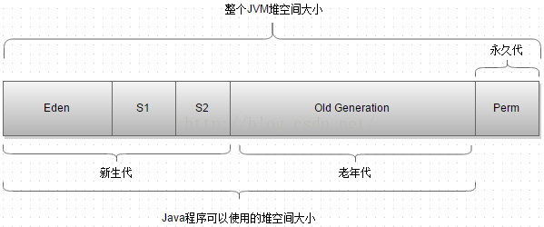
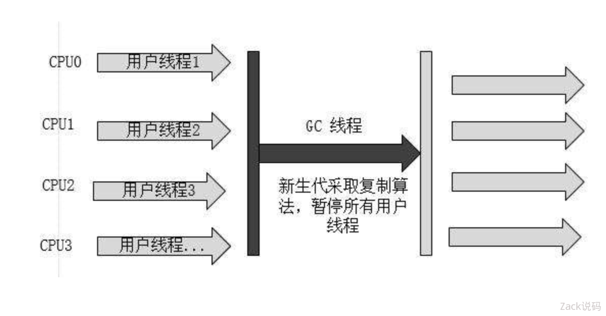
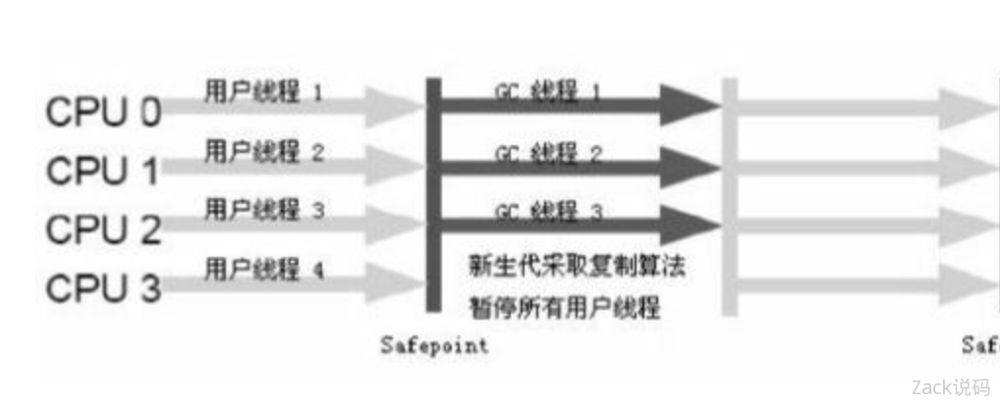
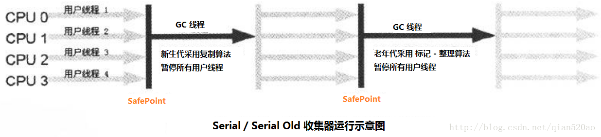
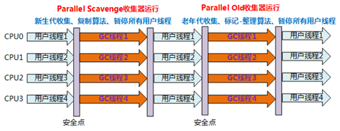
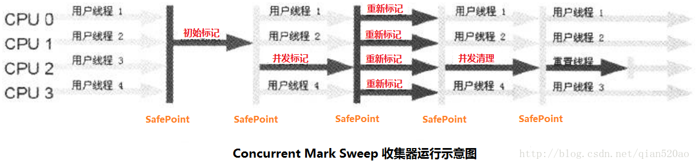
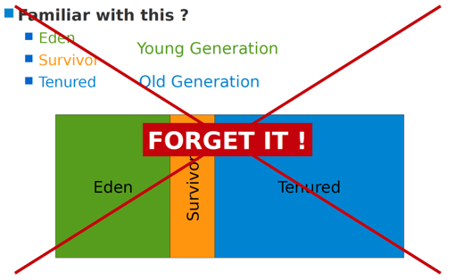
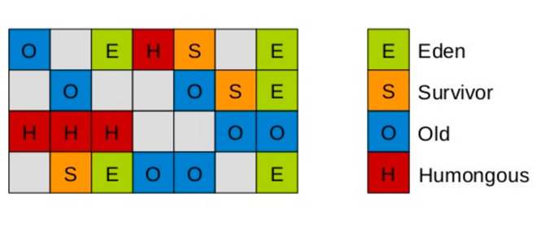
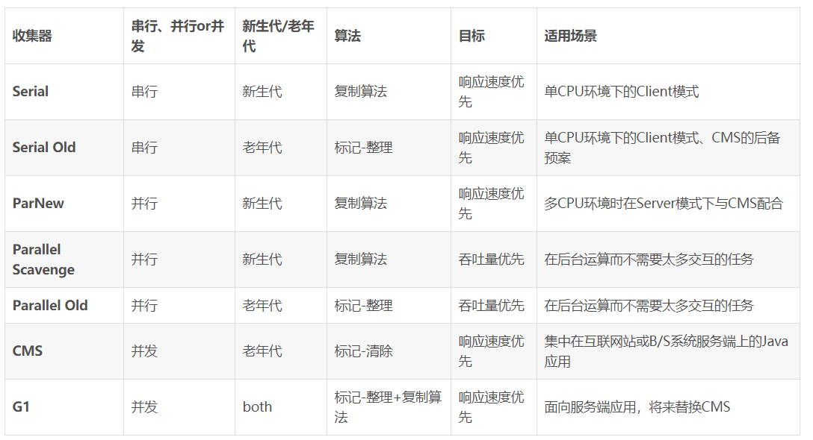
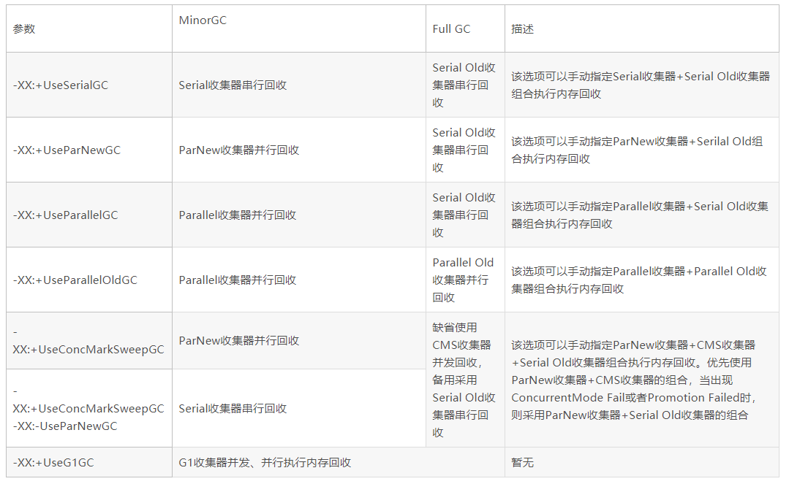

## 虚拟机

[https://www.cnblogs.com/smyhvae/p/4748392.html](https://www.cnblogs.com/smyhvae/p/4748392.html)

每一个线程都有一个**程序计数器（Program Counter Register）**，如果线程正在执行的是一个java方法，这个计数器记录的是正在执行的虚拟机字节码指令的地址；如果正在执行的是native方法，这个计数器的值则为空

　**虚拟机栈（Java Virtual Machine Stack）**也是线程私有的，它描述了java方法执行的内存模型：每个方法在执行时会创建一个栈帧（Stack Frame）用于存储局部变量、操作数栈、动态链接、方法出口等信息。每一个方法从调用到执行完成的过程，就对应着一个栈帧在虚拟机栈中入栈到出栈的过程 
　　**局部变量**存放基本类型、引用类型和returnAddress类型(指向一条字节码指令的地址) 
　　如果线程请求的栈深度超过虚拟机所允许的深度，会抛出StackOverflowError异常；如果虚拟机栈可以动态扩展，当扩展到没有足够的内存时，会抛出OutOfMemoryError异常
　　**本地方法栈（Native Method Stack）**与虚拟机栈作用类似，不过虚拟机栈是为虚拟机执行java方法（字节码）服务，本地方法栈是为虚拟机使用到的native方法服务，本地方法栈也会抛出StackOverflowError和OutOfMemoryError异常
　　
　　**Java堆（Java Heap）**被所有线程共享，用于存放对象实例（不一定是所有对象实例），是垃圾收集器管理的主要区域，堆可以细分为新生代和老年代，Java堆可能划分出多个线程私有的分配缓冲区（Thread Local Allocation Buffer，TLAB）。堆大小可以通过-Xmx和-Xms控制，如果堆中没有内存完成实例分配，并且堆也无法再扩展时，会抛出OutOfMemoryError异常。
　　
**方法区（Method Area）**被所有线程共享，用于存储已被虚拟机加载的类信息、常量、静态变量、即时编译器编译后的代码等数据，通常被称为永久代，也被HotSpot垃圾回收器所管理，这区域的内存回收目标主要是针对常量池的回收和对类型的卸载。这块区域也可能会发生OutOfMemoryError异常。
**运行时常量池（Runtime Constant Pool）**是方法区的一部分，**JDK1.7后，常量池被放入到堆空间中。 **
　　Class文件除了有类的版本、字段、方法、接口等描述信息外，还有一项信息是常量池（Constant Pool Table），用于存放编译器生成的各种字面量和符号引用，这部分内容将在类加载后进入方法区的运行时常量池。运行期间也可能将新的常量放入池中，这种特性被开发人员利用得比较多的便是String类的intern()方法。

　　**直接内存（Direct Memory）**：不是虚拟机运行时数据区的一部分，也可能发生OutOfMemoryError异常。 
　　在JDK 1.4中新加入了NIO（New Input/Output）类，引入了一种基于通道（Channel）与缓冲区（Buffer）的I/O方式，它可以使用Native函数库直接分配堆外内存，然后通过一个存储在Java堆里面的DirectByteBuffer对象作为这块内存的引用进行操作。这样能在一些场景中显著提高性能，因为避免了在Java堆和Native堆中来回复制数据。 
　　NIO的Buffer提供一个可以直接访问系统物理内存的类——DirectBuffer。DirectBuffer类继承自ByteBuffer，但和普通的ByteBuffer不同。普通的ByteBuffer仍在JVM堆上分配内存，其最大内存受到最大堆内存的 限制。而DirectBuffer直接分配在物理内存中，并不占用堆空间。在访问普通的ByteBuffer时，系统总是会使用一个“内核缓冲区”进行操作。而DirectBuffer所处的位置，就相当于这个“内核缓冲区”。因此，使用DirectBuffer是一种更加接近内存底层的方法，所以它的速度比普通的ByteBuffer更快。

**补充说明 **
　　HotSpot不区分虚拟机栈和本地方法栈，栈容量有-Xss容量设定 
操作系统分配给每个进程的内存是有限制的，譬如32位的Windows限制为2GB。如果每个线程分配到的栈空间越大，可以建立的线程自然就越少。 
　　在JDK1.6以及之前的版本中，由于常量池分配在永久代内，所以可以通过-XX:PermSize和-XX:MaxPermSize限制方法区大小，从而间接限制其中常量池的容量。
堆栈内存大小的设置
**-Xms   JVM初始分配的堆内存
-Xmx     JVM最大允许分配的堆内存，按需分配
-XX:PermSize     JVM初始分配的永久代内存
-XX:MaxPermSize    JVM最大允许分配的永久代内存
XX:NewSize   新生代的最小值
-XX:MaxNewSize   新生代的最大值
-XX:NewRatio   设置新生代与老年代在堆空间的大小
-XX:SurvivorRatio  新生代中Eden所占区域的大小
-XX:MaxDirectMemorySize       设置直接内存最大值，默认与java堆最大值一样
**
总结 
程序计数器 
虚拟机栈：方法的局部变量（基本类型、引用类型）、操作数栈、动态链接、出口信息 
本地方法栈： 
堆：对象实例（新生代、老年代） 
方法区（永久代）：类信息、常量、静态变量、即时编译器编译后的代码 
直接内存 
除了程序计数器，其他几个区域都可能发生OutOfMemoryError异常

## 堆结构

[https://blog.csdn.net/sunny243788557/article/details/52796904](https://blog.csdn.net/sunny243788557/article/details/52796904)

1.JVM中堆空间可以分成三个大区，新生代、老年代、永久代(方法区)
2.新生代可以划分为三个区，Eden区(伊甸园)，两个幸存区(From Survivor和To Survivor)

下面讲解一下当对象A创建之后，对象A在各个区之间的流转过程，也就是各个区作用。

1) 对象A被new出来之后，是被存放在Eden区的。注释：Eden即伊甸园，亚当和夏娃的故事

2) 当发生一次GC之后，Eden区存活下来的对象A会被复制到Survivor 1区（此时Survivor 1为To Survivor）；Survivor 0 （此时为From Survivor）中存活的对象也会被复制到Survivor 1中。

3) GC会清空Eden和Survivor 0 （即From Survivor）中存储的所有对象。因为Eden和Survivor 0 中存活的对象都被复制到 Survivor 1中了，所以清空是没问题的。

4) 交换Survivor 0和Survivor 1的角色：即此时有数据的Survivor 1作为From Survivor，被清空的Survivor 0作为To Survivor。要保证在GC发生之前，To Survivor永远是空的那个

5) 下次GC发生时，重复上述步骤。将Eden中存活的对象复制到To Survivor，将From Survivor中活的对象也复制到To Survivor。

说到此处，有细心的同学会发现，这都是新生代之间的作用，那老年代呢？

其实是这样的，在上述步骤中，发生GC时，From Survivor中存活的对象并不是全部都会被复制到To Survivor中，而是根据这个对象在Survivor区中存活了多久而决定去向，当一个对象在Survivor中存活了很久（即经历了多次GC还没死），就会在发生GC时被复制到旧生代中。
-XX:MaxTenuringThreshold,设置将新生代对象转到老年代时需要经过多少次垃圾回收，但是仍然没有被回收

## 垃圾回收算法

### 如何判定对象为垃圾对象

JVM中的堆和方法区主要用来存放对象(方法区中也储存了一些静态变量和全局变量等信息)，那么我们要使用GC算法对其进行回收时首先要考虑的就是该对象是否应该被回收。即判断该对象是否还有其他的引用或者关联使得该对象处于存活状态，我们需要将不在存活状态的对象标记出，以便GC回收。

 #### 引用计数法

  [https://www.cnblogs.com/igoodful/p/8727241.html](https://www.cnblogs.com/igoodful/p/8727241.html)

在对象头处维护一个counter，每增加一次对该对象的引用计数器自加，如果对该对象的引用失联，则计数器自减。当counter为0时，表明该对象已经被废弃，不处于存活状态。这种方式一方面无法区分软、虛、弱、强引用类别。另一方面，会造成死锁，假设两个对象相互引用始终无法释放counter，永远不能GC。

 #### 可达性分析法

  通过一系列为GC Roots的对象作为起始点，从这些节点开始向下搜索，搜索所走过的路径称为引用链，当一个对象到GC Roots没有任何引用链相连时，则证明该对象是不可用的。如果对象在进行可行性分析后发现没有与GC Roots相连的引用链，也不会理解死亡。它会暂时被标记上并且进行一次筛选，筛选的条件是是否与必要执行finalize()方法。如果被判定有必要执行finaliza()方法，就会进入F-Queue队列中，并有一个虚拟机自动建立的、低优先级的线程去执行它。稍后GC将对F-Queue中的对象进行第二次小规模标记。如果这时还是没有新的关联出现，那基本上就真的被回收了。

  可达性分析算法是通过枚举根节点来实现的，最重要的问题是GC停顿。为了确保一致性(即所有对象之间的关系是确定下来的)而导致GC进行时必须进行停顿。在HotSpot的中，使用OopMap的数据结构存储特定位置上的调试信息，存储栈上那个位置原来是什么东西，这个信息是在JIT编译时跟机器码一起产生的。因为只有编译器知道源代码跟产生的代码的对应关系。 这样，GC在扫描时就可以得知这些信息了。这样做的目的是使HotSpot能够快速准确的完成GC Roots枚举，以期望减少GC停顿所带来的影响。HotSpot没有在所有的指令生成OopMap，所以只是在“特定位置”记录这些信息，这些位置就是安全点。程序执行时并非在所有的位置上都能停顿下来GC，只有在到达安全点时才能暂停。安全点选取基本上是以“是否让程序长时间执行的特征”选定。此外，HotSpot虚拟机在安全点的基础上还增加了安全区域的概念，安全区域是安全点的扩展。在一段安全区域中能够实现安全点不能达成的效果。

  GC Roots的对象包含下面几个:

  - 虚拟机栈(栈帧中的本地变量表)中的引用对象

  - 方法区中类静态属性引用的对象

  - 方法区中常量引用的对象

  - 本地方法栈中JNI引用的对象

注:

永生代的垃圾回收主要有两部分内容:废弃常量和无用的类  

无用的类判定方法

1. 该类所有的实例都已经被回收
2. 加载该类的ClassLoader已经被回收
3. 该类对应的java.lang.Class对象没有在任何地方被引用,以及反射引用

### 回收策略

#### 标记清除算法
  最为基础的算法，“标记清除法”跟他的名字一样，算法分为两个阶段，”标记”阶段，跟”清除”阶段。说他是最基础打的算法，是因为后续的算法都是以他为基础而改进得到的， 
  他主要有两个不足：一是标记跟清除的效率都不高，另一方面，在回收之后会有大量的不连续空间碎片，这就会导致之后程序需分配大块连续的内存时，无法找到在足够的连续内存而不得不提前进行另一次的垃圾回收动作

#### 复制算法
为了解决效率问题，于是就出现了“复制算法”它可以将内存按照容量划分为大小相同的两块，每次只使用一块，当这块内存用完后，会将还存活的对象另一块等大的内存中，最后再把已使用过的内存空间清理掉。这样每次都只会对半个内存回收，分配时不需要考虑内存空间碎片等问题。但这样的代价就是牺牲了一半的内存，成本太高。 
然鹅，现在得商业虚拟机都采用这种算法来处理新生代 ，因为新生代 “朝生夕死”,所以不需要按照1:1的比例来分配，而是将内幕分为一块较大的Eden 和 两块Survivor区域，每次使用Eden和其中一块的Survivor区域，当进行垃圾回收时，会将Eden和使用过的Survivor中存活的对象复制到另一块没使用过的Survivor区域中。HotSpot默认Eden 和 Survivor比例为8：1，这样相对1:1浪费一半的内存来说，我们只浪费了10%的内存。 
我们不能保证每次会后过后存活对象都不超过10%,因此，当Survivor区域内存不够时，就需要依赖老年代来进行分配担保 
(Handle Promotion ) ps:最好对这些单词印象加深下下生的以后看到只是似曾相识.

#### 标记整理算法
复制算法的缺陷在于，当对象的存活率高时，我们就需要进行繁多的复制，效率就会下降，更关键的是，如果不想浪费一半的内存空间，就需要新增分配担保，来应对对象都是”老不死”的极端情况，所以年老带不适合用复制算法。 
根据年老带的特点，标记整理算法，跟标记清除前段一样都是标记过程，但后续步骤不是直接清除，而是将存活的对象都向一端移动，最后直接清理掉边界以外的内存。 

#### 分代收集算法
按照对象对象存活周期的不同， 将内存划分为几块。一般是把Java堆分为新生代和年老带，根据各个年代采用最合适的算法。譬如在新生代每次垃圾回收只有少量的存活，就使用复制法，在年老代中，对象都活的久，没有额外的内存担保空间，就必须采用“标记清除”出或者“标记整理”。

### 垃圾回收器

https://blog.csdn.net/CrankZ/article/details/86009279

##### 新生代收集器还是老年代收集器：

新生代收集器：Serial、ParNew、Parallel Scavenge；
老年代收集器：Serial Old、Parallel Old、CMS；
整堆收集器：G1

##### 吞吐量优先、停顿时间优先

吞吐量优先：Parallel Scavenge收集器、Parallel Old 收集器。
停顿时间优先：CMS（Concurrent Mark-Sweep）收集器。

##### 吞吐量与停顿时间适用场景

停顿时间优先：交互多，对响应速度要求高
吞吐量优先：交互少，计算多，适合在后台运算的场景。

##### 串行并行并发

串行：Serial、Serial Old
并行：ParNew、Parallel Scavenge、Parallel Old
并发：CMS、G1

##### 算法

 复制算法：Serial、ParNew、Parallel Scavenge、G1
 标记-清除：CMS
 标记-整理：Serial Old、Parallel Old、G1

------

## Serial

Serial（串行）垃圾收集器是最基本、发展历史最悠久的收集器；

JDK1.3.1前是HotSpot新生代收集的唯一选择；

##### 特点

- 针对新生代

- 串行

- 复制算法

- 单线程一方面意味着它只会使用一个CPU或一条线程去完成垃圾收集工作，

- 另一方面也意味着在它进行垃圾收集时，必须暂停其他所有的工作线程，直到它收集结束为止，这个过程也称为 Stop The world。

- 后者意味着，在用户不可见的情况下要把用户正常工作的线程全部停掉，这显然对很多应用是难以接受的。

  

##### 应用场景

  对于限定单个CPU的环境来说，Serial收集器由于没有线程交互的开销，专心做垃圾收集自然可以获得最高的单线程收集效率。

Serial收集器依然是虚拟机运行在Client模式下的默认新生代收集器。 在用户的桌面应用场景中，可用内存一般不大（几十M至一两百M），可以在较短时间内完成垃圾收集（几十MS至一百多MS）,只要不频繁发生，这是可以接受的

Tips：Stop the World是在用户不可见的情况下执行的，会造成某些应用响应变慢；

Tips：因为新生代的特点是对象存活率低，所以收集算法用的是复制算法，把新生代存活对象复制到老年代，复制的内容不多，性能较好。

Tips：单线程地好处就是减少上下文切换，减少系统资源的开销。但这种方式的缺点也很明显，在GC的过程中，会暂停程序的执行。若GC不是频繁发生，这或许是一个不错的选择，否则将会影响程序的执行性能。 对于新生代来说，区域比较小，停顿时间短，所以比较使用。

参数
-XX:+UseSerialGC：串联收集器
Tips：在JDK Client模式，不指定VM参数，默认是串行垃圾回收器

------

## ParNew（Serial的升级版，多线程）

ParNew收集器就是Serial收集器的多线程版本，它也是一个新生代收集器。除了使用多线程进行垃圾收集外，其余行为包括Serial收集器可用的所有控制参数、收集算法（复制算法）、Stop The World、对象分配规则、回收策略等与Serial收集器完全相同，两者共用了相当多的代码。

ParNew收集器的工作过程如下图：

ParNew收集器除了使用多线程收集外，其他与Serial收集器相比并无太多创新之处，但它却是许多运行在Server模式下的虚拟机中首选的新生代收集器，其中有一个与性能无关的重要原因是，除了Serial收集器外，目前只有它能和CMS收集器（Concurrent Mark Sweep）配合工作，CMS收集器是JDK 1.5推出的一个具有划时代意义的收集器，具体内容将在稍后进行介绍。

ParNew 收集器在单CPU的环境中绝对不会有比Serial收集器有更好的效果，甚至由于存在线程交互的开销，该收集器在通过超线程技术实现的两个CPU的环境中都不能百分之百地保证可以超越。在多CPU环境下，随着CPU的数量增加，它对于GC时系统资源的有效利用是很有好处的。

##### 特点

ParNew收集器其实就是Serial收集器的多线程版本，除了使用多条线程进行垃圾收集外，其余行为和Serial收集器完全一样，包括Serial收集器可用的所有控制参数、收集算法、Stop The world、对象分配规则、回收策略等都一样。在实现上也共用了相当多的代码。

- 针对新生代

- 复制算法

- 串行

- 多线程

- GC时需要暂停所有用户线程，直到GC结束

- Serial多线程版本，其他特点与Serial相同

  

##### 应用场景

ParNew收集器是许多运行在Server模式下的虚拟机中首选的新生代收集器。很重要的原因是：除了Serial收集器之外，目前只有它能与CMS收集器配合工作（看图）。在JDK1.5时期，HotSpot推出了一款几乎可以认为具有划时代意义的垃圾收集器-----CMS收集器，这款收集器是HotSpot虚拟机中第一款真正意义上的并发收集器，它第一次实现了让垃圾收集线程与用户线程同时工作。

参数
"-XX:+UseConcMarkSweepGC"：指定使用CMS后，会默认使用ParNew作为新生代收集器；
"-XX:+UseParNewGC"：强制指定使用ParNew；    
"-XX:ParallelGCThreads"：指定垃圾收集的线程数量，ParNew默认开启的收集线程与CPU的数量相同；

##### 为什么只有ParNew能与CMS收集器配合

CMS是HotSpot在JDK1.5推出的第一款真正意义上的并发（Concurrent）收集器，第一次实现了让垃圾收集线程与用户线程（基本上）同时工作；

CMS作为老年代收集器，但却无法与JDK1.4已经存在的新生代收集器Parallel Scavenge配合工作；

因为Parallel Scavenge（以及G1）都没有使用传统的GC收集器代码框架，而另外独立实现；而其余几种收集器则共用了部分的框架代码；

------

## Parallel Scavenge

Parallel Scavenge收集器和ParNew类似，新生代的收集器，同样用的是复制算法，也是并行多线程收集。与ParNew最大的不同，它关注的是垃圾回收的吞吐量。

##### 特点

- 针对新生代
- 复制算法
- 并行
- 多线程
- 高吞吐量为目标
- 应用场景
- Parallel Scavenge收集器是虚拟机运行在Server模式下的默认垃圾收集器。

高吞吐量为目标，即减少垃圾收集时间，让用户代码获得更长的运行时间；适合那种交互少、运算多的场景

例如，那些执行批量处理、订单处理、工资支付、科学计算的应用程序；

参数
"-XX:+MaxGCPauseMillis"：控制最大垃圾收集停顿时间，大于0的毫秒数；这个参数设置的越小，停顿时间可能会缩短，但也会导致吞吐量下降，导致垃圾收集发生得更频繁。
"-XX:GCTimeRatio"：设置垃圾收集时间占总时间的比率，0<n<100的整数，就相当于设置吞吐量的大小。

先垃圾收集执行时间占应用程序执行时间的比例的计算方法是：
1 / (1 + n)
例如，选项-XX:GCTimeRatio=19，设置了垃圾收集时间占总时间的5%=1/(1+19)；
默认值是1%--1/(1+99)，即n=99；
垃圾收集所花费的时间是年轻一代和老年代收集的总时间；

此外，还有一个值得关注的参数：

"-XX:+UseAdptiveSizePolicy"

开启这个参数后，就不用手工指定一些细节参数，如：

新生代的大小（-Xmn）、Eden与Survivor区的比例（-XX:SurvivorRation）、晋升老年代的对象年龄（-XX:PretenureSizeThreshold）等；

JVM会根据当前系统运行情况收集性能监控信息，动态调整这些参数，以提供最合适的停顿时间或最大的吞吐量，这种调节方式称为GC自适应的调节策略（GC Ergonomiscs）；    

另外值得注意的一点是，Parallel Scavenge收集器无法与CMS收集器配合使用，所以在JDK 1.6推出Parallel Old之前，如果新生代选择Parallel Scavenge收集器，老年代只有Serial Old收集器能与之配合使用。

Parallel Scavenge收集器 VS CMS等收集器：
Parallel Scavenge收集器的特点是它的关注点与其他收集器不同，CMS等收集器的关注点是尽可能地缩短垃圾收集时用户线程的停顿时间，而Parallel Scavenge收集器的目标则是达到一个可控制的吞吐量（Throughput）。
由于与吞吐量关系密切，Parallel Scavenge收集器也经常称为“吞吐量优先”收集器。

Parallel Scavenge收集器 VS ParNew收集器：
Parallel Scavenge收集器与ParNew收集器的一个重要区别是它具有自适应调节策略。

------

## Serial Old

如上图所示，Serial 收集器在新生代和老年代都有对应的版本，除了收集算法不同，两个版本并没有其他差异。

Serial 新生代收集器采用的是复制算法。
Serial Old 老年代采用的是标记 - 整理算法。

##### 特性

- Serial Old是Serial的老年代版本，
- 除了采用标记-整理算法，其他与Serial相同

##### 应用场景

Client模式
Serial Old收集器的主要意义也是在于给Client模式下的虚拟机使用。
Server模式
如果在Server模式下，那么它主要还有两大用途：一种用途是在JDK 1.5以及之前的版本中与Parallel Scavenge收集器搭配使用；另一种用途就是作为CMS收集器的后备预案，在并发收集发生"Concurrent Mode Failure"时使用。

-------

## Parallel Old

如上图所示，Parallel 收集器在新生代和老年代也都有对应的版本，除了收集算法不同，两个版本并没有其他差异。

Parallel Scavenge收集器的老年代版本，并行收集器，吞吐量优先

Parallel Old收集器是Parallel Scavenge收集器的老年版本，它也使用多线程和“标记-整理”算法。这个收集器是在JDK 1.6开始提供。

Mark-Compact

##### 特点

- Parallel Old是Parallel Scavenge的老年代版本
- Parallel Old 老年代采用的是标记 - 整理算法，其他特点与Parallel Scavenge相同

##### 使用场景

在注重吞吐量以及CPU资源敏感的场合，都可以优先考虑Parallel Scavenge加Parallel Old收集器组合。
JDK1.6及之后用来代替老年代的Serial Old收集器；
特别是在Server模式，多CPU的情况下；
参数
-XX:+UseParallelOldGC：指定使用Parallel Old收集器；

-------

## CMS(Concurrent Mark Sweep)收集器

##### 概述

CMS是HotSpot在JDK5推出的第一款真正意义上的并发（Concurrent）收集器，第一次实现了让垃圾收集线程与用户线程（基本上）同时工作；
命名中用的是concurrent，而不是parallel，说明这个收集器是有与工作执行并发的能力的。MS则说明算法用的是Mark Sweep算法。
它关注的是垃圾回收最短的停顿时间（低停顿），在老年代并不频繁GC的场景下，是比较适用的。

##### 特点

- 针对老年代
- 标记-清除算法 (不进行压缩操作，产生内存碎片)；
- 并发
- 多线程
- 收集过程中不需要暂停用户线程
- 以获取最短回收停顿时间为目标

##### 应用场景

与用户交互较多的场景。CMS 收集器是一种以获取最短回收停顿时间为目标的收集器。目前很大一部分的Java应用集中在互联网或者B/S系统的服务端上，这类应用尤其注重服务的响应速度，希望系统停顿时间最短，以给用户带来极好的体验。CMS收集器就非常符合这类应用的需求。

CMS是一种以获取最短回收停顿时间为目标的收集器。在重视响应速度和用户体验的应用中，CMS应用很多。

CMS GC过程分四步完成：

比前面几种收集器更复杂，可以分为4个步骤:

###### 1、初始标记（initial mark）

单线程执行
需要“Stop The World”
但仅仅把GC Roots的直接关联可达的对象给标记一下，由于直接关联对象比较小，所以这里的速度非常快

###### 2、并发标记（concurrent mark）

对于初始标记过程所标记的初始标记对象，进行并发追踪标记，
此时其他线程仍可以继续工作。
此处时间较长，但不停顿。
并不能保证可以标记出所有的存活对象；

###### 3、重新标记（remark）

在并发标记的过程中，由于可能还会产生新的垃圾，所以此时需要重新标记新产生的垃圾。
此处执行并行标记，与用户线程不并发，所以依然是“Stop The World”，
且停顿时间比初始标记稍长，但远比并发标记短。

###### 4、并发清除（concurrent sweep）

并发清除之前所标记的垃圾。
其他用户线程仍可以工作，不需要停顿。
Tips：其中，初始标记和并发标记仍然需要Stop the World、初始标记仅仅标记一下GC Roots能直接关联到的对象，速度很快，并发标记就是进行GC RootsTracing的过程，而重新标记阶段则是为了修正并发标记期间因用户程序继续运行而导致标记产生变动的那一部分对象的标记记录，这个阶段的停顿时间一般会比初始标记阶段长，但远比并发标记的时间短。

由于整个过程中耗时最长的并发标记和并发清除过程收集器线程都可以与用户线程一起工作，所以整体上说，CMS收集器的内存回收过程是与用户线程一共并发执行的。

参数
-XX:+UseConcMarkSweepGC：使用CMS收集器
-XX:+ UseCMSCompactAtFullCollection：Full GC后，进行一次碎片整理；整理过程是独占的，会引起停顿时间变长
-XX:+CMSFullGCsBeforeCompaction：设置进行几次Full GC后，进行一次碎片整理
-XX:ParallelCMSThreads：设定CMS的线程数量（一般情况约等于可用CPU数量） 
缺点
总体来看，与Parallel Old垃圾收集器相比，CMS减少了执行老年代垃圾收集时应用暂停的时间；

但却增加了新生代垃圾收集时应用暂停的时间、降低了吞吐量而且需要占用更大的堆空间；

由于最耗费时间的并发标记与并发清除阶段都不需要暂停工作，所以整体的回收是低停顿的。

由于CMS以上特性，缺点也是比较明显的，

###### 1、对CPU资源非常敏感

对CPU资源非常敏感 其实，面向并发设计的程序都对CPU资源比较敏感。

在并发阶段，它虽然不会导致用户线程停顿，但会因为占用了一部分线程（或者说CPU资源）而导致应用程序变慢，总吞吐量会降低。

CMS默认启动的回收线程数是（CPU数量+3）/4，也就是当CPU在4个以上时，并发回收时垃圾收集线程不少于25%的CPU资源，并且随着CPU数量的增加而下降。

但是当CPU不足4个时（比如2个），CMS对用户程序的影响就可能变得很大，如果本来CPU负载就比较大，还要分出一半的运算能力去执行收集器线程，就可能导致用户程序的执行速度忽然降低了50%，其实也让人无法接受。

并发收集虽然不会暂停用户线程，但因为占用一部分CPU资源，还是会导致应用程序变慢，总吞吐量降低。

CMS的默认收集线程数量是=(CPU数量+3)/4；

当CPU数量多于4个，收集线程占用的CPU资源多于25%，对用户程序影响可能较大；不足4个时，影响更大，可能无法接受。

###### 2、浮动垃圾（Floating Garbage）

由于CMS并发清理阶段用户线程还在运行着，伴随程序运行自然就还会有新的垃圾不断产生，这一部分垃圾出现在标记过程之后，CMS无法在当次收集中处理掉它们，只好留待下一次GC时再清理掉。这一部分垃圾就称为“浮动垃圾”。

由于在垃圾收集阶段用户线程还需要运行，那就还需要预留有足够的内存空间给用户线程使用，因此CMS收集器不能像其他收集器那样等到老年代几乎完全被填满了再进行收集，也可以热为CMS所需要的空间比其他垃圾收集器大；

      "-XX:CMSInitiatingOccupancyFraction"：设置CMS预留内存空间；

      JDK1.5默认值为68%；

      JDK1.6变为大约92%；

###### 3、"Concurrent Mode Failure"失败

如果CMS运行期间预留的内存无法满足程序需要，就会出现一次“Concurrent Mode Failure”失败，这时虚拟机将启动后备预案：临时启用Serial Old收集器来重新进行老年代的垃圾收集，这样会导致另一次Full GC的产生。这样停顿时间就更长了，代价会更大，所以 "-XX:CMSInitiatingOccupancyFraction"不能设置得太大。

###### 4、产生大量内存碎片

这个问题并不是CMS的问题，而是算法的问题。由于CMS基于"标记-清除"算法，清除后不进行压缩操作，所以会产生碎片

"标记-清除"算法介绍时曾说过：

产生大量不连续的内存碎片会导致分配大内存对象时，无法找到足够的连续内存，从而需要提前触发另一次Full GC动作。

4.1碎片解决方法：
（1）、"-XX:+UseCMSCompactAtFullCollection"

      使得CMS出现上面这种情况时不进行Full GC，而开启内存碎片的合并整理过程；

      但合并整理过程无法并发，停顿时间会变长；

      默认开启（但不会进行，结合下面的CMSFullGCsBeforeCompaction）；

（2）、"-XX:+CMSFullGCsBeforeCompaction"

      设置执行多少次不压缩的Full GC后，来一次压缩整理；

      为减少合并整理过程的停顿时间；

      默认为0，也就是说每次都执行Full GC，不会进行压缩整理；

      由于空间不再连续，CMS需要使用可用"空闲列表"内存分配方式，这比简单实用"碰撞指针"分配内存消耗大；

------

## G1收集器

G1（Garbage - First）名称的由来是G1跟踪各个Region里面的垃圾堆的价值大小（回收所获得的空间大小以及回收所需时间的经验值），在后台维护一个优先列表，每次根据允许的收集时间，优先回收价值最大的Region。
G1（Garbage-First）是JDK7-u4才推出商用的收集器；
注意：G1与前面的垃圾收集器有很大不同，它把新生代、老年代的划分取消了！

这样我们再也不用单独的空间对每个代进行设置了，不用担心每个代内存是否足够。

取而代之的是，G1算法将堆划分为若干个区域（Region），它仍然属于分代收集器。不过，这些区域的一部分包含新生代，新生代的垃圾收集依然采用暂停所有应用线程的方式，将存活对象拷贝到老年代或者Survivor空间。老年代也分成很多区域，G1收集器通过将对象从一个区域复制到另外一个区域，完成了清理工作。这就意味着，在正常的处理过程中，G1完成了堆的压缩（至少是部分堆的压缩），这样也就不会有CMS内存碎片问题的存在了。

在G1中，还有一种特殊的区域，叫Humongous区域。 如果一个对象占用的空间超过了分区容量50%以上，G1收集器就认为这是一个巨型对象。这些巨型对象，默认直接会被分配在年老代，但是如果它是一个短期存在的巨型对象，就会对垃圾收集器造成负面影响。为了解决这个问题，G1划分了一个Humongous区，它用来专门存放巨型对象。如果一个H区装不下一个巨型对象，那么G1会寻找连续的H分区来存储。为了能找到连续的H区，有时候不得不启动Full GC。

PS：在java 8中，持久代也移动到了普通的堆内存空间中，改为元空间。

特点
G1除了降低停顿外，还能建立可预测的停顿时间模型；

###### 1、Region概念

横跨整个堆内存
在G1之前的其他收集器进行收集的范围都是整个新生代或者老生代，而G1不再是这样。
G1在使用时，Java堆的内存布局与其他收集器有很大区别，
它将整个Java堆划分为多个大小相等的独立区域（Region），
虽然还保留新生代和老年代的概念，但新生代和老年代不再是物理隔离的了，而都是一部分Region（可以不连续）的集合。

###### 2、可并行，可并发

能充分利用多CPU、多核环境下的硬件优势；

G1 能充分利用多CPU、多核环境下的硬件优势，使用多个CPU来缩短“Stop The World”停顿时间

并行：使用多个CPU来缩短Stop-The-World停顿的时间，

并发：也可以并发让垃圾收集与用户程序同时进行

###### 3、分代收集，收集范围包括新生代和老年代 

能独立管理整个GC堆（新生代和老年代），而不需要与其他收集器搭配；
能够采用不同方式处理不同时期的对象；

###### 4、空间整合，不产生碎片

从整体看，是基于标记-整理算法；
从局部（两个Region间）看，是基于复制算法；
都不会产生内存碎片，有利于长时间运行；
这种特性有利于程序长时间运行，分配大对象时不会因为无法找到连续内存空间而提前触发下一次GC。

###### 5、可预测的停顿：低停顿的同时实现高吞吐量

G1收集器之所以能建立可预测的停顿时间模型，是因为它可以有计划地避免在整个Java堆中进行全区域的垃圾收集。
G1跟踪各个Region里面的垃圾堆积的价值大小（回收所获得的空间大小以及回收所需时间的经验值），在后台维护一个优先列表，
每次根据允许的收集时间，优先回收价值最大的Region，这样就保证了在有限的时间内尽可能提高效率。（这也就是Garbage-First名称的来由）。
这种使用Region划分内存空间以及有优先级的区域回收方式，保证了G1收集器在有限的时间内可以获取尽可能高的收集效率。
应用场景
如果你的应用追求低停顿，那G1现在已经可以作为一个可尝试选择，如果你的应用追求吞吐量，那G1并不会为你带来什么特别的好处。

1.面向服务端应用，针对具有大内存、多处理器的机器；最主要的应用是为需要低GC延迟，并具有大堆的应用程序提供解决方案；
如：在堆大小约6GB或更大时，可预测的暂停时间可以低于0.5秒；
2.用来替换掉JDK1.5的CMS收集器；
（1）、超过50%的Java堆被活动数据占用；
（2）、对象分配频率或年代提升频率变化很大；
（3）、GC停顿时间过长（长与0.5至1秒）。

参数
"-XX:+UseG1GC"：指定使用G1收集器；
"-XX:InitiatingHeapOccupancyPercent"：当整个Java堆的占用率达到参数值时，开始并发标记阶段；默认为45；
"-XX:MaxGCPauseMillis"：为G1设置暂停时间目标，默认值为200毫秒；
"-XX:G1HeapRegionSize"：设置每个Region大小，范围1MB到32MB；目标是在最小Java堆时可以拥有约2048个Region；
为什么G1收集器可以实现可预测的停顿？
G1可以建立可预测的停顿时间模型，是因为：

可以有计划地避免在Java堆的进行全区域的垃圾收集；

G1跟踪各个Region获得其收集价值大小，在后台维护一个优先列表；

每次根据允许的收集时间，优先回收价值最大的Region（名称Garbage-First的由来）；

这就保证了在有限的时间内可以获取尽可能高的收集效率；

G1收集器运作过程

不计算维护Remembered Set的操作，可以分为4个步骤（与CMS较为相似）。

1、初始标记（Initial Marking）
初始标记仅仅只是标记一下GC Roots能直接关联到的对象，
速度很快，
需要“Stop The World”。（OopMap）
2、并发标记（Concurrent Marking）
进行GC Roots Tracing的过程，从刚才产生的集合中标记出存活对象；（也就是从GC Roots 开始对堆进行可达性分析，找出存活对象。）
耗时较长，但应用程序也在运行；
并不能保证可以标记出所有的存活对象；
3、最终标记（Final Marking）
最终标记和CMS的重新标记阶段一样，也是为了修正并发标记期间因用户程序继续运作而导致标记产生变动的那一部分对象的标记记录，
这个阶段的停顿时间一般会比初始标记阶段稍长一些，但远比并发标记的时间短，
也需要“Stop The World”。（修正Remebered Set）
4、筛选回收（Live Data Counting and Evacuation）
首先排序各个Region的回收价值和成本；
然后根据用户期望的GC停顿时间来制定回收计划；
最后按计划回收一些价值高的Region中垃圾对象；
回收时采用"复制"算法，从一个或多个Region复制存活对象到堆上的另一个空的Region，并且在此过程中压缩和释放内存；
可以并发进行，降低停顿时间，并增加吞吐量；
参数
"-XX:+UseG1GC"：指定使用G1收集器；
"-XX:InitiatingHeapOccupancyPercent"：当整个Java堆的占用率达到参数值时，开始并发标记阶段；默认为45；
"-XX:MaxGCPauseMillis"：为G1设置暂停时间目标，默认值为200毫秒；
"-XX:G1HeapRegionSize"：设置每个Region大小，范围1MB到32MB；目标是在最小Java堆时可以拥有约2048个

#### 总结

## ZGC

概述
在JDK 11当中，加入了实验性质的ZGC。它的回收耗时平均不到2毫秒。它是一款低停顿高并发的收集器。

ZGC几乎在所有地方并发执行的，除了初始标记的是STW的。所以停顿时间几乎就耗费在初始标记上，这部分的实际是非常少的。那么其他阶段是怎么做到可以并发执行的呢？

ZGC主要新增了两项技术，一个是着色指针Colored Pointer，另一个是读屏障Load Barrier。

ZGC 是一个并发、基于区域（region）、增量式压缩的收集器。Stop-The-World 阶段只会在根对象扫描（root scanning）阶段发生，这样的话 GC 暂停时间并不会随着堆和存活对象的数量而增加。

ZGC 的设计目标
TB 级别的堆内存管理；
最大 GC Pause 不高于 10ms；
最大的吞吐率（Throughput）损耗不高于 15%；
关键点：GC Pause 不会随着 堆大小的增加 而增大。

##### ZGC 中关键技术

- 加载屏障（Load barriers）技术；
- 有色对象指针（Colored pointers）；
- 单一分代内存管理（这一点很有意思）；
- 基于区域的内存管理；
- 部分内存压缩；
- 即时内存复用。
  

##### 并行化处理阶段

- 标记(Marking);
- 重定位（Relocation）/压缩（Compaction）；
- 重新分配集的选择（Relocation set selection）；
- 引用处理（Reference processing）；
- 弱引用的清理（WeakRefs Cleaning）;
- 字符串常量池（String Table）和符号表（Symbol Table）的清理；
- 类卸载（Class unloading）。
  

##### 着色指针Colored Pointer

ZGC利用指针的64位中的几位表示Finalizable、Remapped、Marked1、Marked0（ZGC仅支持64位平台），以标记该指向内存的存储状态。相当于在对象的指针上标注了对象的信息。注意，这里的指针相当于Java术语当中的引用。

在这个被指向的内存发生变化的时候（内存在Compact被移动时），颜色就会发生变化。

在G1的时候就说到过，Compact阶段是需要STW，否则会影响用户线程执行。那么怎么解决这个问题呢？

##### 读屏障Load Barrier

由于着色指针的存在，在程序运行时访问对象的时候，可以轻易知道对象在内存的存储状态（通过指针访问对象），若请求读的内存在被着色了，那么则会触发读屏障。读屏障会更新指针再返回结果，此过程有一定的耗费，从而达到与用户线程并发的效果。

把这两项技术联合下理解，引用R大（RednaxelaFX）的话

与标记对象的传统算法相比，ZGC在指针上做标记，在访问指针时加入Load Barrier（读屏障），比如当对象正被GC移动，指针上的颜色就会不对，这个屏障就会先把指针更新为有效地址再返回，也就是，永远只有单个对象读取时有概率被减速，而不存在为了保持应用与GC一致而粗暴整体的Stop The World。

ZGC虽然目前还在JDK 11还在实验阶段，但由于算法与思想是一个非常大的提升，相信在未来不久会成为主流的GC收集器使用。

参数
ZGC回收机预计在jdk11支持，ZGC目前仅适用于Linux / x64 。和G1开启很像，用下面参数即可开启：

-XX:+UnlockExperimentalVMOptions -XX:+UseZGC 